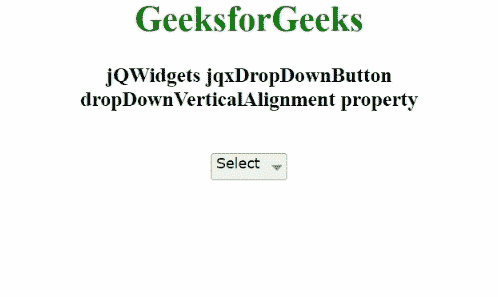

# jQWidgets jqxdropdown 按钮 dropDownVerticalAlignment 属性

> 原文:[https://www . geeksforgeeks . org/jqwidgets-jqxddropdown button-dropdowvertical alignment-property/](https://www.geeksforgeeks.org/jqwidgets-jqxdropdownbutton-dropdownverticalalignment-property/)

**jQWidgets** 是一个 JavaScript 框架，用于为 PC 和移动设备制作基于 web 的应用程序。它是一个非常强大、优化、独立于平台并且得到广泛支持的框架。jqxDropDownButton 用于说明一个 jQuery 小部件，该部件包含显示在下拉按钮中的许多可选择的以及可扩展的项目。

**下拉垂直对齐**属性用于设置或获取显示的下拉按钮的对齐。类型为字符串，默认值为*底部*。

其可能值如下:

*   顶端
*   底部

**语法:**

设置*下拉垂直对齐*属性。

```
$('Selector').jqxDropDownButton({
    dropDownVerticalAlignment: 'top'});  
```

获取*dropdowverticalalignment*属性。

```
var dropDownVerticalAlignment = $('#Selector')
    .jqxDropDownButton('dropDownVerticalAlignment');
```

**链接文件:**从链接下载 [jQWidgets](https://www.jqwidgets.com/download/) 。在 HTML 文件中，找到下载文件夹中的脚本文件。

> <link rel="”stylesheet”" href="”jqwidgets/styles/jqx.base.css”" type="”text/css”">
> <脚本类型= " text/JavaScript " src = " scripts/jquery-1 . 11 . 1 . min . js "></脚本类型>
> <脚本类型= " text/JavaScript " src = " jqwidgets/jqxcore . js "></脚本类型>
> <脚本类型= " text/JavaScript " src = " jqwidgets/jqx-all . js

**示例:**以下示例说明了 jQWidgets 中的 jqxdropdown button*dropdown vertical alignment*属性。

## 超文本标记语言

```
<!DOCTYPE html>
<html lang="en">
  <head>
    <link
      rel="stylesheet"
      href="jqwidgets/styles/jqx.base.css"
      type="text/css"
    />
    <script type="text/javascript" 
        src="scripts/jquery-1.11.1.min.js"></script>
    <script type="text/javascript" 
        src="jqwidgets/jqxcore.js"></script>
     <script type="text/javascript" 
        src="jqwidgets/jqx-all.js"></script>
    <script type="text/javascript" 
        src="jqwidgets/jqxbuttons.js"></script>
  </head>

  <body>
    <center>
      <h1 style="color: green">GeeksforGeeks</h1>
      <h3>jQWidgets jqxDropDownButton 
          dropDownVerticalAlignment property</h3>
      <br />
      <div style="float: center" id="jqxDdB">
        <div id="jqxT">
          <ul>
            <li>GFG</li>
            <li>
              Languages
              <ul>
                <li>C</li>
                <li>Java</li>
              </ul>
            </li>
            <li>
              Subjects
              <ul>
                <li>Data Structutre</li>
                <li>Algorithm</li>
              </ul>
            </li>
          </ul>
        </div>
      </div>
    </center>

    <script type="text/javascript">
      $(document).ready(function () {
        $("#jqxDdB").jqxDropDownButton({
          height: "25px",
          width: "70px",
          dropDownVerticalAlignment: "top",
        });

        $("#jqxT").jqxTree({});
        $("#jqxDdB").jqxDropDownButton("setContent", "Select");
      });
    </script>
  </body>
</html>
```

**输出:**



**参考:**[https://www . jqwidgets . com/jquery-widgets-documentation/documentation/jqxbutton/jquery-button-API . htm？搜索=](https://www.jqwidgets.com/jquery-widgets-documentation/documentation/jqxbutton/jquery-button-api.htm?search=)