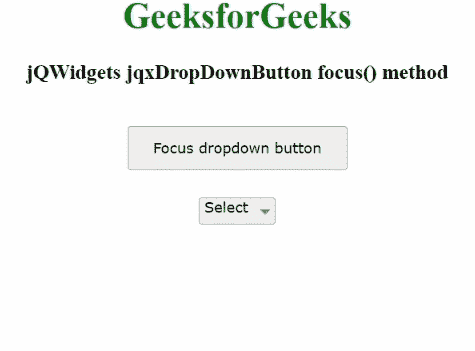

# jQWidgets jqxdropbdown button focus()方法

> 原文:[https://www . geesforgeks . org/jqwidgets-jqxddropdownbutton-focus-method/](https://www.geeksforgeeks.org/jqwidgets-jqxdropdownbutton-focus-method/)

**jQWidgets** 是一个 JavaScript 框架，用于为 PC 和移动设备制作基于 web 的应用程序。它是一个非常强大、优化、独立于平台并且得到广泛支持的框架。jqxDropDownButton 用于说明一个 jQuery 小部件，该部件包含显示在下拉按钮中的许多可选择的以及可扩展的项目。

**聚焦()方法**用于聚焦显示的下拉按钮。它没有参数，也不返回任何内容。

**语法:**

```html
$('Selector').jqxDropDownButton('focus');
```

**链接文件:**从链接下载 [jQWidgets](https://www.jqwidgets.com/download/) 。在 HTML 文件中，找到下载文件夹中的脚本文件。

> <link rel="”stylesheet”" href="”jqwidgets/styles/jqx.base.css”" type="”text/css”">
> <脚本类型=【文本/JavaScript】src =【脚本/jquery-1 . 11 . 1 . min . js】></脚本>
> T8】脚本类型=【文本/JavaScript】src =【jqwidgets/jqxcore . js】></脚本>
> <脚本类型=【文本/JavaScript】src =【jqwidgets/jqxbuttons . js】。

下面的例子说明了 jQWidgets 中的 jqxdropdown button**focus()****方法**。

**示例:**

## 超文本标记语言

```html
<!DOCTYPE html>
<html lang="en">
  <head>
    <link
      rel="stylesheet"
      href="jqwidgets/styles/jqx.base.css"
      type="text/css"
    />
    <script type="text/javascript" 
        src="scripts/jquery-1.11.1.min.js">
    </script>
    <script type="text/javascript" 
        src="jqwidgets/jqxcore.js">
    </script>
    <script type="text/javascript" 
        src="jqwidgets/jqxbuttons.js">
    </script>
  </head>

  <body>
    <center>
      <h1 style="color: green">GeeksforGeeks</h1>
      <h3>jQWidgets jqxDropDownButton focus() method</h3>
      <br />
      <div>
        <input
          type="button"
          id="jqxBtn"
          style="margin-bottom: 25px"
          value="Focus dropdown button"
        />
      </div>
      <div id="log"></div>
      <div style="float: center" id="jqxDdB">
        <div id="jqxT">
          <ul>
            <li>GFG</li>
            <li>
              Languages
              <ul>
                <li>C</li>
                <li>Java</li>
              </ul>
            </li>
            <li>
              Subjects
              <ul>
                <li>Data Structutre</li>
                <li>Algorithm</li>
              </ul>
            </li>
          </ul>
        </div>
      </div>
    </center>

    <script type="text/javascript">
      $(document).ready(function () {
        $("#jqxBtn").jqxButton({
          width: "200px",
          height: "40px",
        });

        $("#jqxDdB").jqxDropDownButton({
          height: "25px",
          width: "70px",
        });
        $("#jqxT").jqxTree({});
        $("#jqxDdB").jqxDropDownButton(
          "setContent", "Select"
        );

        $("#jqxBtn").on("click", function () {
          $("#jqxDdB").jqxDropDownButton("focus");
          $("#log").html("Button focussed");
        });
      });
    </script>
  </body>
</html>
```

**输出:**



**参考:**[https://www . jqwidgets . com/jquery-widgets-documentation/documentation/jqxbutton/jquery-button-API . htm](https://www.jqwidgets.com/jquery-widgets-documentation/documentation/jqxbutton/jquery-button-api.htm)