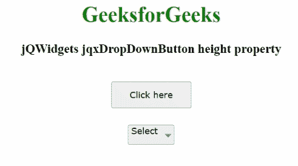

# jQWidgets jqxdropbdown 按钮高度属性

> 原文:[https://www . geeksforgeeks . org/jqwidgets-jqxddropdown button-height-property/](https://www.geeksforgeeks.org/jqwidgets-jqxdropdownbutton-height-property/)

**jQWidgets** 是一个 JavaScript 框架，用于为 PC 和移动设备制作基于 web 的应用程序。它是一个非常强大、优化、独立于平台并且得到广泛支持的框架。jqxDropDownButton 用于说明一个 jQuery 小部件，该部件包含显示在下拉按钮中的许多可选择的以及可扩展的项目。

**高度**属性用于设置或获取显示的下拉按钮的高度。它属于数字或字符串类型，默认值为 null。

**语法:**

*   设置*高度*属性。

    ```html
    $('#jqxDropDownButton').jqxDropDownButton({ height: '25px' });  
    ```

*   获取高度属性。

    ```html
    var height = $('#jqxDropDownButton').jqxDropDownButton('height');
    ```

**链接文件:**从链接下载 [jQWidgets](https://www.jqwidgets.com/download/) 。在 HTML 文件中，找到下载文件夹中的脚本文件。

> <link rel="”stylesheet”" href="”jqwidgets/styles/jqx.base.css”" type="”text/css”">
> <脚本类型= " text/JavaScript " src = " scripts/jquery-1 . 11 . 1 . min . js "></脚本>
> <脚本类型= " text/JavaScript " src = " jqwidgets/jqxcore . js "></脚本>
> 
> <脚本类型= " text/JavaScript " src = " jqwidgets/jqxbuttons . js "></script>

**示例:**下面的示例说明了 jQWidgets 中的 jqxDropDownButton *高度*属性。

## 超文本标记语言

```html
<!DOCTYPE html>
<html lang="en">
  <head>
    <link rel="stylesheet"
          href="jqwidgets/styles/jqx.base.css"
          type="text/css"/>
    <script type="text/javascript" 
            src="scripts/jquery-1.11.1.min.js"></script>
    <script type="text/javascript" 
            src="jqwidgets/jqxcore.js"></script>
     <script type="text/javascript" 
             src="jqwidgets/jqx-all.js"></script>
    <script type="text/javascript" 
            src="jqwidgets/jqxbuttons.js">
    </script>
  </head>

  <body>
    <center>
      <h1 style="color: green">GeeksforGeeks</h1>
      <h3>jQWidgets jqxDropDownButton height property</h3>
      <br />
      <div>
        <input
          type="button"
          id="jqxBtn"
          style="margin-bottom: 25px"
          value="Click here"
        />
      </div>
      <div id="log"></div>
      <div style="float: center" id="jqxDdB">
        <div id="jqxT">
          <ul>
            <li>GFG</li>
            <li>
              Languages
              <ul>
                <li>C</li>
                <li>Java</li>
              </ul>
            </li>
            <li>
              Subjects
              <ul>
                <li>Data Structutre</li>
                <li>Algorithm</li>
              </ul>
            </li>
          </ul>
        </div>
      </div>
    </center>

    <script type="text/javascript">
      $(document).ready(function () {
        $("#jqxBtn").jqxButton({
          width: "120px",
          height: "40px",
        });

        $("#jqxDdB").jqxDropDownButton({
          height: "30px",
          width: "70px",
        });
        $("#jqxT").jqxTree({});
        $("#jqxDdB").jqxDropDownButton("setContent", "Select");

        $("#jqxBtn").on("click", function () {
          var h = $("#jqxDdB").jqxDropDownButton("height");
          $("#log").html("Dropdown button's height: " + h);
        });
      });
    </script>
  </body>
</html>
```

**输出:**



**参考:**[https://www . jqwidgets . com/jquery-widgets-documentation/documentation/jqxbutton/jquery-button-API . htm？搜索=](https://www.jqwidgets.com/jquery-widgets-documentation/documentation/jqxbutton/jquery-button-api.htm?search=)