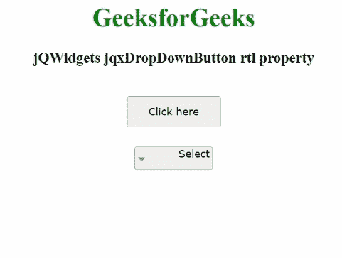

# jQWidgets jqxdropbdown button RTL 物业

> 原文:[https://www . geeksforgeeks . org/jqwidgets-jqxddropbdown button-RTL-property/](https://www.geeksforgeeks.org/jqwidgets-jqxdropdownbutton-rtl-property/)

**jQWidgets** 是一个 JavaScript 框架，用于为 PC 和移动设备制作基于 web 的应用程序。它是一个非常强大、优化、独立于平台并且得到广泛支持的框架。jqxDropDownButton 用于说明一个 jQuery 小部件，该部件包含显示在下拉按钮中的许多可选择的以及可扩展的项目。

***【RTL】*****属性用于设置或获取一个值，该值指定所述小部件的元素是否对齐，以便在从右到左字体的帮助下支持区域设置。为布尔类型，默认值为*假*。**

****语法:****

**设置 *rtl* 属性。**

```
$('Selector').jqxDropDownButton({rtl : true}); 
```

**获得 *rtl* 房产。**

```
var rtl = $('Selector').jqxDropDownButton('rtl'); 
```

****链接文件:**从链接下载 [jQWidgets](https://www.jqwidgets.com/download/) 。在 HTML 文件中，找到下载文件夹中的脚本文件。**

> <link rel="”stylesheet”" href="”jqwidgets/styles/jqx.base.css”" type="”text/css”"> **<脚本类型= " text/JavaScript " src = " scripts/jquery-1 . 11 . 1 . min . js "></脚本>
> <脚本类型= " text/JavaScript " src = " jqwidgets/jqx-all . js "></脚本>
> 脚本类型= " text/JavaScript " src = " jqwidgets/jqxcore . js**

****示例:**下面的示例说明了 jQWidgets 中的 jqxDropDownButton *rtl* 属性。**

## **超文本标记语言**

```
<!DOCTYPE html>
<html lang="en">
  <head>
    <link
      rel="stylesheet"
      href="jqwidgets/styles/jqx.base.css"
      type="text/css"
    />
    <script type="text/javascript" 
        src="scripts/jquery-1.11.1.min.js"></script>
    <script type="text/javascript" 
        src="jqwidgets/jqxcore.js"></script>
     <script type="text/javascript" 
        src="jqwidgets/jqx-all.js"></script>
    <script type="text/javascript" 
        src="jqwidgets/jqxbuttons.js"></script>
  </head>

  <body>
    <center>
      <h1 style="color: green">GeeksforGeeks</h1>
      <h3>jQWidgets jqxDropDownButton rtl property</h3>
      <br />
      <div>
        <input
          type="button"
          id="jqxBtn"
          style="margin-bottom: 25px"
          value="Click here"
        />
      </div>
      <div id="log"></div>
      <div style="float: center" id="jqxDdB">
        <div id="jqxT">
          <ul>
            <li>GFG</li>
            <li>
              Languages
              <ul>
                <li>C</li>
                <li>Java</li>
              </ul>
            </li>
            <li>
              Subjects
              <ul>
                <li>Data Structutre</li>
                <li>Algorithm</li>
              </ul>
            </li>
          </ul>
        </div>
      </div>
    </center>

    <script type="text/javascript">
      $(document).ready(function () {
        $("#jqxBtn").jqxButton({
          width: "120px",
          height: "40px",
        });

        $("#jqxDdB").jqxDropDownButton({
          height: "30px",
          width: "100px",
          rtl: true,
        });
        $("#jqxT").jqxTree({});
        $("#jqxDdB").jqxDropDownButton("setContent", "Select");

        $("#jqxBtn").on("click", function () {
          var rl = $("#jqxDdB").jqxDropDownButton("rtl");
          $("#log").html("Aligned right to left: " + rl);
        });
      });
    </script>
  </body>
</html>
```

****输出:****

****

****参考:**[https://www . jqwidgets . com/jquery-widgets-documentation/documentation/jqxbutton/jquery-button-API . htm？搜索=](https://www.jqwidgets.com/jquery-widgets-documentation/documentation/jqxbutton/jquery-button-api.htm?search=)**