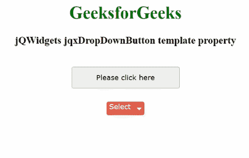

# jQWidgets jqxDropDownButton 模板属性

> 原文:[https://www . geesforgeks . org/jqwidgets-jqxddropdownbutton-template-property/](https://www.geeksforgeeks.org/jqwidgets-jqxdropdownbutton-template-property/)

**jQWidgets** 是一个 JavaScript 框架，用于为 PC 和移动设备制作基于 web 的应用程序。它是一个非常强大、优化、独立于平台并且得到广泛支持的框架。 **jqxDropDownButton** 用于说明一个 jQuery 小部件，该部件包含显示在下拉按钮中的许多可选择的和可扩展的项目。

**模板属性**用于指定显示的下拉按钮的模板，该模板用作默认样式的选项。它是字符串类型，默认值为“default”。

有几种可能的值适用于下面给出的*模板属性* :

*   **默认**:顾名思义，这是默认模板。样式将仅取决于“主题”属性的值。
*   **primary:** 为了显示额外的视觉重量，它使用深蓝色进行造型。
*   **成功:**为了显示成功或积极的行动，它使用绿色作为风格。
*   **警告:**橙色样式用于表示警告。
*   **危险:**表示危险或消极的动作，用红色表示风格
*   **信息:**它是一个蓝色的按钮，不与语义动作或使用相关联。

**语法:**

*   它用于设置模板属性。

```
$("Selector").jqxDropDownButton({ template: 'primary'});
```

*   它用于获取模板属性。

```
var template = $('Selector').jqxDropDownButton('template');
```

**链接文件:**从链接下载 [jQWidgets](https://www.jqwidgets.com/download/) 。在 HTML 文件中，找到下载文件夹中的脚本文件。

> <link rel="”stylesheet”" href="”jqwidgets/styles/jqx.base.css”" type="”text/css”">
> <脚本类型= " text/JavaScript " src = " scripts/jquery-1 . 11 . 1 . min . js "></脚本>
> <脚本类型= " text/JavaScript " src = " jqwidgets/jqx-all . js "></脚本>
> 脚本类型= " text/JavaScript " src = " jqwidgets/jqxcore . js

**示例:**下面的示例说明了 jQWidgets 中的 jqxDropDownButton **模板**属性。

## 超文本标记语言

```
<!DOCTYPE html>
<html lang="en">
  <head>
    <link rel="stylesheet"
            href=
"jqwidgets/styles/jqx.base.css"
           type="text/css"/>
    <script type="text/javascript" 
            src="scripts/jquery-1.11.1.min.js">
    </script>
    <script type="text/javascript" 
            src="jqwidgets/jqxcore.js">
    </script>
    <script type="text/javascript" 
            src="jqwidgets/jqxbuttons.js">
    </script>
  </head>

  <body>
    <center>
      <h1 style="color: green">GeeksforGeeks</h1>
      <h3>jQWidgets jqxDropDownButton template property</h3>
      <br />
      <div>
        <input
          type="button"
          id="jqxBtn"
          style="margin-bottom: 25px"
          value="Please click here"/>
      </div>
      <div id="log"></div>
      <div style="float: center" id="jqxDdB">
        <div id="jqxT">
          <ul>
            <li>GFG</li>
            <li>Languages
              <ul>
                <li>C</li>
                <li>Java</li>
              </ul>
            </li>
            <li>Subjects
              <ul>
                <li>Data Structutre</li>
                <li>Algorithm</li>
              </ul>
            </li>
          </ul>
        </div>
      </div>
    </center>

    <script type="text/javascript">
      $(document).ready(function () {
        $("#jqxBtn").jqxButton({
          width: "200px",
          height: "40px",
        });

        $("#jqxDdB").jqxDropDownButton({
          height: "25px",
          width: "70px",
          template: "danger",
        });
        $("#jqxT").jqxTree({});
        $("#jqxDdB").jqxDropDownButton("setContent", "Select");

        $("#jqxBtn").on("click", function () {
          var temp = $("#jqxDdB").jqxDropDownButton("template");
          $("#log").html("Template name: " + temp);
        });
      });
    </script>
  </body>
</html>
```

**输出:**



**参考:**[https://www . jqwidgets . com/jquery-widgets-documentation/documentation/jqxbutton/jquery-button-API . htm？搜索=](https://www.jqwidgets.com/jquery-widgets-documentation/documentation/jqxbutton/jquery-button-api.htm?search=)