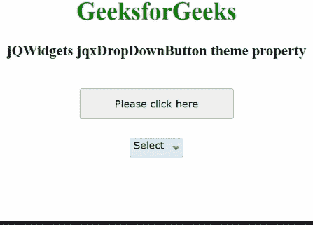

# jQWidgets jqxdropbdown 按钮主题属性

> 原文:[https://www . geeksforgeeks . org/jqwidgets-jqxddropdownbutton-theme-property/](https://www.geeksforgeeks.org/jqwidgets-jqxdropdownbutton-theme-property/)

**jQWidgets** 是一个 JavaScript 框架，用于为 PC 和移动设备制作基于 web 的应用程序。它是一个非常强大、优化、独立于平台并且得到广泛支持的框架。 **jqxDropDownButton** 用于说明一个 jQuery 小部件，该部件包含显示在下拉按钮中的许多可选择的和可扩展的项目。

**主题属性**用于设置或返回显示的下拉按钮的主题。它接受字符串类型值，默认值为空(“”)。为了使用这个属性，我们需要将主题样式表(即 jqx.energyblue.css)合并到标题部分。主题文件包含在“jqx.base.css”文件之后。

这一对 CSS 文件由 jQWidgets 使用，即 *jqx.base.css* 和 *jqx。[主题名称]。css* 。基本样式表用于生成与小部件布局相关的样式，如边框宽度、填充、边距、位置。小部件的颜色和背景可以通过使用第二个 CSS 文件来应用。

**语法:**

*   它用于设置主题属性。

```
$('Selector').jqxDropDownButton({ theme: String });
```

*   它用于获取主题属性。

```
var theme = $('Selector').jqxDropDownButton('theme');
```

**链接文件:**从链接下载 [jQWidgets](https://www.jqwidgets.com/download/) 。在 HTML 文件中，找到下载文件夹中的脚本文件。

> <link rel="”stylesheet”" href="”jqwidgets/styles/jqx.base.css”" type="”text/css”">
> <脚本类型= " text/JavaScript " src = " scripts/jquery-1 . 11 . 1 . min . js "></脚本>
> <脚本类型= " text/JavaScript " src = " jqwidgets/jqx-all . js "></脚本>
> 脚本类型= " text/JavaScript " src = " jqwidgets/jqxcore . js

**示例:**下面的示例说明了 jQWidgets 中的 jqxDropDownButton **主题**属性。

## 超文本标记语言

```
<!DOCTYPE html>
<html lang="en">
  <head>
    <link
      rel="stylesheet"
      href=
"jqwidgets/styles/jqx.base.css"
      type="text/css" />
    <script type="text/javascript" 
            src="scripts/jquery-1.11.1.min.js">
    </script>
    <script type="text/javascript" 
            src="jqwidgets/jqxcore.js">
    </script>
    <script type="text/javascript" 
            src="jqwidgets/jqxbuttons.js">
    </script>
  </head>

  <body>
    <center>
      <h1 style="color: green">GeeksforGeeks</h1>
      <h3>jQWidgets jqxDropDownButton theme property</h3>
      <br />
      <div>
        <input
          type="button"
          id="jqxBtn"
          style="margin-bottom: 25px"
          value="Please click here" />
      </div>
      <div id="log"></div>
      <div style="float: center" 
           id="jqxDdB">
        <div id="jqxT">
          <ul>
            <li>GFG</li>
            <li>Languages
              <ul>
                <li>C</li>
                <li>Java</li>
              </ul>
            </li>
            <li>Subjects
              <ul>
                <li>Data Structutre</li>
                <li>Algorithm</li>
              </ul>
            </li>
          </ul>
        </div>
      </div>
    </center>

    <script type="text/javascript">
      $(document).ready(function () {
        $("#jqxBtn").jqxButton({
          width: "200px",
          height: "40px",
        });

        $("#jqxDdB").jqxDropDownButton({
          height: "25px",
          width: "70px",
          theme: "energyblue",
        });
        $("#jqxT").jqxTree({});
        $("#jqxDdB").jqxDropDownButton("setContent", "Select");

        $("#jqxBtn").on("click", function () {
          var th = $("#jqxDdB").jqxDropDownButton("theme");
          $("#log").html("Theme: " + th);
        });
      });
    </script>
  </body>
</html>
```

**输出:**



**参考:**[https://www . jqwidgets . com/jquery-widgets-documentation/documentation/jqxbutton/jquery-button-API . htm？搜索=](https://www.jqwidgets.com/jquery-widgets-documentation/documentation/jqxbutton/jquery-button-api.htm?search=)