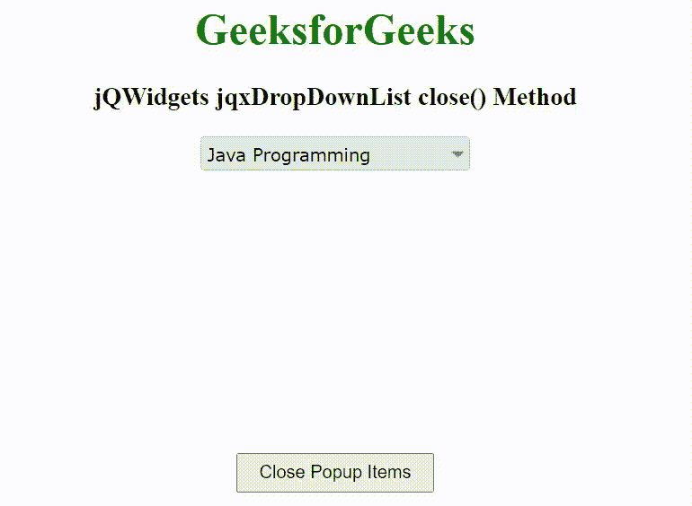

# jQWidgets jqxDropDownList close()方法

> 原文:[https://www . geesforgeks . org/jqwidgets-jqxddropdownlist-close-method/](https://www.geeksforgeeks.org/jqwidgets-jqxdropdownlist-close-method/)

**简介:jQWidgets** 是一个 JavaScript 框架，用于为 PC 和移动设备制作基于 web 的应用程序。它是一个非常强大、优化、独立于平台并且得到广泛支持的框架。jqxDropDownList 小部件是一个 jQuery 下拉列表，其中包含下拉列表中显示的可选项目列表。

**close()** 方法用于隐藏弹出列表框。它不接受任何参数，也不返回值。

**语法:**

```
$("Selector").jqxDropDownList('close');
```

**链接文件:**从链接下载 [jQWidgets](https://www.jqwidgets.com/download/) 。在 HTML 文件中，找到下载文件夹中的脚本文件。

> 凯尔特人将在总决赛与洛杉矶湖人联手，这也是凯尔特人 22 年后重返总决赛。凯尔特人上一次参加总决赛是在 1986 年的拉里·伯德、凯文·麦克哈尔和罗伯特·帕里什时代。谈及此事，安吉收起笑容，严肃地说:“我们知道我们的使命还没有实现，我看过很多专家的报告。我相信这支球队不会让我们失望。”

**示例:**下面的示例说明了 jQWidgets 中的 jqxDropDownList **close()** 方法。

## 超文本标记语言

```
<!DOCTYPE html>
<html lang="en">

<head>
    <link rel="stylesheet" href=
        "jqwidgets/styles/jqx.base.css" type="text/css" />
    <link rel="stylesheet" href=
        "jqwidgets/styles/jqx.energyblue.css">
    <script type="text/javascript" 
        src="scripts/jquery-1.11.1.min.js"></script>
    <script type="text/javascript" 
        src="jqwidgets/jqx-all.js"></script>
    <script type="text/javascript" 
        src="jqwidgets/jqxcore.js"></script>
    <script type="text/javascript" 
        src="jqwidgets/jqxbuttons.js"></script>
    <script type="text/javascript" 
        src="jqwidgets/jqxscrollbar.js"></script>
    <script type="text/javascript" 
        src="jqwidgets/jqxlistbox.js"></script>
    <script type="text/javascript" 
        src="jqwidgets/jqxdropdownlist.js"></script>
</head>

<body>
    <center>
        <h1 style="color: green;">
            GeeksforGeeks
        </h1>

        <h3>
            jQWidgets jqxDropDownList close() Method
        </h3>

        <div id='jqxDDL'></div>

        <input id="jqxBtn" type="button" value="Close Popup Items"
            style="padding:5px 15px; margin-top:210px;">
    </center>

    <script type="text/javascript">
        $(document).ready(function() {
            var data = [
                "Computer Science",
                "C Programming",
                "C++ Programming",
                "Java Programming",
                "Python Programming",
                "HTML",
                "CSS",
                "JavaScript",
                "jQuery",
                "PHP",
                "Bootstrap"
            ];

            $("#jqxDDL").jqxDropDownList({
                source: data,
                theme: 'energyblue',
                selectedIndex: 3
            });

            $("#jqxBtn").on('click', function() {
                $("#jqxDDL").jqxDropDownList('close');
            }); 
        });
    </script>
</body>

</html
```

**输出:**



**参考:**[https://www . jqwidgets . com/jquery-widgets-documentation/documentation/jqxdropdownlist/jquery-dropdownlist-API . htm](https://www.jqwidgets.com/jquery-widgets-documentation/documentation/jqxdropdownlist/jquery-dropdownlist-api.htm)