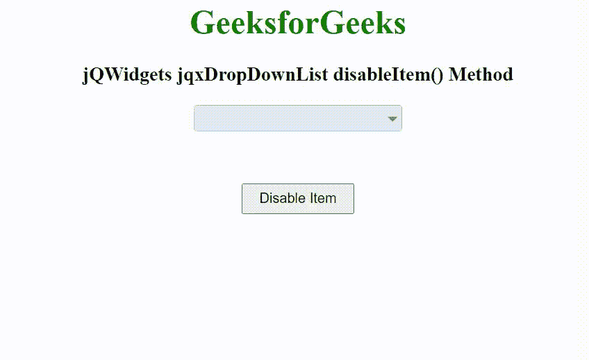

# jQWidgets jqxDropDownList disableItem()方法

> 原文:[https://www . geesforgeks . org/jqwidgets-jqxddropdownlist-disableitem-method/](https://www.geeksforgeeks.org/jqwidgets-jqxdropdownlist-disableitem-method/)

**简介:jQWidgets** 是一个 JavaScript 框架，用于为 PC 和移动设备制作基于 web 的应用程序。它是一个非常强大、优化、独立于平台并且得到广泛支持的框架。jqxDropDownList 小部件是一个 jQuery 下拉列表，其中包含下拉列表中显示的可选项目列表。

**disableItem()** 方法用于禁用某个项目。它接受字符串/对象类型的单个参数项，并且不返回值。

以下字段可用于新项目。

*   **标签:**指定物品的标签。
*   **值:**指定项目的值。
*   **禁用:**指定项目是否启用/禁用。
*   **勾选:**指定项目是否勾选/未勾选。
*   **hasthreads:**指定复选框项支持三种状态。
*   **html:** 指定 html 中的显示项。它可以用来代替标签。
*   **组:**指定物品的组。

**语法:**

```
$("Selector").jqxDropDownList('disableItem', item );
```

**链接文件:**从链接下载 [jQWidgets](https://www.jqwidgets.com/download/) 。在 HTML 文件中，找到下载文件夹中的脚本文件。

> <link rel="”stylesheet”" href="”jqwidgets/styles/jqx.base.css”" type="”text/css”">
> < link rel= "样式表" href = " jqwidgets/style/jqx . energy blue . CSS ">
> <脚本类型= " text/JavaScript " src = " scripts/jquery-1 . 11 . 1 . min . js "></脚本>
> 脚本类型= " text/JavaScript " src = " jqwidgets/jqx-all . js "【T16

**示例:**下面的示例说明了 jQWidgets 中的 jqxDropDownList**disableItem()**方法。

## 超文本标记语言

```
<!DOCTYPE html>
<html lang="en">

<head>
    <link rel="stylesheet" href=
        "jqwidgets/styles/jqx.base.css" type="text/css" />
    <link rel="stylesheet" href=
        "jqwidgets/styles/jqx.energyblue.css">
    <script type="text/javascript" 
        src="scripts/jquery-1.11.1.min.js"></script>
    <script type="text/javascript" 
        src="jqwidgets/jqx-all.js"></script>
    <script type="text/javascript" 
        src="jqwidgets/jqxcore.js"></script>
    <script type="text/javascript" 
        src="jqwidgets/jqxbuttons.js"></script>
    <script type="text/javascript" 
        src="jqwidgets/jqxscrollbar.js"></script>
    <script type="text/javascript" 
        src="jqwidgets/jqxlistbox.js"></script>
    <script type="text/javascript" 
        src="jqwidgets/jqxdropdownlist.js"></script>
</head>

<body>
    <center>
        <h1 style="color: green;">
            GeeksforGeeks
        </h1>

        <h3>
            jQWidgets jqxDropDownList disableItem() Method
        </h3>

        <div id='jqxDDL'></div>

        <input id="jqxBtn" type="button" value="Disable Item" 
            style="padding: 5px 15px; margin-top: 50px;">
    </center>

    <script type="text/javascript">
        $(document).ready(function() {
            var data = [
                "Computer Science",
                "C Programming",
                "C++ Programming",
                "Java Programming",
                "Python Programming",
                "HTML",
                "CSS",
                "JavaScript",
                "jQuery",
                "PHP",
                "Bootstrap"
            ];

            $("#jqxDDL").jqxDropDownList({
                source: data,
                theme: 'energyblue'
            });

            $("#jqxBtn").on('click', function() {
                $("#jqxDDL").jqxDropDownList(
                    'disableItem', "Python Programming"
                );
            });
        });
    </script>
</body>

</html
```

**输出:**



**参考:**[https://www . jqwidgets . com/jquery-widgets-documentation/documentation/jqxdropdownlist/jquery-dropdownlist-API . htm](https://www.jqwidgets.com/jquery-widgets-documentation/documentation/jqxdropdownlist/jquery-dropdownlist-api.htm)