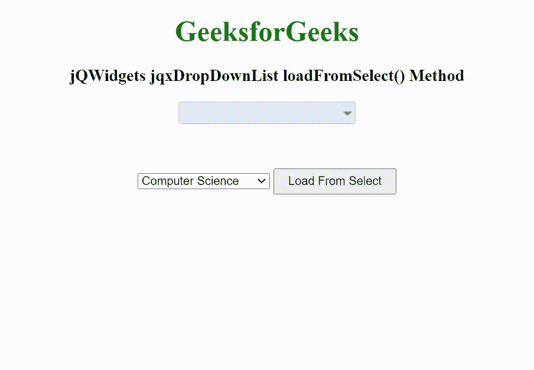

# jQWidgets jqxDropDownList loadfromsselect()方法

> 原文:[https://www . geesforgeks . org/jqwidgets-jqxddropdownlist-loadfromsselect-method/](https://www.geeksforgeeks.org/jqwidgets-jqxdropdownlist-loadfromselect-method/)

jQWidgets 是一个 JavaScript 框架，用于为 PC 和移动设备制作基于 web 的应用程序。它是一个非常强大、优化、独立于平台并且得到广泛支持的框架。jqxDropDownList 小部件是一个 jQuery 下拉列表，其中包含下拉列表中显示的可选项目列表。

loadFromSelect()方法用于从“选择”标记加载列表项。它接受字符串类型的单个参数 id，并且不返回任何值。

**语法:**

```html
$("Selector").jqxDropDownList('loadFromSelect', 'select');
```

**链接文件:**从链接 https://www.jqwidgets.com/download/.下载 jQWidgets 在 HTML 文件中，找到下载文件夹中的脚本文件。

> <link rel="”stylesheet”" href="”jqwidgets/styles/jqx.base.css”" type="”text/css”">
> < link rel= "样式表" href = " jqwidgets/style/jqx . energy blue . CSS ">
> <脚本类型= " text/JavaScript " src = " scripts/jquery-1 . 11 . 1 . min . js "></脚本>
> 脚本类型= " text/JavaScript " src = " jqwidgets/jqx-all . js "【T16

下面的例子说明了 jQWidgets 中的 jqxDropDownList loadFromSelect()方法。

**示例:**

## 超文本标记语言

```html
<!DOCTYPE html>
<html lang="en">

<head>
    <link rel="stylesheet" href=
        "jqwidgets/styles/jqx.base.css" type="text/css" />
    <link rel="stylesheet" href=
        "jqwidgets/styles/jqx.energyblue.css">
    <script type="text/javascript" 
        src="scripts/jquery-1.11.1.min.js"></script>
    <script type="text/javascript" 
        src="jqwidgets/jqx-all.js"></script>
    <script type="text/javascript" 
        src="jqwidgets/jqxcore.js"></script>
    <script type="text/javascript" 
        src="jqwidgets/jqxbuttons.js"></script>
    <script type="text/javascript" 
        src="jqwidgets/jqxscrollbar.js"></script>
    <script type="text/javascript" 
        src="jqwidgets/jqxlistbox.js"></script>
    <script type="text/javascript" 
        src="jqwidgets/jqxdropdownlist.js"></script>
</head>

<body>
    <center>
        <h1 style="color: green;">
            GeeksforGeeks
        </h1>

        <h3>
            jQWidgets jqxDropDownList loadFromSelect() Method
        </h3>

        <div id='jqxDDL'></div>

        <select id="select">
            <option>Computer Science</option>
            <option>C Programming</option>
            <option>C++ Programming</option>
            <option>Java Programming</option>
            <option>Python Programming</option>
            <option>HTML</option>
            <option>CSS</option>
            <option>JavaScript</option>
            <option>jQuery</option>
            <option>PHP</option>
            <option>Bootstrap</option>
        </select>

        <input id="jqxBtn" type="button" 
            value="Load From Select" 
            style="padding: 5px 15px; margin-top: 50px;">
    </center>

    <script type="text/javascript">
        $(document).ready(function() {
            $("#jqxDDL").jqxDropDownList({
                theme: 'energyblue',
                width: '200px',
                height: '25px',
                selectedIndex: 2
            });

            var flag = false;

            $("#jqxBtn").click(function() {
                $("#jqxDDL").jqxDropDownList('loadFromSelect', 'select');
            });

            $("#jqxDDL").on('select', function(event) {
                if (event.args && !updating) {
                    $("#select").val(event.args.item.value);
                }
            });

            $("#select").on('change', function(event) {
                updating = true;
                var index = $("#select")[0].selectedIndex;
                $("#jqxDDL").jqxDropDownList('selectIndex', index);
                $("#jqxDDL").jqxDropDownList('ensureVisible', index);
                updating = false;
            });
        });
    </script>
</body>

</html
```

**输出:**



**参考:**[https://www . jqwidgets . com/jquery-widgets-documentation/documentation/jqxdropdownlist/jquery-dropdownlist-API . htm](https://www.jqwidgets.com/jquery-widgets-documentation/documentation/jqxdropdownlist/jquery-dropdownlist-api.htm)