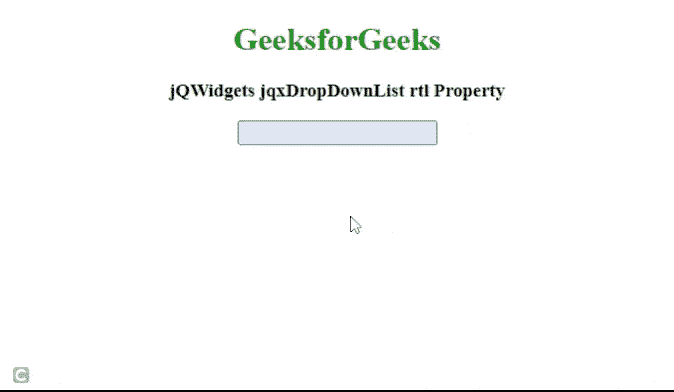

# jQWidgets jqxDropDownList rtl 物业

> 原文:[https://www . geeksforgeeks . org/jqwidgets-jqxddropdownlist-RTL-property/](https://www.geeksforgeeks.org/jqwidgets-jqxdropdownlist-rtl-property/)

**简介:jQWidgets** 是一个 JavaScript 框架，用于为 PC 和移动设备制作基于 web 的应用程序。它是一个非常强大、优化、独立于平台并且得到广泛支持的框架。jqxDropDownList 小部件是一个 jQuery 下拉列表，其中包含下拉列表中显示的可选项目列表。

*rtl* 属性用于设置或返回一个值，该值指示小部件的元素是否对齐以支持使用从右向左字体的区域设置。它接受布尔类型值，默认值为*假*。

**语法:**

设置 *rtl* 属性。

```
$('selector').jqxDropDownList({ rtl: Boolean });
```

归还 *rtl* 房产。

```
var rtl = $('selector').jqxDropDownList('rtl');
```

**链接文件:**从链接下载 [jQWidgets](https://www.jqwidgets.com/download/) 。在 HTML 文件中，找到下载文件夹中的脚本文件。

> <link rel="”stylesheet”" href="”jqwidgets/styles/jqx.base.css”" type="”text/css”">
> < link rel= "样式表" href = " jqwidgets/style/jqx . energy blue . CSS ">
> <脚本类型= " text/JavaScript " src = " scripts/jquery-1 . 11 . 1 . min . js "></脚本>
> 脚本类型= " text/JavaScript " src = " jqwidgets/jqx-all . js "【T16

**示例:**下面的示例说明了 jQWidgets 中的 jqxDropDownList *rtl* 属性。

## 超文本标记语言

```
<!DOCTYPE html>
<html lang="en">

<head>
    <link rel="stylesheet" href=
        "jqwidgets/styles/jqx.base.css" type="text/css" />
    <link rel="stylesheet" href=
        "jqwidgets/styles/jqx.energyblue.css">
    <script type="text/javascript" 
        src="scripts/jquery-1.11.1.min.js"></script>
    <script type="text/javascript" 
        src="jqwidgets/jqx-all.js"></script>
    <script type="text/javascript" 
        src="jqwidgets/jqxcore.js"></script>
    <script type="text/javascript" 
        src="jqwidgets/jqxbuttons.js"></script>
    <script type="text/javascript" 
        src="jqwidgets/jqxscrollbar.js"></script>
    <script type="text/javascript" 
        src="jqwidgets/jqxlistbox.js"></script>
    <script type="text/javascript" 
        src="jqwidgets/jqxdropdownlist.js"></script>
</head>

<body>
    <center>
        <h1 style="color: green;">
            GeeksforGeeks
        </h1>

        <h3>
            jQWidgets jqxDropDownList rtl Property
        </h3>

        <div id='jqxDDL'></div>
    </center>
    <script type="text/javascript">
        $(document).ready(function() {
            var data = [
                "Computer Science",
                "C Programming",
                "C++ Programming",
                "Java Programming",
                "Python Programming",
                "HTML",
                "CSS",
                "JavaScript",
                "jQuery",
                "PHP",
                "Bootstrap"
            ];

            $("#jqxDDL").jqxDropDownList({
                source: data,
                theme: 'energyblue',
                rtl: true
            });
        });
    </script>
</body>

</html>
```

**输出:**



**参考:**[https://www . jqwidgets . com/jquery-widgets-documentation/documentation/jqxdropdownlist/jquery-dropdownlist-API . htm](https://www.jqwidgets.com/jquery-widgets-documentation/documentation/jqxdropdownlist/jquery-dropdownlist-api.htm)