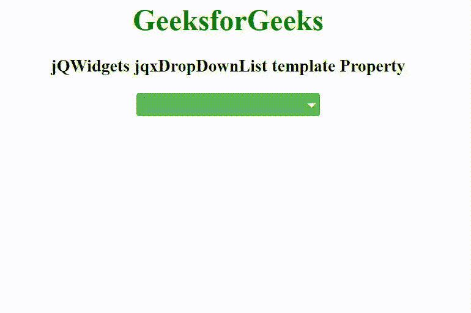

# jQWidgets jqxDropDownList 模板属性

> 原文:[https://www . geesforgeks . org/jqwidgets-jqxddropdownlist-template-property/](https://www.geeksforgeeks.org/jqwidgets-jqxdropdownlist-template-property/)

**jQWidgets** 是一个 JavaScript 框架，用于为 PC 和移动设备制作基于 web 的应用程序。它是一个非常强大、优化、独立于平台并且得到广泛支持的框架。jqxDropDownList 小部件是一个 jQuery 下拉列表，其中包含下拉列表中显示的可选项目列表。

***模板*** **属性**用于设置或返回模板作为默认样式的替代。它接受字符串类型值，其默认值为“默认值”。

它的可能值如下。

*   **‘默认’:**是默认模板，其样式取决于“主题”属性值。
*   **【初级】:**设置深蓝色风格，增加视觉重量。
*   **“成功”:**它为成功或积极的行动设置绿色风格。
*   **“警告”:**设置代表警告的橙色样式。
*   **“危险”:**设置代表危险或消极动作的红色样式。
*   **【信息】:**设置蓝色按钮，不绑定语义动作或使用。

**语法:**

*   设置*模板*属性。

```html
$('selector').jqxDropDownList({ template: String });
```

*   返回*模板*属性。

```html
var template = $('selector').jqxDropDownList('template');
```

**链接文件:**从链接下载 [jQWidgets](https://www.jqwidgets.com/download/) 。在 HTML 文件中，找到下载文件夹中的脚本文件。

> <link rel="”stylesheet”" href="”jqwidgets/styles/jqx.base.css”" type="”text/css”">
> < link rel= "样式表" href = " jqwidgets/style/jqx . energy blue . CSS ">
> <脚本类型= " text/JavaScript " src = " scripts/jquery-1 . 11 . 1 . min . js "></脚本>
> 脚本类型= " text/JavaScript " src = " jqwidgets/jqx-all . js "【T16

**示例:**以下示例说明了 jQWidgets 中的 jqxDropDownList *模板*属性。

## 超文本标记语言

```html
<!DOCTYPE html>
<html lang="en">

<head>
    <link rel="stylesheet" href=
        "jqwidgets/styles/jqx.base.css" type="text/css" />
    <link rel="stylesheet" href=
        "jqwidgets/styles/jqx.energyblue.css">
    <script type="text/javascript" 
        src="scripts/jquery-1.11.1.min.js"></script>
    <script type="text/javascript" 
        src="jqwidgets/jqx-all.js"></script>
    <script type="text/javascript" 
        src="jqwidgets/jqxcore.js"></script>
    <script type="text/javascript" 
        src="jqwidgets/jqxbuttons.js"></script>
    <script type="text/javascript" 
        src="jqwidgets/jqxscrollbar.js"></script>
    <script type="text/javascript" 
        src="jqwidgets/jqxlistbox.js"></script>
    <script type="text/javascript" 
        src="jqwidgets/jqxdropdownlist.js"></script>
</head>

<body>
    <center>
        <h1 style="color: green;">
            GeeksforGeeks
        </h1>

        <h3>
            jQWidgets jqxDropDownList template Property
        </h3>

        <div id='jqxDDL'></div>
    </center>
    <script type="text/javascript">
        $(document).ready(function() {
            var data = [
                "Computer Science",
                "C Programming",
                "C++ Programming",
                "Java Programming",
                "Python Programming",
                "HTML",
                "CSS",
                "JavaScript",
                "jQuery",
                "PHP",
                "Bootstrap"
            ];

            $("#jqxDDL").jqxDropDownList({
                source: data,
                theme: 'energyblue',
                template: 'success'
            });
        });
    </script>
</body>

</html>
```

**输出:**



**参考:**[https://www . jqwidgets . com/jquery-widgets-documentation/documentation/jqxdropdownlist/jquery-dropdownlist-API . htm](https://www.jqwidgets.com/jquery-widgets-documentation/documentation/jqxdropdownlist/jquery-dropdownlist-api.htm)