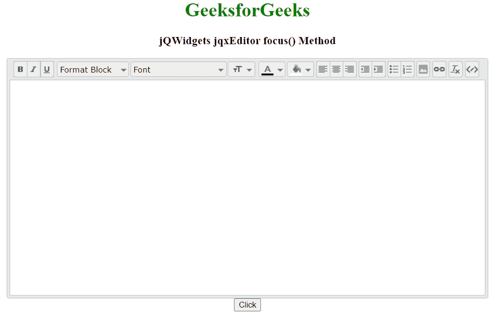

# jQWidgets jqxEditor focus()方法

> 原文:[https://www . geesforgeks . org/jqwidgets-jqxeditor-focus-method/](https://www.geeksforgeeks.org/jqwidgets-jqxeditor-focus-method/)

**jQWidgets** 是一个 JavaScript 框架，用于为 PC 和移动设备制作基于 web 的应用程序。它是一个非常强大、优化、独立于平台并且得到广泛支持的框架。jqxEditor 用于表示 jQuery HTML 文本编辑器，该编辑器可用于简化网页内容创建，也可用于替代 HTML 文本区域。

**focus()方法**用于在 jqxEditor 小部件上设置焦点。它不接受任何参数，也不返回值。

**语法:**

```html
$('Selector').jqxEditor('focus');  
```

**链接文件:**从 https://www.jqwidgets.com/download/链接下载 jQWidgets。在 HTML 文件中，找到下载文件夹中的脚本文件:

> <link rel="”stylesheet”" href="”jqwidgets/styles/jqx.base.css”" type="”text/css”">
> <脚本类型=【text/JavaScript】src =【scripts/jquery-1 . 11 . 1 . min . js】></脚本>
> <脚本类型=【text/JavaScript】src =【jqwidgets/jqxcore . js】></脚本>
> T21】脚本类型=【text/JavaScript】src =【jqwidgets/jqxbuttons。 >
> <脚本类型=“text/JavaScript”src =“jqwidgets/jqxeditor . js”></脚本>
> <脚本类型=“text/JavaScript”src =“jqwidgets/jqxtooltip . js”></脚本>
> <脚本类型=“text/JavaScript”src =“jqwidgets/jqxc

以下示例说明了 jQWidgets 中的 jqxEditor focus()方法:

**示例:**

## 超文本标记语言

```html
<!DOCTYPE html>
<html lang="en">

<head>
    <link rel="stylesheet" href=
        "jqwidgets/styles/jqx.base.css" type="text/css" />
    <script type="text/javascript" 
        src="scripts/jquery-1.11.1.min.js"></script>
    <script type="text/javascript" 
        src="jqwidgets/jqxcore.js"></script>
    <script type="text/javascript" 
        src="jqwidgets/jqxbuttons.js"></script>
    <script type="text/javascript" 
        src="jqwidgets/jqxscrollbar.js"></script>
    <script type="text/javascript" 
        src="jqwidgets/jqxlistbox.js"></script>
    <script type="text/javascript" 
        src="jqwidgets/jqxdropdownlist.js"></script>
    <script type="text/javascript" 
        src="jqwidgets/jqxdropdownbutton.js"></script>
    <script type="text/javascript" 
        src="jqwidgets/jqxcolorpicker.js"></script>
    <script type="text/javascript" 
        src="jqwidgets/jqxwindow.js"></script>
    <script type="text/javascript" 
        src="jqwidgets/jqxeditor.js"></script>
    <script type="text/javascript" 
        src="jqwidgets/jqxtooltip.js"></script>
    <script type="text/javascript" 
        src="jqwidgets/jqxcheckbox.js"></script>
</head>

<body>
    <center>
        <h1 style="color: green;">
            GeeksforGeeks
        </h1>

        <h3>jQWidgets jqxEditor focus() Method</h3>
        <textarea id="editor">
        </textarea>
        <button id="d" >Click</button>
    </center>
    <script type="text/javascript">
        $(document).ready(function () {
            $('#editor').jqxEditor({
                height: "400px",
                width: '800px'
             });
        });
        $("#d").click(function () {
            $('#editor').jqxEditor('focus');
        });
    </script>
</body>
</html>
```

**输出:**



**参考:**[**https://www . jqwidgets . com/jquery-widgets-documentation/jqxeditor/jquery-editor-API . htm**](https://www.jqwidgets.com/jquery-widgets-documentation/documentation/jqxeditor/jquery-editor-api.htm)