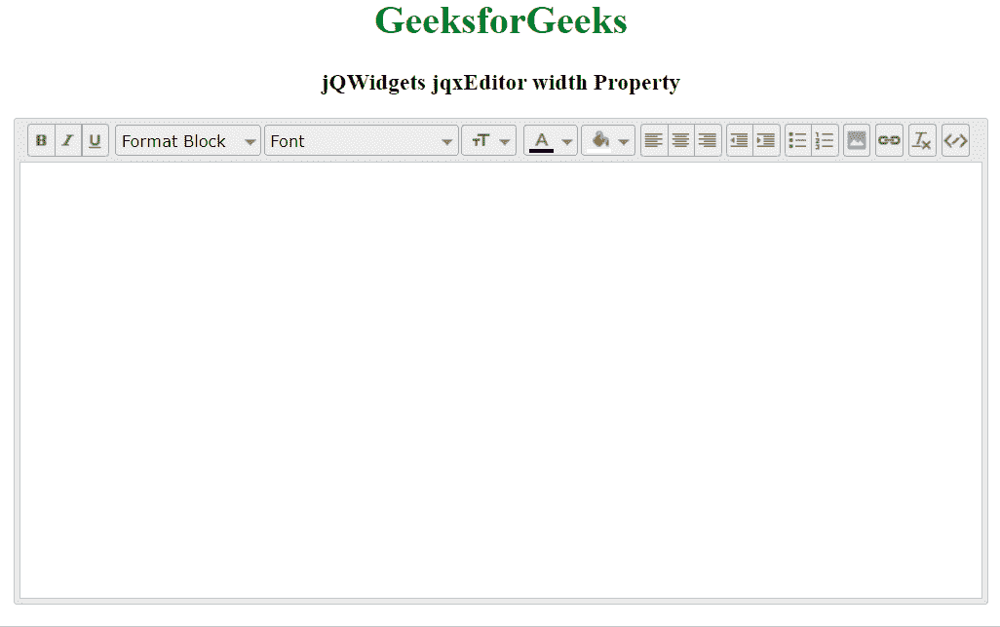

# jQWidgets jqxEditor 宽度属性

> 原文:[https://www . geesforgeks . org/jqwidgets-jqxeditor-width-property/](https://www.geeksforgeeks.org/jqwidgets-jqxeditor-width-property/)

**jQWidgets** 是一个 JavaScript 框架，用于为 PC 和移动设备制作基于 web 的应用程序。它是一个非常强大、优化、独立于平台并且得到广泛支持的框架。 **jqxEditor** 用于表示 jQuery HTML 文本编辑器，可用于简化网页内容创建，也可用于替代 HTML 文本区域。

**宽度** **属性**用于设置或返回宽度小部件。它接受数字类型值，默认值为 null。

**语法:**

设置*宽度*属性。

```
$('Selector').jqxEditor({ width : number});  
```

返回*宽度*属性。

```
var width = $('Selector').jqxEditor('width');
```

**链接文件:**从链接下载 [jQWidgets](https://www.jqwidgets.com/download/) 。在 HTML 文件中，找到下载文件夹中的脚本文件:

> <link rel="”stylesheet”" href="”jqwidgets/styles/jqx.base.css”" type="”text/css”">
> <脚本类型=【text/JavaScript】src =【scripts/jquery-1 . 11 . 1 . min . js】></脚本>
> <脚本类型=【text/JavaScript】src =【jqwidgets/jqxcore . js】></脚本>
> T21】脚本类型=【text/JavaScript】src =【jqwidgets/jqxbuttons。 >
> <脚本类型=“text/JavaScript”src =“jqwidgets/jqxeditor . js”></脚本>
> <脚本类型=“text/JavaScript”src =“jqwidgets/jqxtooltip . js”></脚本>
> <脚本类型=“text/JavaScript”src =“jqwidgets/jqxc

以下示例说明了 jQWidgets 中的 jqxEditor **宽度属性**:

**示例:**

## 超文本标记语言

```
<!DOCTYPE html>
<html lang="en">
<head>
    <link rel="stylesheet"
         href="jqwidgets/styles/jqx.base.css" 
         type="text/css" />
    <script type="text/javascript" 
            src="scripts/jquery-1.11.1.min.js">
      </script>
    <script type="text/javascript" 
            src="jqwidgets/jqxcore.js">
      </script>
    <script type="text/javascript" 
            src="jqwidgets/jqxbuttons.js">
      </script>
    <script type="text/javascript" 
            src="jqwidgets/jqxscrollbar.js">
      </script>
    <script type="text/javascript" 
            src="jqwidgets/jqxlistbox.js">
      </script>
    <script type="text/javascript" 
            src="jqwidgets/jqxdropdownlist.js">
      </script>
    <script type="text/javascript" 
            src="jqwidgets/jqxdropdownbutton.js">
      </script>
    <script type="text/javascript" 
            src="jqwidgets/jqxcolorpicker.js">
      </script>
    <script type="text/javascript" 
            src="jqwidgets/jqxwindow.js">
      </script>
    <script type="text/javascript" 
            src="jqwidgets/jqxeditor.js">
      </script>
    <script type="text/javascript" 
            src="jqwidgets/jqxtooltip.js">
      </script>
    <script type="text/javascript" 
            src="jqwidgets/jqxcheckbox.js">
      </script>
</head>

<body>
    <center>
        <h1 style="color: green;">
              GeeksforGeeks
          </h1>

        <h3>jQWidgets jqxEditor width Property</h3>

        <textarea id="editor">
        </textarea>
    </center>

    <script type="text/javascript">
        $(document).ready(function () {
            $('#editor').jqxEditor({
                height: "400px",
                width: '800px',
            });
        });
    </script>

</body>
</html>
```

**输出:**



**参考:**[https://www . jqwidgets . com/jquery-widgets-documentation/documentation/jqxeditor/jquery-editor-API . htm](https://www.jqwidgets.com/jquery-widgets-documentation/documentation/jqxeditor/jquery-editor-api.htm)