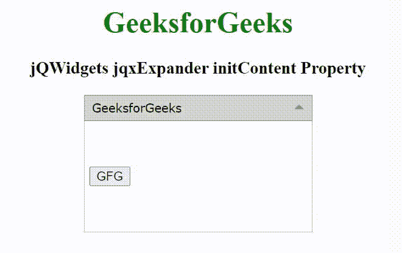

# jqwidgets jqxeexpander init content property

> 原文:[https://www . geesforgeks . org/jqwidgets-jqxexpander-init content-property/](https://www.geeksforgeeks.org/jqwidgets-jqxexpander-initcontent-property/)

**jQWidgets** 是一个 JavaScript 框架，用于为 PC 和移动设备制作基于 web 的应用程序。它是一个非常强大、优化、独立于平台并且得到广泛支持的框架。jqxExpander 表示一个 jQuery 小部件，显示标题和内容部分。单击标题部分展开或折叠内容。

***initContent*** **属性**用于设置或返回需要初始化项目内容时正在调用的回调函数。接受函数类型值，默认值为*空*。

**语法:**

设置 *initContent* 属性。

```html
$('selector').jqxExpander({ initContent: function });
```

返回 *initContent* 属性。

```html
var initContent = $('selector').jqxExpander('initContent');
```

**链接文件:**从给定链接下载 [jQWidgets](https://www.jqwidgets.com/download/) 。在 HTML 文件中，找到下载文件夹中的脚本文件。

> <link rel="”stylesheet”" href="”jqwidgets/styles/jqx.base.css”" type="”text/css”">
> < link rel= "样式表" href = " jqwidgets/style/jqx . energy blue . CSS " type = " text/CSS "/>
> <脚本类型= " text/JavaScript " src = " scripts/jquery-1 . 11 . 1 . min . js "></脚本>
> <脚本类型= " text/JavaScript " src = " jqwidgets/jqx-all

**示例:**以下示例说明了 jQWidgets jqxExpander*initContent*属性。

## 超文本标记语言

```html
<!DOCTYPE html>
<html lang="en">

<head>
    <link rel="stylesheet" href=
        "jqwidgets/styles/jqx.base.css" type="text/css" />
    <script type="text/javascript" 
        src="scripts/jquery-1.11.1.min.js"></script>
    <script type="text/javascript" 
        src="jqwidgets/jqx-all.js"></script>
    <script type="text/javascript" 
        src="jqwidgets/jqxcore.js"></script>
    <script type="text/javascript" 
        src="jqwidgets/jqxexpander.js"></script>
</head>

<body>
    <center>
        <h1 style="color: green;">
            GeeksforGeeks
        </h1>

        <h3>
            jQWidgets jqxExpander initContent Property
        </h3>

        <div id='jqxExp'>
            <div>GeeksforGeeks</div>

            <div style="text-align: justify;">
                <input type="button" id='jqxBtn' 
                    style="margin-top: 50px;" value="GFG" />
            </div>
        </div>
    </center>

    <script type="text/javascript">
        $(document).ready(function() {
            $("#jqxExp").jqxExpander({ 
                width: 250, 
                height: 150,
                initContent: function () {
                    $("#jqxButton").jqxButton({
                        width: 120,
                        height: 40
                    });
                }
            });
        });
    </script>
</body>

</html>
```

**输出:**



**参考:**[https://www . jqwidgets . com/jquery-widgets-documentation/documentation/jqxexpander/jquery-expander-API . htm](https://www.jqwidgets.com/jquery-widgets-documentation/documentation/jqxexpander/jquery-expander-api.htm)