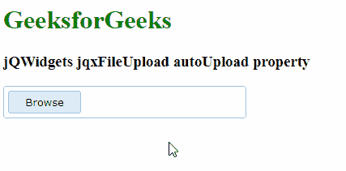

# jQWidgets jqxFileUpload 自动上传属性

> 原文:[https://www . geesforgeks . org/jqwidgets-jqxfileupload-auto upload-property/](https://www.geeksforgeeks.org/jqwidgets-jqxfileupload-autoupload-property/)

jQWidgets 是一个 JavaScript 框架，用于为 PC 和移动设备制作基于 web 的应用程序。它是一个非常强大和优化的框架，独立于平台，并得到广泛支持。jqxFileUpload 是一个小部件，可以用来选择文件并上传到服务器。

autoUpload 属性用于设置或返回文件在被选中时是否自动上传。它接受布尔类型值，默认值为 false。

**语法:**

设置自动上传属性。

```
$('Selector').jqxFileUpload({ autoUpload: boolean });
```

返回自动上传属性。

```
var autoUpload = $('Selector').jqxFileUpload('autoUpload ');
```

**链接文件:**从链接下载 https://www.jqwidgets.com/download/。在 HTML 文件中，找到下载文件夹中的脚本文件:

> <link type="”text/css”" rel="”Stylesheet”" href="”jqwidgets/styles/jqx.base.css”">
> <脚本类型=【文本/JavaScript】src =【脚本/jquery-1 . 11 . 1 . min . js】></脚本>
> <脚本类型=【文本/JavaScript】src =【jqwidgets/jqxcore . js】></脚本>
> <脚本类型=【文本/JavaScript】src =【jqwidgets/jqxbuttons . js

**示例:**以下示例说明了 jQWidgets 中的 jqxFileUpload 自动上传属性:

## 超文本标记语言

```
<!DOCTYPE html>
<html lang="en">

<head>
    <link type="text/css" rel="Stylesheet" 
        href="jqwidgets/styles/jqx.base.css" />
    <script type="text/javascript" 
        src="scripts/jquery-1.11.1.min.js"></script>
    <script type="text/javascript" 
        src="jqwidgets/jqxcore.js"></script>
    <script type="text/javascript" 
        src="jqwidgets/jqxbuttons.js"></script>
    <script type="text/javascript" 
        src="jqwidgets/jqxfileupload.js"></script>
</head>

<body>
    <h1 style="color: green">
        GeeksforGeeks
    </h1>

    <h3>jQWidgets jqxFileUpload autoUpload property</h3>

    <div id="gfg"></div>

    <script type="text/javascript">
        $(document).ready(function () {
            $('#gfg').jqxFileUpload({
                theme: 'energyblue',
                width: 300,
                uploadUrl: 'upload.php',
                fileInputName: 'fileInput',
                autoUpload: true
            });
        });
    </script>
</body>

</html>
```

**输出:**



**参考:**[https://www . jqwidgets . com/jquery-widgets-documentation/documentation/jqxfileupload/jquery-file-upload-入门. htm？搜索=](https://www.jqwidgets.com/jquery-widgets-documentation/documentation/jqxfileupload/jquery-file-upload-getting-started.htm?search=)