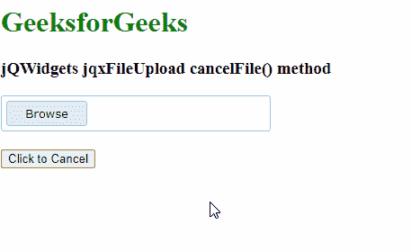

# jQWidgets jqxfileuploadcancelfile()方法

> 原文:[https://www . geesforgeks . org/jqwidgets-jqxfileupload-cancelfile-method/](https://www.geeksforgeeks.org/jqwidgets-jqxfileupload-cancelfile-method/)

**jQWidgets** 是一个 JavaScript 框架，用于为 PC 和移动设备制作基于 web 的应用程序。它是一个非常强大和优化的框架，独立于平台，并得到广泛支持。 **jqxFileUpload** 是一个小部件，可以用来选择文件并上传到服务器。它还支持自动上传和多文件上传。

**cancelFile()** 方法用于设置明确使用另一个按钮取消选定文件的按钮。它不接受任何参数，也不返回值。

**语法:**

```html
$('#jqxFileUpload').jqxFileUpload('cancelFile', 3);
```

@param int。表示预期的参数，即文件索引。

**链接文件:**从链接下载 [jQWidgets](https://www.jqwidgets.com/download/) 。在 HTML 文件中，找到下载文件夹中的脚本文件。

> <link type="”text/css”" rel="”Stylesheet”" href="”jqwidgets/styles/jqx.base.css”">
> <脚本类型=【文本/JavaScript】src =【脚本/jquery-1 . 11 . 1 . min . js】></脚本>
> <脚本类型=【文本/JavaScript】src =【jqwidgets/jqxcore . js】></脚本>
> <脚本类型=【文本/JavaScript】src =【jqwidgets/jqxbuttons . js

**示例:**下面的示例说明了 jQWidgets 中的 jqxFileUpload**cancelFile()**方法。

## 超文本标记语言

```html
<!DOCTYPE html>
<html lang="en">

<head>
    <link type="text/css" rel="Stylesheet" 
          href="jqwidgets/styles/jqx.base.css" />
    <script type="text/javascript" 
              src="scripts/jquery-1.11.1.min.js">
    </script>
    <script type="text/javascript" 
              src="jqwidgets/jqxcore.js">
    </script>
    <script type="text/javascript" 
            src="jqwidgets/jqxbuttons.js">
    </script>
    <script type="text/javascript" 
            src="jqwidgets/jqxfileupload.js">
    </script>

</head>

<body>
    <h1 style="color: green">
          GeeksforGeeks 
    </h1>
    <h3>jQWidgets jqxFileUpload cancelFile() method</h3>
    <div id="gfg"></div>
    <input style="margin-top: 20px;" type="button"
           id="jqxButton" value="Click to Cancel" />

    <script type="text/javascript">
        $(document).ready(function () {
            $('#gfg').jqxFileUpload({ 
                theme: 'energyblue',
                width: 300,
                uploadUrl: 'upload.php',
            });
            $('#jqxButton').on('click', function () {
                $('#gfg').jqxFileUpload('cancelFile',0);
            });
        });
    </script>
</body>

</html>
```

**输出:**



**参考**:[https://www . jqwidgets . com/jquery-widgets-documentation/documentation/jqxfileupload/jquery-file-upload-API . htm](https://www.jqwidgets.com/jquery-widgets-documentation/documentation/jqxfileupload/jquery-file-upload-api.htm)