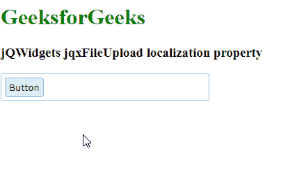

# jQWidgets jqxFileUpload 本地化属性

> 原文:[https://www . geesforgeks . org/jqwidgets-jqxfileupload-localization-property/](https://www.geeksforgeeks.org/jqwidgets-jqxfileupload-localization-property/)

**jQWidgets** 是一个 JavaScript 框架，用于为 PC 和移动设备制作基于 web 的应用程序。它是一个非常强大、优化、独立于平台并且得到广泛支持的框架。 **jqxFileUpload** 是一个小部件，可以用来选择文件并上传到服务器。

***本地化*** 属性用于设置小部件中使用的各种文本值。它接受对象类型值，默认值为 *null* 。

**语法:**

*   设置*本地化*属性。

    ```html
    $('Selector').jqxFileUpload({ localization : object });
    ```

*   返回*本地化*属性。

    ```html
    var localization = $('Selector').jqxFileUpload('localization');
    ```

**链接文件:** [从链接下载](https://www.jqwidgets.com/download/)。在 HTML 文件中，找到下载文件夹中的脚本文件。

> <link type="”text/css”" rel="”Stylesheet”" href="”jqwidgets/styles/jqx.base.css”">
> <脚本类型=【文本/JavaScript】src =【脚本/jquery-1 . 11 . 1 . min . js】></脚本>
> <脚本类型=【文本/JavaScript】src =【jqwidgets/jqxcore . js】></脚本>
> <脚本类型=【文本/JavaScript】src =【jqwidgets/jqxbuttons . js

**示例:**下面的示例说明了 jQWidgets 中的 **jqxFileUpload** *本地化*属性。

## 超文本标记语言

```html
<!DOCTYPE html>
<html lang="en">

<head>
    <link type="text/css" rel="Stylesheet" 
          href="jqwidgets/styles/jqx.base.css" />
    <script type="text/javascript" 
            src="scripts/jquery-1.11.1.min.js">
    </script>
    <script type="text/javascript" 
            src="jqwidgets/jqxcore.js">
    </script>
    <script type="text/javascript" 
            src="jqwidgets/jqxbuttons.js">
    </script>
    <script type="text/javascript" 
            src="jqwidgets/jqxfileupload.js">
    </script>
</head>

<body>
    <h1 style="color:green">
          GeeksforGeeks 
    </h1>

    <h3>jQWidgets jqxFileUpload localization property</h3>

    <div id="gfg"></div>

    <script type="text/javascript">
        $(document).ready(function () {
            $('#gfg').jqxFileUpload({ 
                theme: 'energyblue',
                width: 300,
                uploadUrl: 'upload.php',
                localization: {
                  browseButton: 'Button',
                  uploadButton: 'Upload',
                  cancelButton: 'Cancel'
                }
            });
        });
    </script>
</body>

</html>
```

**输出:**



**参考:**[https://www . jqwidgets . com/jquery-widgets-documentation/documentation/jqxfileupload/jquery-file-upload-API . htm](https://www.jqwidgets.com/jquery-widgets-documentation/documentation/jqxfileupload/jquery-file-upload-api.htm)