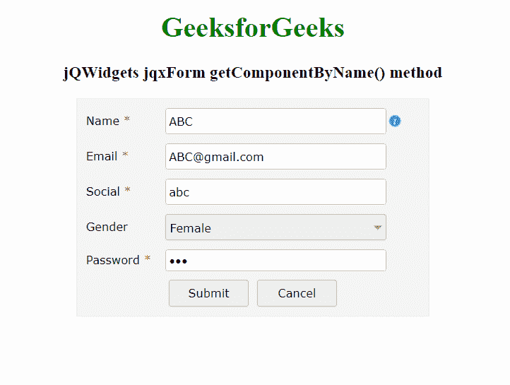

# jQWidgets jqxForm getComponentByName()方法

> 原文:[https://www . geesforgeks . org/jqwidgets-jqxform-getcomponentbyname-method/](https://www.geeksforgeeks.org/jqwidgets-jqxform-getcomponentbyname-method/)

**jQWidgets** 是一个 JavaScript 框架，用于为 PC 和移动设备制作基于 web 的应用程序。它是一个非常强大、优化、独立于平台并且得到广泛支持的框架。jqxForm 代表一个 jQuery 表单小部件，它包含文本字段、文本区域和密码字段等，帮助我们将数据存储在应用程序的后端。

**getComponentByName()** 方法是利用组件的名称获取组件信息。它不返回任何值，并将组件名称作为参数。

**语法:**

```
$('Selector').jqxForm(
    'getComponentByName', 'componentName');
```

**链接文件:**从链接下载 [jQWidgets](https://www.jqwidgets.com/download/) 。在 HTML 文件中，找到下载文件夹中的脚本文件。

> <link rel="”stylesheet”" href="”jqwidgets/styles/jqx.base.css”" type="”text/css”">
> <脚本类型=【text/JavaScript】src =【scripts/jquery-1 . 12 . 4 . min . js】></脚本>
> <脚本类型=【text/JavaScript】src =【jqwidgets/jqxcore . js】></脚本>
> <脚本类型=【text/JavaScript】src =【jqwidgets/jqx-1

下面的例子说明了 jQWidgets 中的 jqxForm**getComponentByName()**方法。

**示例:**

## 超文本标记语言

```
<!DOCTYPE html>
<html lang="en">

<head>
    <link rel="stylesheet" href=
          "jqwidgets/styles/jqx.base.css" type="text/css" />
    <script type="text/javascript" 
           src="scripts/jquery-1.12.4.min.js"></script>
    <script type="text/javascript" 
           src="jqwidgets/jqxcore.js"></script>
    <script type="text/javascript" 
           src="jqwidgets/jqx-all.js"></script>
    <script type="text/javascript" 
           src="jqwidgets/jqxbuttons.js"></script>
    <script type="text/javascript" 
           src="jqwidgets/jqxinput.js"></script>
    <script type="text/javascript" 
           src="jqwidgets/jqxlistbox.js"></script>
    <script type="text/javascript" 
            src="jqwidgets/jqxscrollbar.js"></script>
    <script type="text/javascript" 
            src="jqwidgets/jqxpanel.js"></script>
    <script type="text/javascript" 
            src="jqwidgets/jqxdropdownlist.js"></script>
    <script type="text/javascript" 
            src="jqwidgets/jqxform.js"></script>
    <script type="text/javascript" 
            src="scripts/demos.js"></script>
</head>

<body>
    <center>
        <h1 style="color: green;">
              GeeksforGeeks
          </h1>

        <h3>jQWidgets jqxForm getComponentByName() method</h3>
        <div id='Form' style="width: 400px; height: auto;"></div>  
    </center>

    <script type="text/javascript">
        $(document).ready(function () {

            var tp = [
                {
                    name: 'Name',
                    bind: 'Name',
                    type: 'text',
                    label: 'Name',
                    required: true,
                    labelWidth: '80px',
                    width: '250px',
                    info: 'Enter Name',
                    infoPosition: 'right'
                }, 
                {
                    bind: 'Email',
                    type: 'text',
                    label: 'Email',
                    required: true,
                    labelWidth: '80px',
                    width: '250px'
                },
                {
                    bind: 'Social',
                    type: 'text',
                    label: 'Social',
                    required: true,
                    labelWidth: '80px',
                    width: '250px'
                },
                {
                    bind: 'Gender',
                    type: 'option',
                    label: 'Gender',
                    required: false,
                    labelWidth: '80px',
                    width: '250px',
                    component: 'jqxDropDownList',
                    options: [
                        { value: 'Male' },
                        { value: 'Female'}
                    ]
                },
                {
                    bind: 'Password',
                    type: 'password',
                    label: 'Password',
                    required: true,
                    labelWidth: '80px',
                    width: '250px'
                },

                {
                    columns: [
                        {
                            type: 'button',
                            text: 'Submit',
                            width: '90px',
                            height: '30px',
                            rowHeight: '40px',
                            columnWidth: '50%',
                            align: 'right'
                        },
                        {
                            type: 'button',
                            text: 'Cancel',
                            width: '90px',
                            height: '30px',
                            rowHeight: '40px',
                            columnWidth: '50%'
                        }                
                    ]
                }
            ];
            var value = {
                Name: 'ABC',
                Email: 'ABC@gmail.com',
                Social: 'abc',
                Gender: 'Female',
                Password: 'abc',
            };    

            $('#Form').jqxForm({
                template: tp
            });

            $("#Form").jqxForm("val", value);

            var name = $('#Form').jqxForm(
                'getComponentByName', "Name");
            alert(name[0].value);
        });
    </script>
</body>
</html>
```

**输出:**



**参考:**[https://www . jqwidgets . com/jquery-widgets-documentation/documentation/jqxform/jquery-form-API . htm？搜索=](https://www.jqwidgets.com/jquery-widgets-documentation/documentation/jqxform/jquery-form-api.htm?search=)