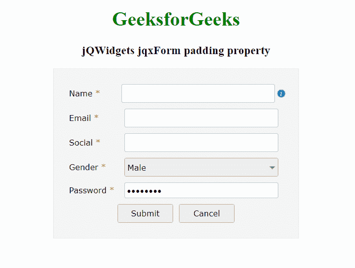

# jQWidgets jqxForm 填充属性

> 原文:[https://www . geeksforgeeks . org/jqwidgets-jqxform-padding-property/](https://www.geeksforgeeks.org/jqwidgets-jqxform-padding-property/)

**jQWidgets** 是一个 JavaScript 框架，用于为 PC 和移动设备制作基于 web 的应用程序。它是一个非常强大、优化、独立于平台且得到广泛支持的框架。jqxForm 代表一个 jQuery 表单小部件，它包含文本字段、文本区域和密码字段等，帮助我们将数据存储在应用程序的后端。

***【填充】*** 属性用于设置或返回填充属性，即可以设置表单的填充。它接受一个对象类型值，默认值为 *{左:5，上:5，右:5，下:5 }* 。

**语法:**

设置*填充*属性。

```html
$('Selector').jqxForm({ padding :  {
    left: 5, top: 5, right: 5, bottom: 5
} });  
```

返回*填充*属性。

```html
var stylesheets = $('Selector').jqxForm('padding');
```

**链接文件:**从链接下载 [jQWidgets](https://www.jqwidgets.com/download/) 。在 HTML 文件中，找到下载文件夹中的脚本文件。

> <link rel="”stylesheet”" href="”jqwidgets/styles/jqx.base.css”" type="”text/css”">
> <脚本类型=【text/JavaScript】src =【scripts/jquery-1 . 12 . 4 . min . js】></脚本>
> <脚本类型=【text/JavaScript】src =【jqwidgets/jqxcore . js】></脚本>
> <脚本类型=【text/JavaScript】src =【jqwidgets/jqxbuttons

下面的例子说明了 jQWidgets 中的 jqxForm *填充*属性。

**示例:**

## 超文本标记语言

```html
<!DOCTYPE html>
<html lang="en">

<head>
      <link rel="stylesheet" href=
          "jqwidgets/styles/jqx.base.css" type="text/css" />
      <script type="text/javascript" 
           src="scripts/jquery-1.12.4.min.js"></script>
    <script type="text/javascript" 
           src="jqwidgets/jqxcore.js"></script>
    <script type="text/javascript" 
           src="jqwidgets/jqxbuttons.js"></script>
    <script type="text/javascript" 
           src="jqwidgets/jqxinput.js"></script>
    <script type="text/javascript" 
           src="jqwidgets/jqxlistbox.js"></script>
    <script type="text/javascript" 
            src="jqwidgets/jqxscrollbar.js"></script>
    <script type="text/javascript" 
            src="jqwidgets/jqxpanel.js"></script>
    <script type="text/javascript" 
            src="jqwidgets/jqxdropdownlist.js"></script>
    <script type="text/javascript" 
            src="jqwidgets/jqxform.js"></script>
    <script type="text/javascript" 
            src="scripts/demos.js"></script>
</head>

<body>
    <center>
        <h1 style="color: green;">
              GeeksforGeeks
          </h1>

        <h3>jQWidgets jqxForm padding property</h3>
        <div id='Form' style="width: 400px; height: auto;"></div>  
    </center>

    <script type="text/javascript">
        $(document).ready(function () {

            var tp = [
                {
                    bind: 'Name',
                    type: 'text',
                    label: 'Name',
                    required: true,
                    labelWidth: '80px',
                    width: '250px',
                    info: 'Enter Name',
                    infoPosition: 'right'
                }, 
                {
                    bind: 'Email',
                    type: 'text',
                    label: 'Email',
                    required: true,
                    labelWidth: '80px',
                    width: '250px'
                },
                {
                    bind: 'Social',
                    type: 'text',
                    label: 'Social',
                    required: true,
                    labelWidth: '80px',
                    width: '250px'
                },
                {
                    bind: 'Gender',
                    type: 'option',
                    label: 'Gender',
                    required: true,
                    labelWidth: '80px',
                    width: '250px',
                    component: 'jqxDropDownList',
                    options: [
                        { value: 'Male' },
                        { value: 'Female'}
                    ]
                },
                {
                    bind: 'Password',
                    type: 'password',
                    label: 'Password',
                    required: true,
                    labelWidth: '80px',
                    width: '250px'
                },

                {
                    columns: [
                        {
                            type: 'button',
                            text: 'Submit',
                            width: '90px',
                            height: '30px',
                            rowHeight: '40px',
                            columnWidth: '50%',
                            align: 'right'
                        },
                        {
                            type: 'button',
                            text: 'Cancel',
                            width: '90px',
                            height: '30px',
                            rowHeight: '40px',
                            columnWidth: '50%'
                        }                
                    ]
                }
            ];

            $('#Form').jqxForm({
                template: tp,
                padding: { left: 20, top: 20, right: 20, bottom: 20 }
            });
        });

    </script>
</body>
</html>
```

**输出:**



**参考:**[**https://www . jqwidgets . com/jquery-widgets-documentation/documentation/jqxform/jquery-form-API . htm？搜索=**](https://www.jqwidgets.com/jquery-widgets-documentation/documentation/jqxform/jquery-form-api.htm?search=)