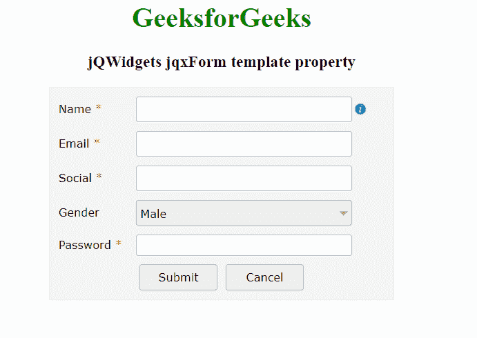

# jQWidgets jqxForm 模板属性

> 原文:[https://www . geesforgeks . org/jqwidgets-jqxform-template-property/](https://www.geeksforgeeks.org/jqwidgets-jqxform-template-property/)

**jQWidgets** 是一个 JavaScript 框架，用于为 PC 和移动设备制作基于 web 的应用程序。它是一个非常强大、优化、独立于平台并且得到广泛支持的框架。jqxForm 代表一个 jQuery 表单小部件，它包含文本字段、textArea 和密码字段等，帮助我们将数据存储在应用程序的后端。

*模板* 属性用于设置或返回*模板*属性，该属性用于设置定义 jqxForm 元素结构的基本模板。它接受一个对象，默认值是未定义的。

**其可能值如下。**

*   **绑定:**用于设置模板的成员名称。
*   **类型:**用于设置模板成员的类型。
*   **标签:**用于设置字段旁边显示的标签。
*   **标签宽度:**用于设置宽度，标签显示在字段旁边。
*   **必选:**用于设置字段是否可选。
*   **信息:**用于设置字段信息图标的工具提示。
*   **信息位置:**用于设置信息图标的位置。
*   **组件:**用于设置组件的类型。
*   **选项:**用于设置‘选项’类型的选项。
*   **init:** 用于设置‘自定义’类型初始化的回调函数。
*   **行高:**用于设置行高。
*   **宽度:**用于设置行的宽度。
*   **列:**用于设置行的列。
*   **对齐:**用于设置字段的对齐方式。
*   **valign:** 用于设置字段的垂直对齐。
*   **列宽:**用于设置列宽。

**语法:**

*   设置*模板*属性。

    ```
    $('Selector').jqxForm({ template :  object });
    ```

*   返回*模板*属性。

    ```
    var template = $('Selector').jqxForm('template');
    ```

**链接文件:**从链接下载 [jQWidgets](https://www.jqwidgets.com/download/) 。在 HTML 文件中，找到下载文件夹中的脚本文件。

> <link rel="”stylesheet”" href="”jqwidgets/styles/jqx.base.css”" type="”text/css”">
> <脚本类型=【text/JavaScript】src =【scripts/jquery-1 . 12 . 4 . min . js】></脚本>
> <脚本类型=【text/JavaScript】src =【jqwidgets/jqxcore . js】></脚本>
> <脚本类型=【text/JavaScript】src =【jqwidgets/jqxbuttons

**示例:**以下示例说明了 jQWidgets 中的 jqxForm *模板*属性。

## 超文本标记语言

```
<!DOCTYPE html>
<html lang="en">

<head>
      <link rel="stylesheet"
          href="jqwidgets/styles/jqx.base.css" 
          type="text/css" />
      <script type="text/javascript" 
            src="scripts/jquery-1.12.4.min.js">
    </script>
    <script type="text/javascript" 
            src="jqwidgets/jqxcore.js">
    </script>
    <script type="text/javascript" 
            src="jqwidgets/jqxbuttons.js">
    </script>
    <script type="text/javascript" 
            src="jqwidgets/jqxinput.js">
    </script>
    <script type="text/javascript" 
            src="jqwidgets/jqxlistbox.js">
    </script>
    <script type="text/javascript" 
            src="jqwidgets/jqxscrollbar.js">
    </script>
    <script type="text/javascript" 
            src="jqwidgets/jqxpanel.js">
    </script>
    <script type="text/javascript" 
            src="jqwidgets/jqxdropdownlist.js">
    </script>
    <script type="text/javascript" 
            src="jqwidgets/jqxform.js">
    </script>
    <script type="text/javascript" 
            src="scripts/demos.js">
    </script>
</head>

<body>
    <center>
        <h1 style="color: green;">
              GeeksforGeeks
          </h1>

        <h3>jQWidgets jqxForm template property</h3>
        <div id='Form' style="width: 400px; height: auto;"></div>  
    </center>

    <script type="text/javascript">
        $(document).ready(function () {
            var tp = [
                {
                    bind: 'Name',
                    type: 'text',
                    label: 'Name',
                    required: true,
                    labelWidth: '80px',
                    width: '250px',
                    info: 'Enter Name',
                    infoPosition: 'right'
                }, 
                {
                    bind: 'Email',
                    type: 'text',
                    label: 'Email',
                    required: true,
                    labelWidth: '80px',
                    width: '250px'
                },
                {
                    bind: 'Social',
                    type: 'text',
                    label: 'Social',
                    required: true,
                    labelWidth: '80px',
                    width: '250px'
                },
                {
                    bind: 'Gender',
                    type: 'option',
                    label: 'Gender',
                    required: false,
                    labelWidth: '80px',
                    width: '250px',
                    component: 'jqxDropDownList',
                    options: [
                        { value: 'Male' },
                        { value: 'Female'}
                    ]
                },
                {
                    bind: 'Password',
                    type: 'password',
                    label: 'Password',
                    required: true,
                    labelWidth: '80px',
                    width: '250px'
                },

                {
                    columns: [
                        {
                            type: 'button',
                            text: 'Submit',
                            width: '90px',
                            height: '30px',
                            rowHeight: '40px',
                            columnWidth: '50%',
                            align: 'right'
                        },
                        {
                            type: 'button',
                            text: 'Cancel',
                            width: '90px',
                            height: '30px',
                            rowHeight: '40px',
                            columnWidth: '50%'
                        }                
                    ]
                }
            ];

            $('#Form').jqxForm({
                template: tp
            });
        });
    </script>
</body>

</html>
```

**输出:**



**参考:**[https://www . jqwidgets . com/jquery-widgets-documentation/documentation/jqxform/jquery-form-API . htm？搜索=](https://www.jqwidgets.com/jquery-widgets-documentation/documentation/jqxform/jquery-form-api.htm?search=)