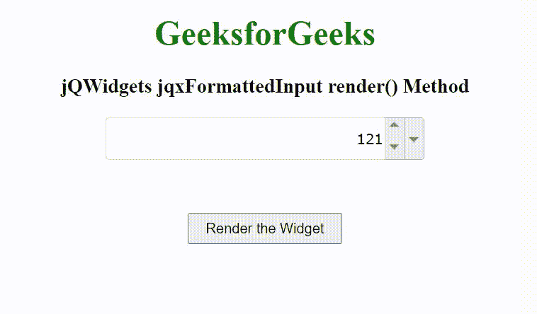

# jQWidgets jqxformatedinput render()方法

> 原文:[https://www . geesforgeks . org/jqwidgets-jqxformatedinput-render-method/](https://www.geeksforgeeks.org/jqwidgets-jqxformattedinput-render-method/)

**jQWidgets** 是一个 JavaScript 框架，用于为 PC 和移动设备制作基于 web 的应用程序。它是一个非常强大和优化的框架，独立于平台，并得到广泛支持。jqxFormattedInput 是一个 jQuery 输入小部件，用于输入二进制、八进制、十进制或十六进制格式的数字。可以通过可选的旋转按钮增加/减少输入数字，也可以通过可选的弹出菜单改变数字系统。

**渲染()方法**用于渲染 jqxFormattedInput 小部件。它不接受任何参数，也不返回值。

**语法:**

```html
$('Selector').jqxFormattedInput('render');
```

**链接文件:**从给定的链接 https://www.jqwidgets.com/download/.下载 jQWidgets 在 HTML 文件中，找到下载文件夹中的脚本文件。

> <link rel="”stylesheet”" href="”jqwidgets/styles/jqx.base.css”" type="”text/css”">
> <脚本类型= " text/JavaScript " src = " scripts/jquery-1 . 11 . 1 . min . js "></脚本类型>
> <脚本类型= " text/JavaScript " src = " jqwidgets/jqxcore . js "></脚本类型>
> <脚本类型= " text/JavaScript " src = " jqwidgets/jqxformatedinput。

下面的例子说明了 jQWidgets jqxformatedinput render()方法。

**示例:**

## 超文本标记语言

```html
<!DOCTYPE html>
<html lang="en">

<head>
    <link rel="stylesheet" href=
        "jqwidgets/styles/jqx.base.css" type="text/css" />
    <script type="text/javascript" 
        src="scripts/jquery-1.11.1.min.js"></script>
    <script type="text/javascript" 
        src="jqwidgets/jqxcore.js"></script>
    <script type="text/javascript" 
        src="jqwidgets/jqxformattedinput.js"></script>
</head>

<body>
    <center>
        <h1 style="color: green;">
            GeeksforGeeks
        </h1>

        <h3>
            jQWidgets jqxFormattedInput render() Method
        </h3>

        <div id="jqxFI">
            <input type="text" />
            <div></div>
            <div></div>
        </div>

        <input type="button" id="jqxBtn" 
            value="Render the Widget" 
            style="padding: 5px 15px; margin-top: 50px;">        
    </center>

    <script type="text/javascript">
        $(document).ready(function() {
            $("#jqxFI").jqxFormattedInput({
                width: 300,
                height: 40,
                radix: "decimal",
                value: "121",
                spinButtons: true,
                dropDown: true
            });

            $("#jqxBtn").on('click', function() {
                $("#jqxFI").jqxFormattedInput('render');
            })
        });
    </script>
</body>

</html>
```

**输出:**



**参考:**[https://www . jqwidgets . com/jquery-widgets-documentation/documentation/jqxformatedinput/jquery-formated-input-API . htm](https://www.jqwidgets.com/jquery-widgets-documentation/documentation/jqxformattedinput/jquery-formatted-input-api.htm)