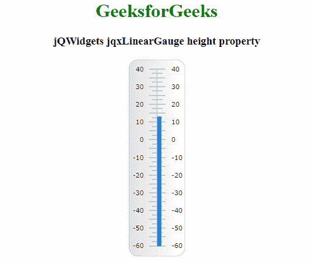

# jQWidgets jqxGauge 线规高度属性

> 原文:[https://www . geesforgeks . org/jqwidgets-jqxgauge-linear gauge-height-property/](https://www.geeksforgeeks.org/jqwidgets-jqxgauge-lineargauge-height-property/)

**jQWidgets** 是一个 JavaScript 框架，用于为 PC 和移动设备制作基于 web 的应用程序。它是一个非常强大、优化、独立于平台并且得到广泛支持的框架。 **jqxGauge** 代表一个 jQuery 量表小部件，它是一个数值范围内的指示器。我们可以使用仪表来显示数据区域中某个值范围内的某个值。有两种量规:径向量规和线性量规。在**线性仪表**中，数值由一些数值以垂直方式线性表示。

**高度属性**用于设置或返回高度属性，即用于设置或返回 jqxLinearGauge 的高度。该属性只接受*像素*和*百分比*的大小。它接受数字类型值，默认值为 300。

**语法:**

它用于设置高度属性。

```html
$('Selector').jqxLinearGauge({ height : number});
```

它用于返回高度属性。

```html
var height = $('Selector').jqxLinearGauge('height');
```

**链接文件:**从链接下载 [jQWidgets](https://www.jqwidgets.com/download/) 。在 HTML 文件中，找到下载文件夹中的脚本文件。

> <link rel="”stylesheet”" href="”jqwidgets/styles/jqx.base.css”" type="”text/css”">
> <脚本类型= " text/JavaScript " src = " scripts/jquery-1 . 11 . 1 . min . js "></脚本类型>
> <脚本类型= " text/JavaScript " src = " jqwidgets/jqxcore . js "></脚本类型>
> <脚本类型= " text/JavaScript " src = " jqwidgets/jqxchart . js

**示例:**以下示例说明了 jQWidgets 中的 jqxlineargage**高度**属性。

## 超文本标记语言

```html
<!DOCTYPE html>
<html lang="en">

<head>
    <link rel="stylesheet" href=
    "jqwidgets/styles/jqx.base.css" type="text/css" />
    <script type="text/javascript" 
        src="scripts/jquery-1.11.1.min.js"></script>
    <script type="text/javascript" 
        src="jqwidgets/jqxcore.js"></script>
    <script type="text/javascript" 
        src="jqwidgets/jqxchart.js"></script>
    <script type="text/javascript" 
        src="jqwidgets/jqxgauge.js"></script>
</head>

<body>
    <center>
        <h1 style="color: green">
            GeeksforGeeks
        </h1>

        <h3>jQWidgets jqxLinearGauge height property</h3>

        <div id="gauge"></div>
    </center>

    <script type="text/javascript">
        $(document).ready(function () {
            $("#gauge").jqxLinearGauge({
                height: 340,
                value: 13,
            });
        });
    </script>
</body>

</html>
```

**输出:**



**参考:**[https://www . jqwidgets . com/jquery-widgets-documentation/documentation/jqxgauge/jquery-gauge-API . htm？搜索=](https://www.jqwidgets.com/jquery-widgets-documentation/documentation/jqxgauge/jquery-gauge-api.htm?search=)