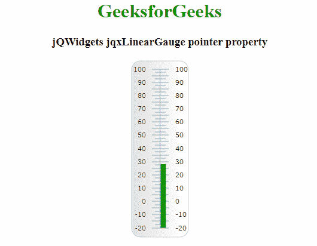

# jQWidgets jqxGauge 线规指针属性

> 原文:[https://www . geesforgeks . org/jqwidgets-jqxgauge-linear gauge-pointer-property/](https://www.geeksforgeeks.org/jqwidgets-jqxgauge-lineargauge-pointer-property/)

**jQWidgets** 是一个 JavaScript 框架，用于为 PC 和移动设备制作基于 web 的应用程序。它是一个非常强大、优化、独立于平台并且得到广泛支持的框架。jqxGauge 代表一个 jQuery gauge 小部件，它是一个值范围内的指示器。我们可以使用仪表来显示数据区域中一系列值中的一个值，有两种类型的仪表:径向仪表和线性仪表。在**线性仪表**中，数值由一些数值以垂直方式线性表示。

**指针**属性用于设置或返回指针属性。即，它用于设置或返回其指针的 jqxLinearGauge 属性。它接受对象类型值，默认值如下

```html
{ 
  pointerType: 'default', 
  style: 
     { 
       fill: 'theme-specific-color', 
       stroke: 'theme-specific-color'
      }, 
  size: '7%', visible: true, offset: 0
 }
```

**语法:**

*   设置*指针*属性。

    ```html
    $('Selector').jqxLinearGauge({ pointer : object });
    ```

*   返回*指针*属性。

    ```html
    var pointer = $('Selector').jqxLinearGauge('pointer');
    ```

**链接文件:**从链接下载 [jQWidgets](https://www.jqwidgets.com/download/) 。在 HTML 文件中，找到下载文件夹中的脚本文件。

> <link rel="”stylesheet”" href="”jqwidgets/styles/jqx.base.css”" type="”text/css”">
> <脚本类型= " text/JavaScript " src = " scripts/jquery-1 . 11 . 1 . min . js "></脚本类型>
> <脚本类型= " text/JavaScript " src = " jqwidgets/jqxcore . js "></脚本类型>
> <脚本类型= " text/JavaScript " src = " jqwidgets/jqxchart . js

**示例:**下面的示例说明了 jQWidgets 中的 jqxlineargage*指针*属性。

## 超文本标记语言

```html
<!DOCTYPE html>
<html lang="en">

<head>
    <link rel="stylesheet" href=
    "jqwidgets/styles/jqx.base.css" type="text/css" />
    <script type="text/javascript" 
        src="scripts/jquery-1.11.1.min.js"></script>
    <script type="text/javascript" 
        src="jqwidgets/jqxcore.js"></script>
    <script type="text/javascript" 
        src="jqwidgets/jqxchart.js"></script>
    <script type="text/javascript" 
        src="jqwidgets/jqxgauge.js"></script>
</head>

<body>
    <center>
        <h1 style="color: green;">
            GeeksforGeeks
        </h1>
        <h3>jQWidgets jqxLinearGauge pointer property</h3>
        <div id="gauge"></div>
    </center>

    <script type="text/javascript">
        $(document).ready(function () {
            $("#gauge").jqxLinearGauge({
                max: 100,
                min: -20,
                value: 28,
                pointer: {
                    pointerType: 'default',
                    style: {
                        fill: '#1bad0a'
                    },
                    length: '80%',
                    width: '2%',
                    size: '10%'
                }
            });
        });
    </script>
</body>

</html>
```

**输出:**



**参考:**[https://www . jqwidgets . com/jquery-widgets-documentation/documentation/jqxgauge/jquery-gauge-API . htm？搜索=](https://www.jqwidgets.com/jquery-widgets-documentation/documentation/jqxgauge/jquery-gauge-api.htm?search=)