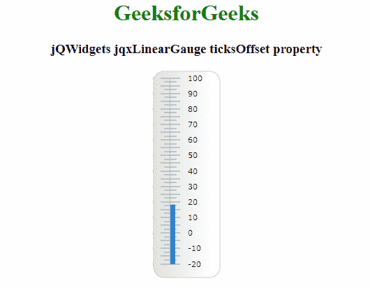

# jQWidgets jqxGauge linear gauge ticks offset 属性

> 原文:[https://www . geeksforgeeks . org/jqwidgets-jqxgauge-linear gauge-tick soffset-property/](https://www.geeksforgeeks.org/jqwidgets-jqxgauge-lineargauge-ticksoffset-property/)

**jQWidgets** 是一个 JavaScript 框架，用于为 PC 和移动设备制作基于 web 的应用程序。它是一个非常强大、优化、独立于平台并且得到广泛支持的框架。 **jqxGauge** 代表一个 jQuery 量表小部件，它是一个数值范围内的指示器。我们可以使用仪表来显示数据区域中一系列值中的一个值，有两种类型的仪表:径向仪表和线性仪表。**线性仪表**是一个仪表部件，可以水平或垂直表示&它的值由一些值以垂直方式线性表示。

**ticksOffset** 属性用于设置或返回 ticksOffset 属性。即该属性用于设置线性仪表的偏移量。它接受两个元素的数组类型值，其中数组的第一个元素是左偏移量，第二个元素是顶偏移量。默认值为['36% '，' 5%']。此属性可用于设置像素值或百分比值。

**语法:**

*   它用于设置 ticksOffset 属性。

```
$('Selector').jqxLinearGauge({ rangeSize: array });
```

*   它用于返回 ticksOffset 属性。

```
var ticksOffset = $('Selector').jqxLinearGauge('ticksOffset ');
```

**链接文件:**从链接下载 [jQWidgets](https://www.jqwidgets.com/download/Download) 。在 HTML 文件中，找到下载文件夹中的脚本文件。

> <link rel="”stylesheet”" href="”jqwidgets/styles/jqx.base.css”" type="”text/css”">
> <脚本类型= " text/JavaScript " src = " scripts/jquery-1 . 11 . 1 . min . js "></脚本类型>
> <脚本类型= " text/JavaScript " src = " jqwidgets/jqxcore . js "></脚本类型>
> <脚本类型= " text/JavaScript " src = " jqwidgets/jqxchart . js

**示例:**下面的示例说明了 jQWidgets 中的 jqxlineargage**ticks offset**属性。

## 超文本标记语言

```
<!DOCTYPE html>
<html lang="en">
  <head>
    <link rel="stylesheet"
            href="jqwidgets/styles/jqx.base.css"
            type="text/css"/>
    <script type="text/javascript" 
            src="scripts/jquery-1.11.1.min.js">
    </script>
    <script type="text/javascript" 
            src="jqwidgets/jqxcore.js">
    </script>
    <script type="text/javascript" 
            src="jqwidgets/jqxchart.js">
    </script>
    <script type="text/javascript" 
            src="jqwidgets/jqxgauge.js">
    </script>
  </head>

  <body>
    <center>
      <h1 style="color: green">GeeksforGeeks</h1>
      <h3>jQWidgets jqxLinearGauge ticksOffset property</h3>
      <div id="gauge"></div>
    </center>

    <script type="text/javascript">
      $(document).ready(function () {
        $("#gauge").jqxLinearGauge({
          max: 100,
          min: -20,
          value: 18,
          ticksOffset: [10, 10],
        });
      });
    </script>
  </body>
</html>
```

**输出:**



**参考:**[https://www . jqwidgets . com/jquery-widgets-documentation/documentation/jqxgauge/jquery-gauge-API . htm？搜索=](https://www.jqwidgets.com/jquery-widgets-documentation/documentation/jqxgauge/jquery-gauge-api.htm?search=)