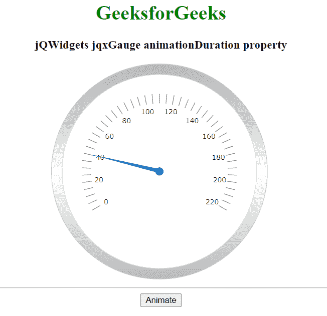

# jQWidgets jqxGauge RadialGauge animation duration 属性

> 原文:[https://www . geeksforgeeks . org/jqwidgets-jqxgauge-radial gage-animation duration-property/](https://www.geeksforgeeks.org/jqwidgets-jqxgauge-radialgauge-animationduration-property/)

**jQWidgets** 是一个 JavaScript 框架，用于为 PC 和移动设备制作基于 web 的应用程序。它是一个非常强大、优化、独立于平台并且得到广泛支持的框架。jqxGauge 代表一个 jQuery gauge 小部件，它是一个值范围内的指示器。我们可以使用仪表来显示数据区域中一系列值中的一个值，有两种类型的仪表:径向仪表和线性仪表。在**径向八进制**中，数值由一些数值以圆形方式径向表示。

*动画持续时间*属性用于设置或返回*动画持续时间*属性，即用于设置标尺值变化的动画持续时间。它接受数字类型值，默认值为 400。

**语法:**

*   设置*动画持续时间*属性。

    ```html
    $('Selector').jqxGauge({ animationDuration : number });  
    ```

*   返回*动画持续时间*属性。

    ```html
    var animationDuration = 
        $('Selector').jqxGauge('animationDuration');
    ```

**链接文件:**从链接下载 [jQWidgets](https://www.jqwidgets.com/download/) 。在 HTML 文件中，找到下载文件夹中的脚本文件。

> <link rel="”stylesheet”" href="”jqwidgets/styles/jqx.base.css”" type="”text/css”">
> <脚本类型= " text/JavaScript " src = " scripts/jquery-1 . 11 . 1 . min . js "></脚本类型>
> <脚本类型= " text/JavaScript " src = " jqwidgets/jqxcore . js "></脚本类型>
> <脚本类型= " text/JavaScript " src = " jqwidgets/jqxchart . js

**示例:**以下示例说明了 jQWidgets 中的 jqxGauge*animation duration*属性。

## 超文本标记语言

```html
<!DOCTYPE html>
<html lang="en">

<head>
    <link rel="stylesheet"
          href="jqwidgets/styles/jqx.base.css" 
          type="text/css" />
    <script type="text/javascript" 
            src="scripts/jquery-1.11.1.min.js">
    </script>
    <script type="text/javascript" 
            src="jqwidgets/jqxcore.js">
    </script>
    <script type="text/javascript" 
            src="jqwidgets/jqxbuttons.js">
    </script>
</head>

<body>
    <center>
        <h1 style="color: green;">
          GeeksforGeeks
        </h1>

        <h3>jQWidgets jqxGauge animationDuration property</h3>

        <div id="gauge"></div>
        <hr>
        <button id = 'btn'>Animate</button>
    </center>

    <script type="text/javascript">
        $(document).ready(function () {
            $("#gauge").jqxGauge({   
                value: 40,
                animationDuration: 1200
            });

            $("#btn").click(function () {
                $('#gauge').jqxGauge({
                    value: 150
                });
            });
        });
    </script>
</body>

</html>
```

**输出:**



**参考:**[https://www . jqwidgets . com/jquery-widgets-documentation/documentation/jqxgauge/jquery-gauge-API . htm？搜索=](https://www.jqwidgets.com/jquery-widgets-documentation/documentation/jqxgauge/jquery-gauge-api.htm?search=)