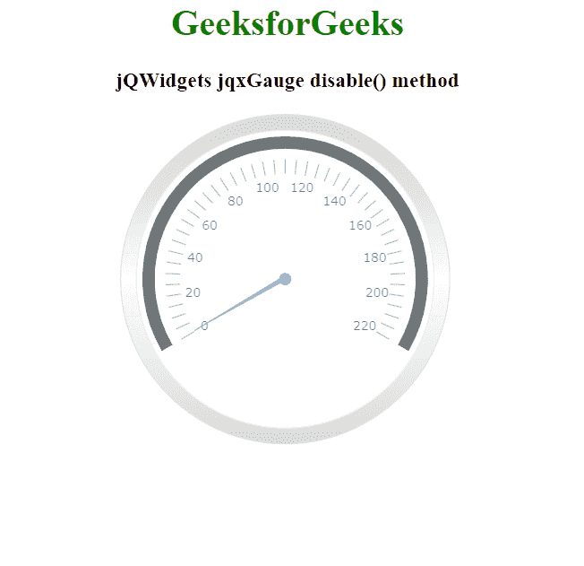

# jQWidgets jqxGauge RadialGauge disable()方法

> 原文:[https://www . geesforgeks . org/jqwidgets-jqxgauge-radial gage-disable-method/](https://www.geeksforgeeks.org/jqwidgets-jqxgauge-radialgauge-disable-method/)

**jQWidgets** 是一个 JavaScript 框架，用于为 PC 和移动设备制作基于 web 的应用程序。它是一个非常强大和优化的框架，独立于平台，并得到广泛支持。 **jqxGauge** 代表一个 jQuery 量表小部件，它是一个范围值内的指标。我们可以使用仪表来显示数据区域中一系列值中的一个值，有两种类型的仪表:径向仪表和线性仪表。在**径向八进制**中，数值由一些数值以圆形方式径向表示。

**禁用()** **方法**用于禁用 jqxGauge 元素。它不接受任何参数，也不返回值。

**语法:**

```html
$('Selector').jqxGauge('disable');
```

**链接文件:**从链接下载 [jQWidgets](https://www.jqwidgets.com/download/) 。在 HTML 文件中，找到下载文件夹中的脚本文件:

> <link rel="”stylesheet”" href="”jqwidgets/styles/jqx.base.css”" type="”text/css”">
> <脚本类型= " text/JavaScript " src = " scripts/jquery-1 . 11 . 1 . min . js "></脚本类型>
> <脚本类型= " text/JavaScript " src = " jqwidgets/jqxcore . js "></脚本类型>
> <脚本类型= " text/JavaScript " src = " jqwidgets/jqxchart . js

下面的例子说明了 jQWidgets 中的 jqxGauge **disable()方法**:

**例**:

## 超文本标记语言

```html
<!DOCTYPE html>
<html lang="en">

<head>
    <link rel="stylesheet"
          href="jqwidgets/styles/jqx.base.css" 
          type="text/css" />
    <script type="text/javascript"
            src="scripts/jquery-1.11.1.min.js">
    </script>
    <script type="text/javascript" 
            src="jqwidgets/jqxcore.js">
    </script>
    <script type="text/javascript"
            src="jqwidgets/jqxchart.js">
    </script>
    <script type="text/javascript"
            src="jqwidgets/jqxgauge.js">
    </script>
</head>

<body>
    <center>
        <h1 style="color: green;">
            GeeksforGeeks
        </h1>

        <h3>jQWidgets jqxGauge disable() method</h3>

        <div id="gauge"></div>
    </center>

    <script type="text/javascript">
        $(document).ready(function () {
            $("#gauge").jqxGauge(
                {
                    ranges:
                        [
                            { startValue: 0, endValue: 220 },
                        ],
                    width: 300
                });

            $("#gauge").jqxGauge('disable');
        });
    </script>
</body>

</html>
```

**输出:**



**参考:**[https://www . jqwidgets . com/jquery-widgets-documentation/documentation/jqxgauge/jquery-gauge-API . htm](https://www.jqwidgets.com/jquery-widgets-documentation/documentation/jqxgauge/jquery-gauge-api.htm)