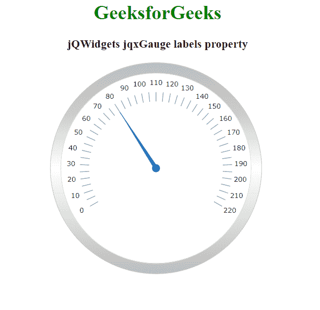

# jQWidgets jqxGauge RadialGauge 标签属性

> 原文:[https://www . geesforgeks . org/jqwidgets-jqxgauge-radial gage-labels-property/](https://www.geeksforgeeks.org/jqwidgets-jqxgauge-radialgauge-labels-property/)

**jQWidgets** 是一个 JavaScript 框架，用于为 PC 和移动设备制作基于 web 的应用程序。它是一个非常强大和优化的框架，独立于平台，并得到广泛支持。jqxGauge 代表一个 jQuery gauge 小部件，它是一个值范围内的指示器。我们可以使用仪表来显示数据区域中一系列值中的一个值，有两种类型的仪表:径向仪表和线性仪表。在**径向八进制**中，数值由一些数值以圆形方式径向表示。

**labels 属性**用于设置或返回 labels 属性，即用于设置 jqxGauge 的标签的属性，它接受一个对象，默认值为 *{ distance: '38% '，position: 'none '，interval: 20，offset: [0，-10]，visible: true，format value:function(value){ return；}}.*

**语法:**

设置标签属性。

```
$('Selector').jqxGauge({ labels : object });  
```

返回标签属性。

```
var labels = $('Selector').jqxGauge('labels');
```

**链接文件:**从 https://www.jqwidgets.com/download/链接下载 jQWidgets。在 HTML 文件中，找到下载文件夹中的脚本文件:

> <link rel="”stylesheet”" href="”jqwidgets/styles/jqx.base.css”" type="”text/css”">
> <脚本类型= " text/JavaScript " src = " scripts/jquery-1 . 11 . 1 . min . js "></脚本类型>
> <脚本类型= " text/JavaScript " src = " jqwidgets/jqxcore . js "></脚本类型>
> <脚本类型= " text/JavaScript " src = " jqwidgets/jqxchart . js

以下示例说明了 jQWidgets 中的 jqxGauge 标签属性:

**示例:**

## 超文本标记语言

```
<!DOCTYPE html>
<html lang="en">

<head>
  <link rel="stylesheet" href=
         "jqwidgets/styles/jqx.base.css" type="text/css" />
  <script type="text/javascript" 
          src="scripts/jquery-1.11.1.min.js"></script>
  <script type="text/javascript" 
          src="jqwidgets/jqxcore.js"></script>
  <script type="text/javascript" 
          src="jqwidgets/jqxchart.js"></script>
  <script type="text/javascript" 
          src="jqwidgets/jqxgauge.js"></script>
</head>

<body>
    <center>
        <h1 style="color: green;">
          GeeksforGeeks
        </h1>

        <h3>jQWidgets jqxGauge labels property</h3>

        <div id="gauge"></div>
    </center>

    <script type="text/javascript">
        $(document).ready(function () {
            $("#gauge").jqxGauge({   
                value: 80
            });

            $('#gauge').jqxGauge({ labels: { 
                  position: 'outside', 
                  interval: 10, 
                 offset: [0, -10]}
            });
        });
    </script>
</body>
</html>
```

**输出:**



**参考:**[**https://www . jqwidgets . com/jquery-widgets-documentation/documentation/jqxgauge/jquery-gauge-API . htm？搜索=**](https://www.jqwidgets.com/jquery-widgets-documentation/documentation/jqxgauge/jquery-gauge-api.htm?search=)