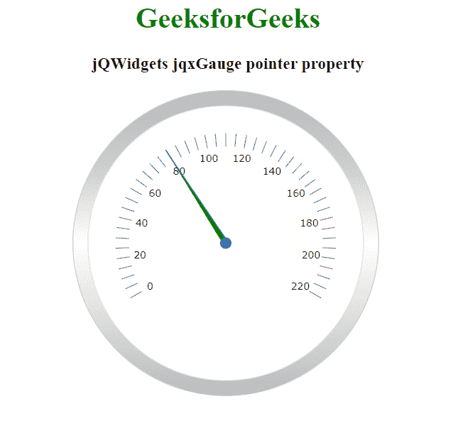

# jQWidgets jqxGauge RadialGauge 指针属性

> 原文:[https://www . geesforgeks . org/jqwidgets-jqxgauge-radialgauge-pointer-property/](https://www.geeksforgeeks.org/jqwidgets-jqxgauge-radialgauge-pointer-property/)

**jQWidgets** 是一个 JavaScript 框架，用于为 PC 和移动设备制作基于 web 的应用程序。它是一个非常强大和优化的框架，独立于平台，并得到广泛支持。jqxGauge 代表一个 jQuery gauge 小部件，它是一个值范围内的指示器。我们可以使用仪表来显示数据区域中一系列值中的一个值，有两种类型的仪表:径向仪表和线性仪表。在**径向八进制**中，数值由一些数值以圆形方式径向表示。

**指针属性**用于设置或返回指针属性，即用于设置 jqxGauge 元素的指针属性，它接受一个对象值，默认值为 *{ pointerType: 'default '，样式:{ fill: 'theme-specific-color '，描边:' theme-specific-color' }，长度:' 70% '，宽度:' 2% '，可见:true }。*

**语法:**

*   设置指针属性。

    ```html
    $('Selector').jqxGauge({ pointer: object });  
    ```

*   返回指针属性。

    ```html
    var pointer = $('Selector').jqxGauge('pointer');
    ```

**链接文件:**从 https://www.jqwidgets.com/download/链接下载 jQWidgets。在 HTML 文件中，找到下载文件夹中的脚本文件:

> <link rel="”stylesheet”" href="”jqwidgets/styles/jqx.base.css”" type="”text/css”">
> <脚本类型= " text/JavaScript " src = " scripts/jquery-1 . 11 . 1 . min . js "></脚本类型>
> <脚本类型= " text/JavaScript " src = " jqwidgets/jqxcore . js "></脚本类型>
> <脚本类型= " text/JavaScript " src = " jqwidgets/jqxchart . js

以下示例说明了 jQWidgets 中的 jqxGauge 指针属性:

**示例:**

## 超文本标记语言

```html
<!DOCTYPE html>
<html lang="en">

<head>
  <link rel="stylesheet" 
        href="jqwidgets/styles/jqx.base.css" 
        type="text/css" />
  <script type="text/javascript" 
          src="scripts/jquery-1.11.1.min.js">
  </script>
  <script type="text/javascript" 
          src="jqwidgets/jqxcore.js">
  </script>
  <script type="text/javascript" 
          src="jqwidgets/jqxchart.js">
  </script>
  <script type="text/javascript" 
          src="jqwidgets/jqxgauge.js">
  </script>
</head>

<body>
    <center>
        <h1 style="color: green;">
          GeeksforGeeks
        </h1>

        <h3>jQWidgets jqxGauge pointer property</h3>

        <div id="gauge"></div>
    </center>

    <script type="text/javascript">
        $(document).ready(function () {
            $("#gauge").jqxGauge({   
                value: 80,
                pointer: { 
                    pointerType: 'default', 
                    style: { 
                        fill: 'green', 
                        stroke: 'blue' 
                    }, 
                    length: '80%', 
                    width: '2%' 
                }
            });
        });
    </script>
</body>

</html>
```

**输出:**



**参考:**[**https://www . jqwidgets . com/jquery-widgets-documentation/documentation/jqxgauge/jquery-gauge-API . htm？搜索=**](https://www.jqwidgets.com/jquery-widgets-documentation/documentation/jqxgauge/jquery-gauge-api.htm?search=)