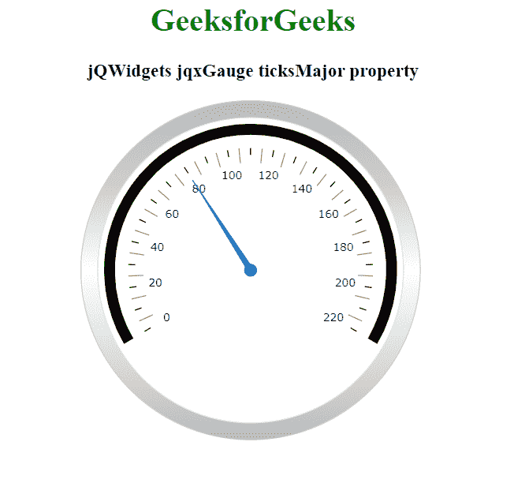

# jQWidgets jqxGauge RadialGauge ticks 主要属性

> 原文:[https://www . geesforgeks . org/jqwidgets-jqxgauge-radialgauge-ticksmajor-property/](https://www.geeksforgeeks.org/jqwidgets-jqxgauge-radialgauge-ticksmajor-property/)

**jQWidgets** 是一个 JavaScript 框架，用于为 PC 和移动设备制作基于 web 的应用程序。它是一个非常强大和优化的框架，独立于平台，并得到广泛支持。 **jqxGauge** 代表一个 jQuery 量表小部件，它是一个范围值内的指标。我们可以使用仪表来显示数据区域中一系列值中的一个值，有两种类型的仪表:径向仪表和线性仪表。在**径向八进制**中，数值由一些数值以圆形方式径向表示。

**ticksMajor 属性**用于设置或返回 ticksMajor 属性，即用于设置或获取 jqxGauge 元素主要刻度的属性。它接受一个对象值，默认值为 *{ size: '10% '，间隔:5，样式:{ stroke: '#898989'}，可见:true }*

**语法:**

*   设置 *ticksMajor* 属性。

    ```html
    $('Selector').jqxGauge({ ticksMajor: object });  
    ```

*   返回 *ticksMajor* 属性。

    ```html
    var ticksMajor = $('Selector').jqxGauge('ticksMajor');
    ```

**链接文件:**从链接下载 [jQWidgets](https://www.jqwidgets.com/download/) 。在 HTML 文件中，找到下载文件夹中的脚本文件:

> <link rel="”stylesheet”" href="”jqwidgets/styles/jqx.base.css”" type="”text/css”">
> <脚本类型= " text/JavaScript " src = " scripts/jquery-1 . 11 . 1 . min . js "></脚本类型>
> <脚本类型= " text/JavaScript " src = " jqwidgets/jqxcore . js "></脚本类型>
> <脚本类型= " text/JavaScript " src = " jqwidgets/jqxchart . js

以下示例说明了 jQWidgets 中的 jqxGauge **ticksMajor 属性**:

**示例:**

## 超文本标记语言

```html
<!DOCTYPE html>
<html lang="en">

<head>
    <link rel="stylesheet" 
          href="jqwidgets/styles/jqx.base.css"
          type="text/css" />
    <script type="text/javascript" 
            src="scripts/jquery-1.11.1.min.js">
    </script>
    <script type="text/javascript" 
            src="jqwidgets/jqxcore.js">
    </script>
    <script type="text/javascript" 
            src="jqwidgets/jqxchart.js">
    </script>
    <script type="text/javascript" 
            src="jqwidgets/jqxgauge.js">
    </script>
</head>

<body>
    <center>
        <h1 style="color: green;">
            GeeksforGeeks
        </h1>

        <h3>jQWidgets jqxGauge ticksMajor property</h3>

        <div id="gauge"></div>
    </center>
    <script type="text/javascript">
        $(document).ready(function () {
            $("#gauge").jqxGauge({
                ranges: [{ 
                    startValue: 0, 
                    endValue: 220 },
                ],
                value: 80,
            });

            $('#gauge').jqxGauge({
                ticksMajor: { 
                    size: '7px', 
                    interval: 10,
                    style: { stroke: 'black' } 
                }
            });
        });
    </script>
</body>

</html>
```

**输出:**



**参考:**[https://www . jqwidgets . com/jquery-widgets-documentation/documentation/jqxgauge/jquery-gauge-API . htm](https://www.jqwidgets.com/jquery-widgets-documentation/documentation/jqxgauge/jquery-gauge-api.htm)