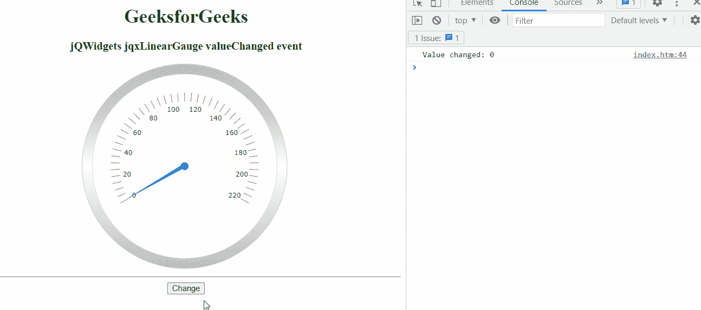

# jQWidgets jqxGauge RadialGauge 值更改事件

> 原文:[https://www . geesforgeks . org/jqwidgets-jqxgauge-radial gage-value changed-event/](https://www.geeksforgeeks.org/jqwidgets-jqxgauge-radialgauge-valuechanged-event/)

**jQWidgets** 是一个 JavaScript 框架，用于为 PC 和移动设备制作基于 web 的应用程序。它是一个非常强大、优化、独立于平台且得到广泛支持的框架。 **jqxGauge** 代表一个 jQuery 量表小部件，它是一个范围值内的指标。我们可以使用仪表来显示数据区域中一系列值中的一个值，有两种类型的仪表:径向仪表和线性仪表。在 RadialGauge 中，值由一些值以圆形方式径向表示。

当仪表值改变时，触发**值改变**事件。

**语法:**

```
$('#jqxGauge').bind('valueChanged', function (e) {
    // Code 
});
```

**链接文件:**下载 [jQWidgets](https://www.jqwidgets.com/download/) 。在 HTML 文件中，找到下载文件夹中的脚本文件。

> <link rel="”stylesheet”" href="”jqwidgets/styles/jqx.base.css”" type="”text/css”">
> <脚本类型= " text/JavaScript " src = " scripts/jquery-1 . 11 . 1 . min . js "></脚本类型>
> <脚本类型= " text/JavaScript " src = " jqwidgets/jqxcore . js "></脚本类型>
> <脚本类型= " text/JavaScript " src = " jqwidgets/jqxchart . js

**示例:**以下示例说明了 jQWidgets 中的 jqxRadialGauge **值已更改**事件

## 超文本标记语言

```
<!DOCTYPE html>
<html lang="en">

<head>
    <link rel="stylesheet" href=
    "jqwidgets/styles/jqx.base.css" type="text/css" />
    <script type="text/javascript" 
        src="scripts/jquery-1.11.1.min.js"></script>
    <script type="text/javascript" 
        src="jqwidgets/jqxcore.js"></script>
    <script type="text/javascript" 
        src="jqwidgets/jqxchart.js"></script>
    <script type="text/javascript" 
        src="jqwidgets/jqxgauge.js"></script>
</head>

<body>
    <center>
        <h1 style="color: green;">
            GeeksforGeeks
        </h1>

        <h3>jQWidgets RadialGauge valueChanged event</h3>

        <div id="gauge"></div>
        <hr>
        <button id='btn'>Change</button>
    </center>

    <script type="text/javascript">
        $(document).ready(function () {
            $("#gauge").jqxGauge({
                value: 0,
            });
        });

        $("#btn").click(function () {
            $('#gauge').jqxGauge({
                value: 30
            });
        });

        $('#gauge').bind('valueChanged', function (e) {
            console.log('Value changed: ' + e.args.value);
        });
    </script>
</body>

</html>
```

**输出:**



**参考:**[https://www . jqwidgets . com/jquery-widgets-documentation/documentation/jqxgauge/jquery-gauge-API . htm？搜索=](https://www.jqwidgets.com/jquery-widgets-documentation/documentation/jqxgauge/jquery-gauge-api.htm?search=)