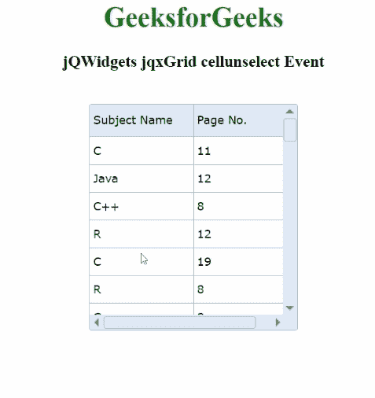

# jQWidgets jqxGrid 单元格取消选择事件

> 原文:[https://www . geesforgeks . org/jqwidgets-jqxgrid-cellunselect-event/](https://www.geeksforgeeks.org/jqwidgets-jqxgrid-cellunselect-event/)

**jQWidgets** 是一个 JavaScript 框架，用于为 PC 和移动设备制作基于 web 的应用程序。它是一个非常强大、优化、独立于平台并且得到广泛支持的框架。 **jqxGrid** 用于说明以表格形式显示数据的 jQuery 小部件。此外，它完全支持与数据的连接，以及分页、分组、排序、过滤和编辑。

只要未选择显示的 **jqxGrid** 的单元格，就会激活**单元格取消选择**事件。

**语法:**

```
$("#Selector").on('cellunselect', function (event) {

   // Arguments of the event
   var args = event.args;

   // Text of the column
   var column = $("#Selector").jqxGrid(
      'getcolumn', event.args.datafield).text;

   // Data field of the column
   var dataField = event.args.datafield;

   // Bound index of the row
   var rowBoundIndex = event.args.rowindex;

   // Value of the cell
   var value = args.value;
});
```

**链接文件:**从给定链接下载 [jQWidgets](https://www.jqwidgets.com/download/) 。在 HTML 文件中，找到下载文件夹中的脚本文件。

> <link rel="”stylesheet”" href="”jqwidgets/styles/jqx.base.css”" type="”text/css”">
> <脚本类型=【text/JavaScript】src =【scripts/jquery-1 . 11 . 1 . min . js】></脚本>
> <脚本类型=【text/JavaScript】src =【jqwidgets/jqxcore . js】></脚本>
> <脚本类型=【text/JavaScript】src =【jqwidgets/jqxdata

**示例:**以下示例说明了 jQWidgets 中的 jqxGrid **cellunselect** 事件。

## 超文本标记语言

```
<!DOCTYPE html>
<html lang="en">

<head>
    <link rel="stylesheet" href=
        "jqwidgets/styles/jqx.base.css" type="text/css" />
    <script type="text/javascript" 
        src="scripts/jquery-1.11.1.min.js"></script>
    <script type="text/javascript" 
        src="jqwidgets/jqxcore.js"></script>
    <script type="text/javascript" 
        src="jqwidgets/jqxdata.js"></script>
    <script type="text/javascript" 
        src="jqwidgets/jqxbuttons.js"></script>
    <script type="text/javascript" 
        src="jqwidgets/jqxscrollbar.js"></script>
    <script type="text/javascript" 
        src="jqwidgets/jqxmenu.js"></script>
    <script type="text/javascript" 
        src="jqwidgets/jqxgrid.js"></script>
    <script type="text/javascript" 
        src="jqwidgets/jqxgrid.selection.js"></script>
</head>

<body>
    <center>
        <h1 style="color:green">
            GeeksforGeeks
        </h1>

        <h3>jQWidgets jqxGrid cellunselect Event
        </h3>
        <br/>

        <div id="jqxg"></div>
        <br/>

        <div id="log"></div>
    </center>

    <script type="text/javascript">
        $(document).ready(function () {
            var d = new Array();
            var subjectNames =
                ["C++", "Scala", "Java", "C", "R", "JavaScript"];

            var pageNumber =
                ["7", "8", "12", "11", "10", "19"];

            for (var j = 0; j < 50; j++) {
                var r = {};
                r["subjectnames"] =
                    subjectNames[Math.floor(
                        Math.random() * subjectNames.length)
                    ];

                r["pagenumber"] =
                    pageNumber[Math.floor(
                        Math.random() * pageNumber.length)
                    ];
                d[j] = r;

            }
            var src = {
                localdata: d,
                datatype: "array",
            };
            var data_Adapter = new $.jqx.dataAdapter(src);
            $("#jqxg").jqxGrid({
                source: data_Adapter,
                selectionmode: 'singlecell',
                theme: 'energyblue',
                height: "260px",
                width: "240px",
                columns: [
                    {
                        text: "Subject Name",
                        datafield: "subjectnames",
                        width: "120px",
                    },
                    {
                        text: "Page No.",
                        datafield: "pagenumber",
                        width: "120px",
                    },
                ],
            });

            $("#jqxg").on("cellunselect", function (event) {
                $('#log').html(
                    "Unselected cell's row index: " 
                      + event.args.rowindex
                );
            });
        });
    </script>
</body>

</html>
```

**输出:**



**参考:**[https://www . jqwidgets . com/jquery-widgets-documentation/documentation/jqxgrid/jquery-grid-API . htm？搜索=](https://www.jqwidgets.com/jquery-widgets-documentation/documentation/jqxgrid/jquery-grid-api.htm?search=)