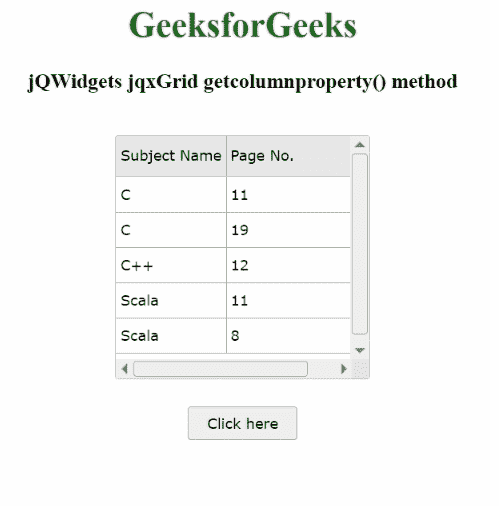

# jQWidgets jqxGrid get column property()方法

> 原文:[https://www . geesforgeks . org/jqwidgets-jqxgrid-getcolumn property-method/](https://www.geeksforgeeks.org/jqwidgets-jqxgrid-getcolumnproperty-method/)

**jQWidgets** 是一个 JavaScript 框架，用于为 PC 和移动设备制作基于 web 的应用程序。它是一个非常强大、优化、独立于平台并且得到广泛支持的框架。 **jqxGrid** 用于说明以表格形式显示数据的 jQuery 小部件。此外，它完全支持与数据的连接，以及分页、分组、排序、过滤和编辑。

getcolumnproperty()方法用于返回指定列的属性。它有两个参数，即字符串类型的数据字段和字符串类型的属性名称。它返回一个对象。

**语法:**

```html
var value = $('#Selector').jqxGrid(
    'getcolumnproperty', 'firstname', 'width');
```

可能的属性如下:

*   **文字:**是列的规定名称。
*   **隐藏:**表示指定列是否隐藏。
*   **隐藏:**表示指定的列是否可以隐藏。
*   **渲染器:**渲染指定的列。
*   **细胞渲染程序:**渲染细胞。
*   **对齐:**定义列的对齐方式。
*   **细胞标志:**它定义了细胞的排列。
*   **单元格格式:**定义单元格的格式。
*   **被固定:**表示一列是否被固定。
*   **contenttype:** 定义指定列的内容类型。
*   **可调整大小:**表示列是否可调整大小。
*   **可过滤:**表示该列是否可过滤。
*   **可编辑:**表示该列是否可编辑。
*   **cellclassname:** 定义指定单元格的类的名称。
*   **类名:**定义类名。
*   **宽度:**定义指定列的宽度。
*   **最小宽度:**定义指定列的最小宽度。
*   **最大宽度:**定义指定列的最大宽度。

**链接文件:**从给定链接下载 [jQWidgets](https://www.jqwidgets.com/download/) 。在 HTML 文件中，找到下载文件夹中的脚本文件。

> <link rel="”stylesheet”" href="”jqwidgets/styles/jqx.base.css”" type="”text/css”">
> <脚本类型=【text/JavaScript】src =【scripts/jquery-1 . 11 . 1 . min . js】></脚本>
> <脚本类型=【text/JavaScript】src =【jqwidgets/jqxcore . js】></脚本>
> <脚本类型=【text/JavaScript】src =【jqwidgets/jqxdata

**示例:**下面的示例说明了 jQWidgets 中的 jqxGrid*getcolumn property()*方法。

## 超文本标记语言

```html
<!DOCTYPE html>
<html lang="en">

<head>
    <link rel="stylesheet" 
          href="jqwidgets/styles/jqx.base.css"
          type="text/css" />
    <script type="text/javascript" 
            src="scripts/jquery-1.11.1.min.js">
    </script>
    <script type="text/javascript" 
            src="jqwidgets/jqxcore.js">
    </script>
    <script type="text/javascript" 
            src="jqwidgets/jqxdata.js">
    </script>
    <script type="text/javascript" 
            src="jqwidgets/jqxbuttons.js">
    </script>
    <script type="text/javascript" 
            src="jqwidgets/jqxscrollbar.js">
    </script>
    <script type="text/javascript" 
            src="jqwidgets/jqxmenu.js">
    </script>
    <script type="text/javascript" 
            src="jqwidgets/jqxgrid.js">
    </script>
    <script type="text/javascript" 
            src="jqwidgets/jqxgrid.selection.js">
    </script>
</head>

<body>
    <center>
        <h1 style="color: green">
            GeeksforGeeks
        </h1>

        <h3>jQWidgets jqxGrid getcolumnproperty() method</h3>
        <br />

        <div id="jqxg"></div>

        <div>
            <input type="button" id="jqxBtn" 
                style="margin-top: 25px" value="Click here" />
        </div>

        <div id="log"></div>
    </center>

    <script type="text/javascript">
        $(document).ready(function () {
            var d = new Array();
            var subjectNames =
                ["C++", "Scala", "Java", "C", "R", "JavaScript"];

            var pageNumber =
                ["7", "8", "12", "11", "10", "19"];
            for (var j = 0; j < 5; j++) {
                var r = {};
                r["subjectnames"] =
                    subjectNames[Math.floor(
                      Math.random() * subjectNames.length)
                  ];

                r["pagenumber"] =
                    pageNumber[Math.floor(
                      Math.random() * pageNumber.length)
                  ];
                d[j] = r;
            }
            var src = {
                localdata: d,
                datatype: "array",
            };
            var data_Adapter = new $.jqx.dataAdapter(src);
            $("#jqxg").jqxGrid({
                source: data_Adapter,
                columns: [
                    {
                        text: "Subject Name",
                        datafield: "subjectnames",
                        width: "100px",
                    },
                    {
                        text: "Page No.",
                        datafield: "pagenumber",
                        width: "140px",
                    },
                ],
            });

            $("#jqxg").jqxGrid({
                height: "220px",
                width: "230px",
            });

            $("#jqxBtn").jqxButton({
                width: "100px",
                height: "30px",
            });
            $("#jqxBtn").on("click", function () {
                var gcp = $("#jqxg").jqxGrid(
                    "getcolumnproperty",
                    "pagenumber",
                    "width"
                );
                $("#log").text("Width: " + gcp);
            });
        });
    </script>
</body>

</html>
```

**输出:**



**参考:**[https://www . jqwidgets . com/jquery-widgets-documentation/documentation/jqxgrid/jquery-grid-API . htm？搜索=](https://www.jqwidgets.com/jquery-widgets-documentation/documentation/jqxgrid/jquery-grid-api.htm?search=)