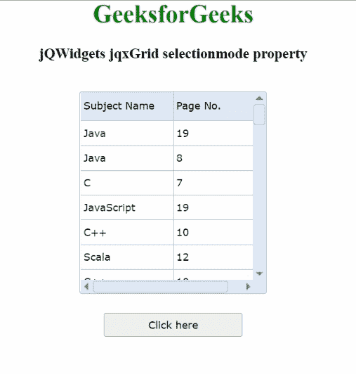

# jQWidgets jqxGrid 选择模式属性

> 原文:[https://www . geesforgeks . org/jqwidgets-jqxgrid-selection mode-property/](https://www.geeksforgeeks.org/jqwidgets-jqxgrid-selectionmode-property/)

**jQWidgets** 是一个 JavaScript 框架，用于为 PC 和移动设备制作基于 web 的应用程序。它是一个非常强大、优化、独立于平台并且得到广泛支持的框架。 **jqxGrid** 用于说明以表格形式显示数据的 jQuery 小部件。此外，它完全支持与数据的连接，以及分页、分组、排序、过滤和编辑。

**选择模式属性**用于设置或获取选择的模式。它是字符串类型，默认为*单行*。

属性的可能值如下:

*   **无:**用于禁用选择。
*   **单行:**用于整行选择。
*   **多行:**用于每次点击选择一个新行。单击所选行会取消选中它。
*   **多行扩展:**用于选择多行以及拖放功能。
*   **单细胞:**用于选择单细胞。
*   **多单元格:**用于每次点击选择一个新单元格。单击选中的单元格会取消选中它。
*   **多单元格扩展:**用于选择多个单元格以及拖放功能。
*   **多单元格高级:**用于选择多个单元格以及拖放功能。这是一个非常先进的细胞采摘模式。
*   **复选框:**通过复选框选择多行。

**语法:**

*   设置*选择模式*属性。

    ```html
    $('#Selector').jqxGrid({ selectionmode: 'singlecell'});
    ```

*   返回*选择模式*属性。

    ```html
    var selectionmode = $('#Selector').jqxGrid('selectionmode');
    ```

**链接文件:**从给定链接下载 [jQWidgets](https://www.jqwidgets.com/download/) 。在 HTML 文件中，找到下载文件夹中的脚本文件。

> <link rel="”stylesheet”" href="”jqwidgets/styles/jqx.base.css”" type="”text/css”">
> <脚本类型=【text/JavaScript】src =【scripts/jquery-1 . 11 . 1 . min . js】></脚本>
> <脚本类型=【text/JavaScript】src =【jqwidgets/jqxcore . js】></脚本>
> <脚本类型=【text/JavaScript】src =【jqwidgets/jqxdata

下面的例子说明了 jQWidgets 中的 jqxGrid **selectionmode 属性**。

**示例:**

## 超文本标记语言

```html
<!DOCTYPE html>
<html lang="en">

<head>
    <link rel="stylesheet" 
          href="jqwidgets/styles/jqx.base.css" 
          type="text/css" />
    <script type="text/javascript" 
            src="scripts/jquery-1.11.1.min.js">
      </script>
    <script type="text/javascript" 
            src="jqwidgets/jqxcore.js">
      </script>
    <script type="text/javascript" 
            src="jqwidgets/jqxdata.js">
      </script>
    <script type="text/javascript" 
            src="jqwidgets/jqxbuttons.js">
      </script>
    <script type="text/javascript" 
            src="jqwidgets/jqxscrollbar.js">
      </script>
    <script type="text/javascript" 
            src="jqwidgets/jqxmenu.js">
      </script>
    <script type="text/javascript" 
            src="jqwidgets/jqxgrid.js">
      </script>
    <script type="text/javascript" 
            src="jqwidgets/jqxgrid.selection.js">
      </script>
</head>

<body>
    <center>
        <h1 style="color: green">
            GeeksforGeeks
        </h1>

        <h3>jQWidgets jqxGrid selectionmode
            property
        </h3>
        <br />

        <div id="jqxg"></div>

        <div>
            <input type="button" id="jqxBtn" 
                   style="margin-top: 25px" 
                   value="Click here" />
        </div>

        <div id="log"></div>
    </center>

    <script type="text/javascript">
        $(document).ready(function () {
            var d = new Array();
            var subjectNames =
                ["C++", "Scala", "Java",
                 "C", "R", "JavaScript"];

            var pageNumber =
                ["7", "8", "12", "11", "10", "19"];

            for (var j = 0; j < 50; j++) {
                var r = {};
                r["subjectnames"] =
                    subjectNames[Math.floor(
                        Math.random() * subjectNames.length)
                    ];

                r["pagenumber"] =
                    pageNumber[Math.floor(
                        Math.random() * pageNumber.length)
                    ];
                d[j] = r;

            }
            var src = {
                localdata: d,
                datatype: "array",
            };
            var data_Adapter = new $.jqx.dataAdapter(src);
            $("#jqxg").jqxGrid({
                source: data_Adapter,
                selectionmode: 'multiplecells',
                theme: 'energyblue',
                height: "260px",
                width: "240px",
                columns: [
                    {
                        text: "Subject Name",
                        datafield: "subjectnames",
                        width: "120px",
                    },
                    {
                        text: "Page No.",
                        datafield: "pagenumber",
                        width: "120px",
                    },
                ],
            });

            $("#jqxBtn").jqxButton({
                width: "180px",
                height: "30px",
            });
            $("#jqxBtn").on("click", function () {
                var sm = $('#jqxg').jqxGrid('selectionmode');
                $('#log').text("Mode of selection: " + sm);
            });
        });
    </script>
</body>

</html>
```

**输出:**



**参考:**[https://www . jqwidgets . com/jquery-widgets-documentation/documentation/jqxgrid/jquery-grid-API . htm](https://www.jqwidgets.com/jquery-widgets-documentation/documentation/jqxgrid/jquery-grid-api.htm)