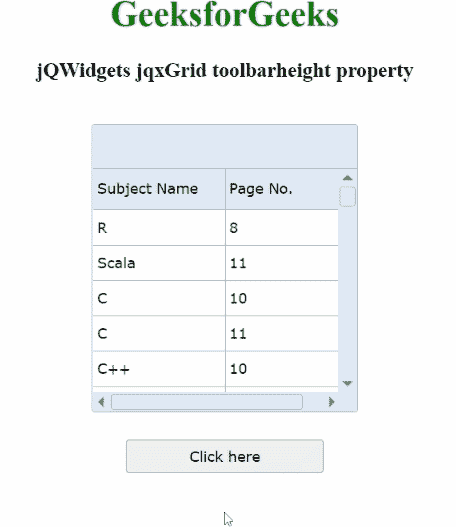

# jQWidgets jqxGrid 工具栏高度属性

> 原文:[https://www . geesforgeks . org/jqwidgets-jqxgrid-toolbarheight-property/](https://www.geeksforgeeks.org/jqwidgets-jqxgrid-toolbarheight-property/)

**jQWidgets** 是一个 JavaScript 框架，用于为 PC 和移动设备制作基于 web 的应用程序。它是一个非常强大、优化、独立于平台并且得到广泛支持的框架。 **jqxGrid** 用于说明以表格形式显示数据的 jQuery 小部件。此外，它完全支持与数据的连接，以及分页、分组、排序、过滤和编辑。

***工具栏高度*** 属性用于在显示的 **jqxGrid** 中设置或返回工具栏的高度。它属于数字类型，默认值为 34。

**语法:**

*   设置*工具栏高度*属性。

    ```html
    $('#Selector').jqxGrid({ toolbarheight: true});
    ```

*   返回*工具栏高度*属性。

    ```html
    var toolbarheight = 
        $('#Selector').jqxGrid('toolbarheight');
    ```

**链接文件:**从给定链接下载 [jQWidgets](https://www.jqwidgets.com/download/) 。在 HTML 文件中，找到下载文件夹中的脚本文件。

> <link rel="”stylesheet”" href="”jqwidgets/styles/jqx.base.css”" type="”text/css”">
> <脚本类型=“text/JavaScript”src =“scripts/jquery-1 . 11 . 1 . min . js”></script>
> <脚本类型=“text/JavaScript”src =“jqwidgets/jqxcore . js”></script>
> <脚本类型=“text/JavaScript”src =“jqwidgets/jqx-1

**示例:**以下示例说明了 jQWidgets 中的 jqxGrid *toolbarheight* 属性。

## 超文本标记语言

```html
<!DOCTYPE html>
<html lang="en">

<head>
    <link rel="stylesheet" 
          href="jqwidgets/styles/jqx.base.css" 
          type="text/css" />
    <script type="text/javascript" 
            src="scripts/jquery-1.11.1.min.js">
    </script>
    <script type="text/javascript" 
            src="jqwidgets/jqxcore.js">
    </script>
    <script type="text/javascript" 
            src="jqwidgets/jqx-all.js">
    </script>
    <script type="text/javascript" 
            src="jqwidgets/jqxdata.js">
    </script>
    <script type="text/javascript" 
            src="jqwidgets/jqxbuttons.js">
    </script>
    <script type="text/javascript" 
            src="jqwidgets/jqxscrollbar.js">
    </script>
    <script type="text/javascript" 
            src="jqwidgets/jqxmenu.js">
    </script>
    <script type="text/javascript" 
            src="jqwidgets/jqxgrid.js">
    </script>
    <script type="text/javascript" 
            src="jqwidgets/jqxgrid.selection.js">
    </script>
</head>

<body>
    <center>
        <h1 style="color:green">
            GeeksforGeeks
        </h1>

        <h3>jQWidgets jqxGrid toolbarheight property
        </h3>
        <br />

        <div id="jqxg"></div>

        <div>
            <input type="button" id="jqxBtn" 
                style="margin-top: 25px" value="Click here" />
        </div>

        <div id="log"></div>
    </center>

    <script type="text/javascript">
        $(document).ready(function () {
            var d = new Array();
            var subjectNames =
                ["C++", "Scala", "Java", "C", "R", "JavaScript"];

            var pageNumber =
                ["7", "8", "12", "11", "10", "19"];

            for (var j = 0; j < 50; j++) {
                var r = {};
                r["subjectnames"] =
                    subjectNames[Math.floor(
                        Math.random() * subjectNames.length)
                    ];

                r["pagenumber"] =
                    pageNumber[Math.floor(
                        Math.random() * pageNumber.length)
                    ];
                d[j] = r;

            }
            var src = {
                localdata: d,
                datatype: "array",
            };
            var data_Adapter = new $.jqx.dataAdapter(src);
            $("#jqxg").jqxGrid({
                source: data_Adapter,
                sortable: true,
                theme: 'energyblue',
                filterable: true,
                showtoolbar: true,
                toolbarheight: 40,
                height: "260px",
                width: "240px",
                columns: [
                    {
                        text: "Subject Name",
                        datafield: "subjectnames",
                        width: "120px",
                    },
                    {
                        text: "Page No.",
                        datafield: "pagenumber",
                        width: "120px",
                    },
                ],
            });

            $("#jqxBtn").jqxButton({
                width: "180px",
                height: "30px",
            });
            $("#jqxBtn").on("click", function () {
                var sth = $('#jqxg').jqxGrid('toolbarheight');
                $('#log').text("Toolbar's height: " + sth);
            });
        });
    </script>
</body>

</html>
```

**输出:**



**参考:**[https://www . jqwidgets . com/jquery-widgets-documentation/documentation/jqxgrid/jquery-grid-API . htm？搜索=](https://www.jqwidgets.com/jquery-widgets-documentation/documentation/jqxgrid/jquery-grid-api.htm?search=)