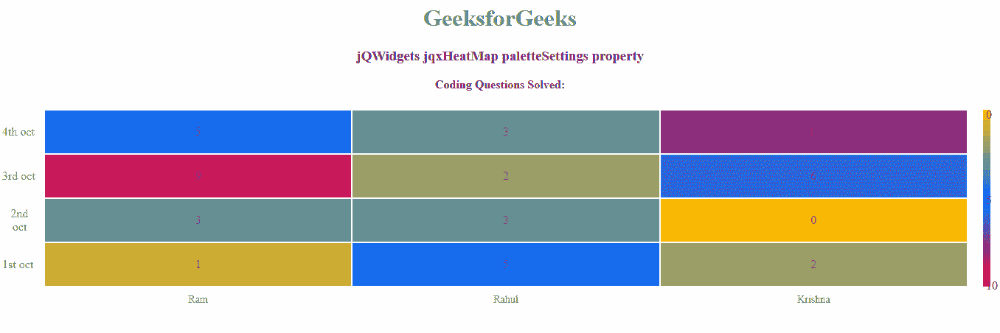

# jQWidgets jqxHeatMap palettetesettings 属性

> 原文:[https://www . geesforgeks . org/jqwidgets-jqxheatmap-palettesettings-property/](https://www.geeksforgeeks.org/jqwidgets-jqxheatmap-palettesettings-property/)

**jQWidgets** 是一个 JavaScript 框架，用于为 PC 和移动设备制作基于 web 的应用程序。它是一个非常强大和优化的框架，独立于平台，并得到广泛支持。 **jqxHeatMap** 代表一个 jQuery 小部件，它显示了使用颜色编码来表示不同值的数据的图形表示。

**参数设置**属性用于设置或返回参数设置属性。即该属性用于设置或返回热图调色板的设置。它接受对象类型值，默认值为 null。

**语法:**

*   它用于设置 paletteSettings 属性。

    ```
    $('Selector').jqxHeatMap({ paletteSettings : object });
    ```

*   它用于返回 paletteSettings 属性。

    ```
    var paletteSettings = 
        $('Selector').jqxHeatMap('paletteSettings');
    ```

**属性:**

*   **调色板**:用于设置热图单元格的颜色集合。它包含以下值:
    *   **值**:调色板颜色值。
    *   **颜色**:调色板。
    *   **标签**:调色板颜色的标签。此属性是可选的。
*   **类型**:用于设置颜色样式。可能的选项有“渐变”(用于显示具有线性渐变颜色的单元格)、“固定”(用于显示具有固定颜色的单元格)。默认值为“渐变”。
*   **空点颜色**:用于设置空点的颜色。默认值为“#eee”。

**链接文件:**从链接下载 [jQWidgets](https://www.jqwidgets.com/download/) 。在 HTML 文件中，找到下载文件夹中的脚本文件。

> <script type = " text/JavaScript " src = " scripts/jquery-1 . 11 . 1min . js "></script><【script type = " text/JavaScript " src = " jqwidgets/jqxcore . js ">T10】

**示例:**以下示例说明了 jQWidgets 中的 jqxheatpmap**paletteSettings**属性。

## 超文本标记语言

```
<!DOCTYPE html>
<html lang="en">

<head>
    <link rel="stylesheet" 
          href="jqwidgets/styles/jqx.base.css" 
          type="text/css" />
    <script type="text/javascript" 
            src="scripts/jquery-1.11.1.min.js">
    </script>
    <script type="text/javascript" 
            src="jqwidgets/jqxcore.js">
    </script>
    <script type="text/javascript" 
            src="jqwidgets/jqxheatmap.js">
    </script>
</head>

<body>
    <center>
        <h1 style="color: green">
          GeeksforGeeks
        </h1>
        <h3>jQWidgets jqxHeatMap paletteSettings property</h3>
        <body class='default'>
            <div id="heatmap"></div>
        </body>
    </center>
    <script type="text/javascript">
        $(document).ready(function () {
            var x = {
                labels: ['Ram', 'Rahul', 'Krishna']
            };
            var y = {
                labels: ['1st oct', '2nd oct', 
                         '3rd oct', '4th oct']
            };
            var arr = [
                [1, 3, 9, 5],
                [5, 3, 2, 3],
                [2, 0, 6, 8]
            ];
            $("#heatmap").jqxHeatMap({
                xAxis: x,
                yAxis: y,
                source: arr,
                title: 'Coding Questions Solved:',
                paletteSettings: {
                    palette: [ 
                        { value: 0, color: '#fcba03' },
                        { value: 5, color: '#0373fc' },

                    { value: 10, color: '#fc0331' }],
                    type: 'Gradient'}
            });
        });
    </script>
</body>

</html>
```

**输出:**



**参考:**[https://www . jqwidgets . com/jquery widgets-documentation/documentation/jxheatmap/jquery-heat map-API . htm？search=](https://www.jqwidgets.com/jquery-widgets-documentation/documentation/jqxheatmap/jquery-heatmap-api.htm?search=)