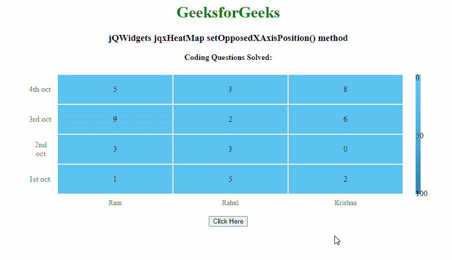

# jQWidgets jqxHeatMap setappedxaxispoposition()方法

> 原文:[https://www . geeksforgeeks . org/jqwidgets-jqxheatmap-setoppedxaxispoposition-method/](https://www.geeksforgeeks.org/jqwidgets-jqxheatmap-setopposedxaxisposition-method/)

**jQWidgets** 是一个 JavaScript 框架，用于为 PC 和移动设备制作基于 web 的应用程序。它是一个非常强大和优化的框架，独立于平台，并得到广泛支持。 **jqxHeatMap** 代表一个 jQuery 小部件，它显示了使用颜色编码来表示不同值的数据的图形表示。

**setappedxaxispoposition()方法**用于将 x 轴设置在相对侧。它采用布尔类型值，不返回任何值。

**语法:**

```html
$('Selector').jqxHeatMap(
    'setOpposedXAxisPosition', boolean);
```

**链接文件:**从链接下载 https://www.jqwidgets.com/download/。在 HTML 文件中，找到下载文件夹中的脚本文件:

> <script type = " text/JavaScript " src = " scripts/jquery-1 . 11 . 1min . js "></script><【script type = " text/JavaScript " src = " jqwidgets/jqxcore . js ">T10】

**示例:**下面的示例说明了 jQWidgets 中的 jqxHeatMap setappedxaxispoposition()方法:

## 超文本标记语言

```html
<!DOCTYPE html>
<html lang="en">

<head>
    <link rel="stylesheet"
          href="jqwidgets/styles/jqx.base.css" 
          type="text/css" />
    <script type="text/javascript" 
            src="scripts/jquery-1.11.1.min.js">
    </script>
    <script type="text/javascript" 
            src="jqwidgets/jqxcore.js">
    </script>
    <script type="text/javascript" 
            src="jqwidgets/jqxheatmap.js">
    </script>
</head>

<body>
    <center>
        <h1 style="color: green">
          GeeksforGeeks
        </h1>
        <h3>
            jQWidgets jqxHeatMap 
            setOpposedXAxisPosition() method
        </h3>
        <body class='default'>
            <div id="heatmap"></div>
            <br>
            <button id='gfg'>Click Here</button>
        </body>
    </center>
    <script type="text/javascript">
        $(document).ready(function () {
            var x = {
                labels: ['Ram', 'Rahul', 'Krishna']
            };
            var g = {
                labels: ['1st oct', '2nd oct', 
                         '3rd oct', '4th oct']
            };
            var arr = [
                [1, 3, 9, 5],
                [5, 3, 2, 3],
                [2, 0, 6, 8]
            ];
            $("#heatmap").jqxHeatMap({
                xAxis: x,
                yAxis: g,
                source: arr,
                title: 'Coding Questions Solved:',
                width : 800
                });

            $('#gfg').click(function () {
                $("#heatmap").jqxHeatMap(
                  'setOpposedXAxisPosition', true);
            });
        });

    </script>
</body>

</html>
```

**输出:**



**参考:**[**https://www . jqwidgets . com/jquery widgets-documentation/documentation/jqxheatmap/jquery-heat map-API . htm？search=**](https://www.jqwidgets.com/jquery-widgets-documentation/documentation/jqxheatmap/jquery-heatmap-api.htm?search=)