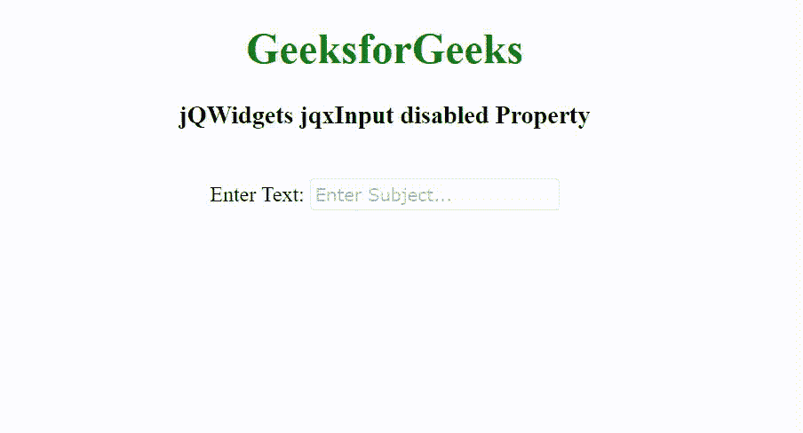

# jQWidgets jqxInput 禁用属性

> 原文:[https://www . geesforgeks . org/jqwidgets-jqxinput-disabled-property/](https://www.geeksforgeeks.org/jqwidgets-jqxinput-disabled-property/)

**jQWidgets** 是一个 JavaScript 框架，用于为 PC 和移动设备制作基于 web 的应用程序。它是一个非常强大、优化、独立于平台并且得到广泛支持的框架。jqxInput 用于表示包含自动完成功能的 jQuery 输入小部件

***禁用*** **属性**用于启用或禁用 jqxInput。它接受布尔类型值，默认值为 false。

**语法:**

设置*禁用*属性。

```html
$('selector').jqxInput({ disabled: Boolean });
```

返回*禁用的*属性。

```html
var disabled = $('selector').jqxInput('disabled');
```

**链接文件:**从链接下载 [jQWidgets](https://www.jqwidgets.com/download/) 。在 HTML 文件中，找到下载文件夹中的脚本文件。

> <link rel="”stylesheet”" href="”jqwidgets/styles/jqx.base.css”" type="”text/css”">
> <脚本类型= " text/JavaScript " src = " scripts/jquery-1 . 11 . 1 . min . js "></脚本>
> <脚本类型= " text/JavaScript " src = " jqwidgets/jqx-all . js "></脚本>
> 脚本类型= " text/JavaScript " src = " jqwidgets/jqxcore . js

**示例:**下面的示例说明了 jQWidgets 中的 jqxInput 禁用属性。

## 超文本标记语言

```html
<!DOCTYPE html>
<html lang="en">

<head>
    <link rel="stylesheet" href=
"jqwidgets/styles/jqx.base.css" type="text/css" />
    <script type="text/javascript" 
            src="scripts/jquery-1.11.1.min.js">
    </script>
    <script type="text/javascript" 
            src="jqwidgets/jqx-all.js">
    </script>
    <script type="text/javascript" 
            src="jqwidgets/jqxcore.js">
    </script>
    <script type="text/javascript" 
            src="jqwidgets/jqxinput.js">
    </script>
</head>

<body class='default'>
    <center>
        <h1 style="color: green;">
            GeeksforGeeks
        </h1>

        <h3>
            jQWidgets jqxInput disabled Property
        </h3>
        <br>

        <label for="css">Enter Text: </label>
        <input type="text" id="GFG"/>
    </center>

    <script type="text/javascript">
        $(document).ready(function() {
            var data = [
                "Computer Science",
                "C Programming",
                "C++ Programming",
                "Java Programming",
                "Python Programming",
                "HTML",
                "CSS",
                "JavaScript",
                "jQuery",
                "PHP",
                "Bootstrap"
            ];

            $("#GFG").jqxInput({
                source: data,
                placeHolder: "Enter Subject...",
                disabled: true
            });
        });
    </script>
</body>
</html>
```

**输出:**



**参考:**[https://www . jqwidgets . com/jquery-widgets-documentation/documentation/jqxinput/jquery-input-API . htm](https://www.jqwidgets.com/jquery-widgets-documentation/documentation/jqxinput/jquery-input-api.htm)