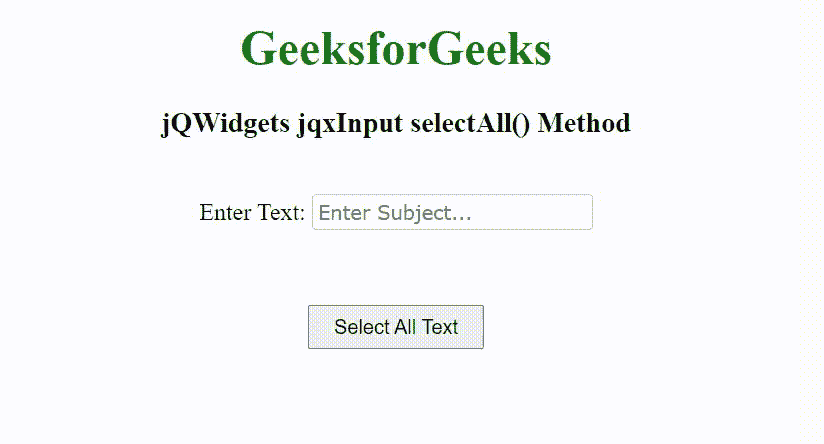

# jQWidgets jqxInput selectAll()方法

> 原文:[https://www . geesforgeks . org/jqwidgets-jqxinput-selectall-method/](https://www.geeksforgeeks.org/jqwidgets-jqxinput-selectall-method/)

jQWidgets 是一个 JavaScript 框架，用于为 PC 和移动设备制作基于 web 的应用程序。它是一个非常强大、优化、独立于平台并且得到广泛支持的框架。jqxInput 用于表示包含自动完成功能的 jQuery 输入小部件

**selectAll()方法**用于选择输入字段中的所有文本内容。它不接受任何参数，也不返回值。

**语法:**

```html
$('selector').jqxInput('selectAll'); 
```

**链接文件:**从链接 https://www.jqwidgets.com/download/.下载 jQWidgets 在 HTML 文件中，找到下载文件夹中的脚本文件。

> <link rel="”stylesheet”" href="”jqwidgets/styles/jqx.base.css”" type="”text/css”">

下面的例子说明了 jQWidgets 中的 jqxInput selectAll()方法。

**示例:**

## 超文本标记语言

```html
<!DOCTYPE html>
<html lang="en">

<head>
    <link rel="stylesheet" href=
        "jqwidgets/styles/jqx.base.css" type="text/css" />
    <link rel="stylesheet" href=
        "jqwidgets/styles/jqx.energyblue.css">
    <script type="text/javascript" 
        src="scripts/jquery-1.11.1.min.js">
    </script>
    <script type="text/javascript" 
        src="jqwidgets/jqx-all.js">
    </script>
    <script type="text/javascript" 
        src="jqwidgets/jqxcore.js">
    </script>
    <script type="text/javascript" 
        src="jqwidgets/jqxinput.js">
    </script>
</head>

<body class='default'>
    <center>
        <h1 style="color: green;">
            GeeksforGeeks
        </h1>

        <h3>
            jQWidgets jqxInput selectAll() Method
        </h3>
        <br>

        <label for="css">Enter Text: </label>
        <input type="text" id="GFG" />
        <br>
        <input type="button" id='jqxBtn' 
            value="Select All Text" 
            style="padding: 5px 15px; margin-top: 50px;" />
    </center>

    <script type="text/javascript">
        $(document).ready(function() {
            var data = [
                "Computer Science",
                "C Programming",
                "C++ Programming",
                "Java Programming",
                "Python Programming",
                "HTML",
                "CSS",
                "JavaScript",
                "jQuery",
                "PHP",
                "Bootstrap"
            ];

            $("#GFG").jqxInput({
                source: data,
                placeHolder: "Enter Subject..."
            });

            $('#jqxBtn').on('click', function () {
                $('#GFG').jqxInput('selectAll');
            });
        });
    </script>
</body>

</html>
```

**输出:**



**参考:**[https://www . jqwidgets . com/jquery-widgets-documentation/documentation/jqxinput/jquery-input-API . htm](https://www.jqwidgets.com/jquery-widgets-documentation/documentation/jqxinput/jquery-input-api.htm)