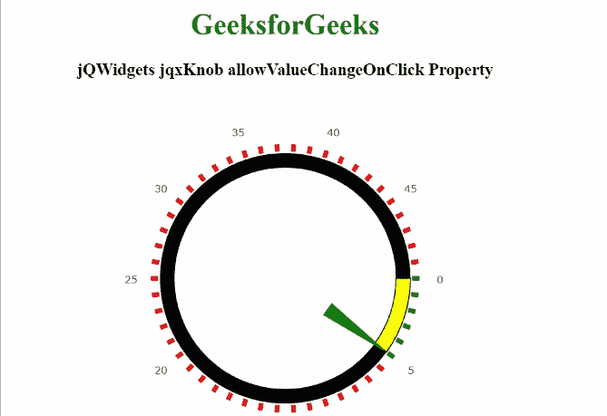

# jqxk nob 小部件允许 ValueChangeOnClick 属性

> 原文:[https://www . geesforgeks . org/jqwidgets-jqxknob-allowvaluechangeonclick-property/](https://www.geeksforgeeks.org/jqwidgets-jqxknob-allowvaluechangeonclick-property/)

**jQWidgets** 是一个 JavaScript 框架，用于为 PC 和移动设备制作基于 web 的应用程序。它是一个非常强大、优化、独立于平台并且得到广泛支持的框架。**jqxKnob** 用于表示圆形的 jQuery 插件，并显示指定值范围内的可拖动指示器。该应用编程接口也可用于表或矩阵中，以显示指定数据区域中某个值范围内某个字段的相对值。

****allowValueChangeOnClick****属性**用于设置或获取指定的 jqxKnob 的值是否可以在点击时更改。**

****语法:****

*   **设置*允许值更改点击*属性:**

    ```
    $('#jqxKnob').jqxKnob({allowValueChangeOnClick: true });
    ```

*   **获取*允许值更改点击*属性:**

    ```
    var allowValueChangeOnClick = 
        $('#jqxKnob').jqxKnob('allowValueChangeOnClick');
    ```

****链接文件:**从给定链接下载 [jQWidgets](https://www.jqwidgets.com/download/) 。在 HTML 文件中，找到下载文件夹中的脚本文件。**

> <link rel="”stylesheet”" href="”jqwidgets/styles/jqx.base.css”" type="”text/css”"> **<脚本类型=“text/JavaScript”src =“scripts/jquery . js”></script>
> <脚本类型=“text/JavaScript”src =“jqwidgets/jqxcore . js”></script>
> <脚本类型=“text/JavaScript”src =“jqwidgets/jqxbuttons . js”>**

****示例:**下面的示例说明了 jQWidgets 中的 jqxKnob**allowValueChangeOnClick****属性**。**

## **超文本标记语言**

```
<!DOCTYPE html>
<html lang="en">

<head>
    <link rel="stylesheet"
          href="jqwidgets/styles/jqx.base.css"
          type="text/css"/>
    <script type="text/javascript" 
            src="scripts/jquery.js">
    </script>
    <script type="text/javascript" 
            src="jqwidgets/jqxcore.js">
    </script>
    <script type="text/javascript" 
            src="jqwidgets/jqxbuttons.js">
    </script>
    <script type="text/javascript" 
            src="jqwidgets/jqxdraw.js">
    </script>
    <script type="text/javascript" 
            src="jqwidgets/jqxknob.js">
    </script>
    <script type="text/javascript" 
            src="jqwidgets/jqxnumberinput.js">
    </script>
    <script type="text/javascript" 
            src="jqwidgets/jqx-all.js">
    </script>
</head>

<body>
    <center>
        <h1 style="color:green;">
            GeeksforGeeks
        </h1>
        <h3>
            jQWidgets jqxKnob allowValueChangeOnClick Property
        </h3>
        <div id='jqx_Knob'>
            <center>
                GeeksforGeeks
            </center>
        </div>
        <input type="button" style="margin: 65px;" 
            id="button_for_allowValueChangeOnClick"
            value="Value of the allowValueChangeOnClick property"/>
        <div id="log"></div>
        <script type="text/javascript">
            $(document).ready(function () {
                $('#jqx_Knob').jqxKnob({
                    value: 5,
                    min: 0,
                    max: 50,
                    startAngle: 0,
                    endAngle: 360,
                    snapToStep: true,
                    allowValueChangeOnClick: true,
                    marks: {
                        colorRemaining: { color: 'red' },
                        colorProgress: { color: 'green' },
                        offset: '70%',
                        thickness: 5,
                        size: '4%'
                    },
                    labels: {
                        offset: '85%',
                        step: 5
                    },
                    progressBar: {
                        style: { fill: 'yellow', 
                                 stroke: 'black' },
                        size: '8%',
                        offset: '61%',
                        background: { fill: 'black' }
                    },
                    pointer: { type: 'arrow', 
                              style: { fill: 'green' }, 
                              size: '68%', 
                              offset: '29%', 
                              thickness: 15 }
                });

                $("#button_for_allowValueChangeOnClick").jqxButton({
                    width: 300,
                    theme: 'energyblue'
                });

                $('#button_for_allowValueChangeOnClick')
                .jqxButton().click(function () {
                    var value_of_allowValueChangeOnClick 
                        = $('#jqx_Knob').jqxKnob(
                          'allowValueChangeOnClick');

                    $("#log").html(
                        value_of_allowValueChangeOnClick);
                    })
            });
        </script>
    </center>
</body>

</html>
```

****输出:****

****

****参考:**[https://www . jqwidgets . com/jquery-widgets-documentation/documentation/jqxknob/jquery-knob-API . htm](https://www.jqwidgets.com/jquery-widgets-documentation/documentation/jqxknob/jquery-knob-api.htm)**