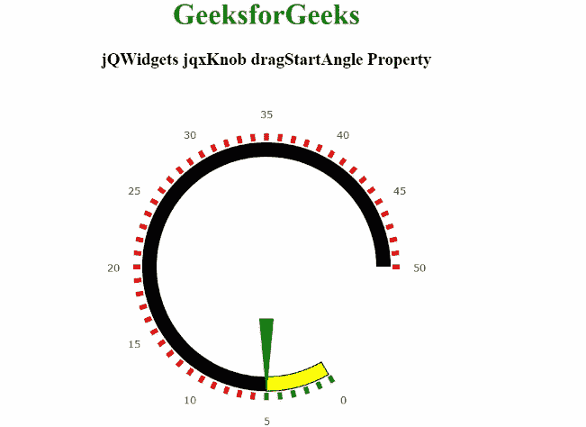

# jQWidgets jqxKnob dragStartAngle 属性

> 原文:[https://www . geesforgeks . org/jqwidgets-jqxknob-dragstarangle-property/](https://www.geeksforgeeks.org/jqwidgets-jqxknob-dragstartangle-property/)

**jQWidgets** 是一个 JavaScript 框架，用于为 PC 和移动设备制作基于 web 的应用程序。它是一个非常强大、优化、独立于平台并且得到广泛支持的框架。 **jqxKnob** 用于表示圆形的 jQuery 插件，并在指定值的范围内显示可拖动的指示器。该应用编程接口也可用于表或矩阵中，以显示指定数据区域中某个值范围内某个字段的相对值。

***拖动开始角度*** 属性用于设置或获取指针拖动开始的指定 jqxKnob 的度数。

**语法:**

*   用于设置*拖动开始角度*属性。

    ```html
    $('#jqxKnob').jqxKnob({dragStartAngle: 60 });
    ```

*   获取*dragstarangle*房产。

    ```html
    var allowValueChangeOnClick = 
        $('#jqxKnob').jqxKnob('dragStartAngle');
    ```

**链接文件:**从给定链接下载 [jQWidgets](https://www.jqwidgets.com/download/) 。在 HTML 文件中，找到下载文件夹中的脚本文件。

> <link rel="”stylesheet”" href="”jqwidgets/styles/jqx.base.css”" type="”text/css”">
> <脚本类型=“text/JavaScript”src =“scripts/jquery . js”></script>
> <脚本类型=“text/JavaScript”src =“jqwidgets/jqxcore . js”></script>
> <脚本类型=“text/JavaScript”src =“jqwidgets/jqxbuttons . js”>

**示例:**下面的示例说明了 jQWidgets jqxKnob***dragstarangle***属性。在以下示例中，***dragstarangle***属性的值已设置为 60。

## 超文本标记语言

```html
<!DOCTYPE html>
<html lang="en">

<head>
    <link rel="stylesheet" 
          href="jqwidgets/styles/jqx.base.css" 
          type="text/css"/>
    <script type="text/javascript" 
            src="scripts/jquery.js">
    </script>
    <script type="text/javascript" 
            src="jqwidgets/jqxcore.js">
    </script>
    <script type="text/javascript" 
            src="jqwidgets/jqxbuttons.js">
    </script>
    <script type="text/javascript" 
            src="jqwidgets/jqxdraw.js">
    </script>
    <script type="text/javascript" 
            src="jqwidgets/jqxknob.js">
    </script>
    <script type="text/javascript" 
            src="jqwidgets/jqxnumberinput.js">
    </script>
    <script type="text/javascript" 
            src="jqwidgets/jqx-all.js">
    </script>
</head>
<body>
    <center>
        <h1 style="color:green;">
            GeeksforGeeks
        </h1>
        <h3> jQWidgets jqxKnob dragStartAngle Property </h3>
        <div id='jqx_Knob'>
            <center>
                GeeksforGeeks
            </center>
        </div>
        <input type="button" style="margin:65px;" 
               id="button_for_dragStartAngle"
               value="Value of the dragStartAngle property"/>
        <div id="log"></div>
        <script type="text/javascript">
            $(document).ready(function () {
                $('#jqx_Knob').jqxKnob({
                    value: 5,
                    min: 0,
                    max: 50,
                    dragStartAngle: 60,
                    startAngle: 0,
                    endAngle: 360,
                    snapToStep: true,
                    marks: {
                        colorRemaining: { color: 'red' },
                        colorProgress: { color: 'green' },
                        offset: '70%',
                        thickness: 5,
                        size: '4%'
                    },
                    labels: {
                        offset: '85%',
                        step: 5
                    },
                    progressBar: {
                        style: {
                            fill: 'yellow',
                            stroke: 'black'
                        },
                        size: '8%',
                        offset: '61%',
                        background: { fill: 'black' }
                    },
                    pointer: {
                        type: 'arrow',
                        style: { fill: 'green' },
                        size: '68%',
                        offset: '29%',
                        thickness: 15
                    }
                });
                $("#button_for_dragStartAngle").jqxButton({
                    width: 350,
                    theme: 'energyblue'
                });
                $('#button_for_dragStartAngle')
                .jqxButton().click(function () {
                    var value_of_dragStartAngle =
                        $('#jqx_Knob').jqxKnob('dragStartAngle');
                    $("#log").html(value_of_dragStartAngle);
                })
            });
        </script>
    </center>
</body>
</html>
```

**输出:**



**参考:**[https://www . jqwidgets . com/jquery-widgets-documentation/documentation/jqxknob/jquery-knob-API . htm？搜索=](https://www.jqwidgets.com/jquery-widgets-documentation/documentation/jqxknob/jquery-knob-api.htm?search=)