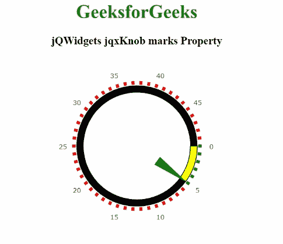

# jQWidgets jqxKnob 标记属性

> 原文:[https://www . geesforgeks . org/jqwidgets-jqxknob-marks-property/](https://www.geeksforgeeks.org/jqwidgets-jqxknob-marks-property/)

**jQWidgets** 是一个 JavaScript 框架，用于为 PC 和移动设备制作基于 web 的应用程序。它是一个非常强大、优化、独立于平台并且得到广泛支持的框架。**jqxKnob** 用于表示圆形的 jQuery 插件，并显示指定值范围内的可拖动指示器。该应用编程接口也可用于表或矩阵中，以显示指定数据区域中某个值范围内某个字段的相对值。这个 API 支持 HTML5，SVG，& VML 渲染。

**标记**属性用于设置或获取指定 jqxKnob 的标记属性。它属于对象类型&，其默认值为空。

**语法:**

*   设置*标记*属性:

```
$('#jqxKnob').jqxKnob({
    marks: {
        colorRemaining: { color: 'red' },
        colorProgress: { color: 'green' },
        offset: '70%',
        thickness: 5,
        size: '4%'
    }
});
```

*   获取*标记*属性:

```
var allowValueChangeOnClick = $('#jqxKnob').jqxKnob('marks');
```

旋钮的标记属性有几个属性，如下所示:

*   **colorProgress** :用于表示十六进制颜色串。
*   **颜色保留**:也用于表示十六进制颜色串。
*   **绘制上方进度条**:用于绘制 z 指数高于进度条的标记。
*   **小刻度间隔**:显示小刻度间隔。
*   **主要间隔**:显示主要滴答间隔。
*   **主要尺寸**:它显示了一个主要刻度的尺寸，该尺寸指定了圆形线条的半径，或者线条的长度。
*   **偏移**:用于指定标签偏移。
*   **尺寸**:用于指定圆弧线情况下的半径或直线情况下的长度。
*   **型**:可以是“圆”型，也可以是“线”型。
*   **厚度**:用于线的情况下指定厚度。
*   **可见**:用于确定标签的可见性。

**链接文件:**从给定链接下载 [jQWidgets](https://www.jqwidgets.com/download/) 。在 HTML 文件中，找到下载文件夹中的脚本文件。

> <link rel="”stylesheet”" href="”jqwidgets/styles/jqx.base.css”" type="”text/css”">
> <脚本类型=“text/JavaScript”src =“scripts/jquery . js”></script>
> <脚本类型=“text/JavaScript”src =“jqwidgets/jqxcore . js”></script>
> <脚本类型=“text/JavaScript”src =“jqwidgets/jqxbuttons . js”>

**示例:**以下示例说明了 jQWidgets jqxKnob **标记** 属性。

## 超文本标记语言

```
<!DOCTYPE html>
<html lang="en">

<head>
    <link rel="stylesheet" 
          href="jqwidgets/styles/jqx.base.css" 
          type="text/css"/>
    <script type="text/javascript" 
            src="scripts/jquery.js">
    </script>
    <script type="text/javascript" 
            src="jqwidgets/jqxcore.js">
    </script>
    <script type="text/javascript" 
            src="jqwidgets/jqxbuttons.js">
    </script>
    <script type="text/javascript" 
            src="jqwidgets/jqxdraw.js">
    </script>
    <script type="text/javascript" 
            src="jqwidgets/jqxknob.js">
    </script>
    <script type="text/javascript" 
            src="jqwidgets/jqxnumberinput.js">
    </script>
    <script type="text/javascript" 
            src="jqwidgets/jqx-all.js">
    </script>
</head>

<body>
    <center>
        <h1 style="color:green;">
            GeeksforGeeks
        </h1>
        <h3>
            jQWidgets jqxKnob marks Property
        </h3>
        <div id='jqx_Knob'>
        </div>
        <script type="text/javascript">
            $(document).ready(function () {
                $('#jqx_Knob').jqxKnob({
                    value: 5,
                    min: 0,
                    max: 50,
                    width: 300,
                    startAngle: 0,
                    endAngle: 360,
                    snapToStep: true,
                    marks: {
                        colorRemaining: { color: 'red' },
                        colorProgress: { color: 'green' },
                        offset: '70%',
                        thickness: 5,
                        size: '4%'
                    },
                    labels: {
                        offset: '85%',
                        step: 5
                    },
                    progressBar: {
                        style: {
                            fill: 'yellow',
                            stroke: 'black'
                        },
                        size: '8%',
                        offset: '61%',
                        background: { fill: 'black' }
                    },
                    pointer: {
                        type: 'arrow',
                        style: { fill: 'green' },
                        size: '68%',
                        offset: '29%',
                        thickness: 15
                    }
                });
            });
        </script>
    </center>
</body>

</html>
```

**输出:**



**参考:**[https://www . jqwidgets . com/jquery-widgets-documentation/documentation/jqxknob/jquery-knob-API . htm？搜索=](https://www.jqwidgets.com/jquery-widgets-documentation/documentation/jqxknob/jquery-knob-api.htm?search=)