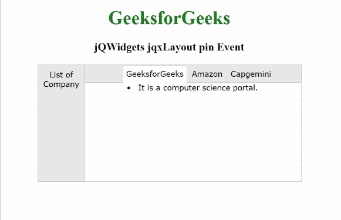

# jqwidgets jxllayout pin 事件

> 原文:[https://www . geesforgeks . org/jqwidgets-jqxlayout-pin-event/](https://www.geeksforgeeks.org/jqwidgets-jqxlayout-pin-event/)

**jQWidgets** 是一个 JavaScript 框架，用于为 PC 和移动设备制作基于 web 的应用程序。它是一个非常强大、优化、独立于平台并且得到广泛支持的框架。 **jqxLayout** 用于表示 jQuery 小部件，该部件用于创建具有嵌套、调整大小、固定、取消固定和闭合面板的复杂布局。

当一组指定的 **jqxLayout** 部件被固定时，触发 ***固定*** 事件。

**语法:**

```html
$('#jqxLayout').on('pin', function (event) {
   // Code Section
}); 
```

**链接文件:**从给定链接下载 [jQWidgets](https://www.jqwidgets.com/download/) 。在 HTML 文件中，找到下载文件夹中的脚本文件。

> <link rel="”stylesheet”" href="”jqwidgets/styles/jqx.base.css”" type="”text/css”">
> <脚本类型=“text/JavaScript”src =“scripts/jquery . js”></脚本>
> <脚本类型=“text/JavaScript”src =“jqwidgets/jqxcore . js”></脚本>
> <脚本类型=“text/JavaScript”src =“jqwidgets/jqxmenu . js”>

**示例:**下面的示例说明了 jQWidgets**jqxLayout***T5】pin*事件。

## 超文本标记语言

```html
<!DOCTYPE html>
<html lang="en">

<head>
    <link rel="stylesheet"
          href= "jqwidgets/styles/jqx.base.css"
          type="text/css"/>
    <script type="text/javascript" 
            src="scripts/jquery-1.11.1.min.js">
    </script>
    <script type="text/javascript" 
            src="jqwidgets/jqxcore.js">
    </script>
    <script type="text/javascript" 
            src="jqwidgets/jqxbuttons.js">
    </script>
    <script type="text/javascript" 
            src="jqwidgets/jqxribbon.js">
    </script>
    <script type="text/javascript" 
            src="jqwidgets/jqxlayout.js">
    </script>
    <script type="text/javascript" 
            src="jqwidgets/jqx-all.js">
    </script>
</head>

<body>
    <center>
        <h1 style="color:green;">
            GeeksforGeeks
        </h1>
        <h3>
            jQWidgets jqxLayout pin Event
        </h3>
        <div id="jqx_Layout">
            <div data-container="A1">
                <ol>
                    <li>GeeksforGeeks</li>
                    <li>Amazon</li>
                    <li>Capgemini</li>
                </ol>
            </div>
            <div data-container="A2">
                <li>It is a computer science portal.</li>
            </div>
            <div data-container="A3">
                <li>It is a eCommerce platform.</li>
            </div>
            <div data-container="A4">
                <li>It is a service based company.</li>
            </div>
        </div>
        <div id="log"></div>
        <script type="text/javascript">
            $(document).ready(function () {
                var layout = [{
                    items: [{
                        items: [{
                            contentContainer: 'A1',
                            type: 'layoutPanel',
                            title: 'List of Company'
                        }],
                        width: 80,
                        type: 'autoHideGroup',
                        alignment: 'left'
                    }, {
                        items: [{
                            items: [{
                                contentContainer: 'A2',
                                type: 'documentPanel',
                                title: 'GeeksforGeeks',
                            }, {
                                contentContainer: 'A3',
                                type: 'documentPanel',
                                title: 'Amazon',
                            }, {
                                contentContainer: 'A4',
                                type: 'documentPanel',
                                title: 'Capgemini',
                            }],
                            type: 'documentGroup',
                            height: 200,
                        },],
                        width: 370,
                        orientation: 'vertical',
                        type: 'layoutGroup',
                    }],
                    orientation: 'horizontal',
                    type: 'layoutGroup',
                }];
                $('#jqx_Layout').jqxLayout({
                    width: 450,
                    height: 200,
                    layout: layout
                });
                $('#jqx_Layout').on('pin', function () {
                  $("#log").html('The group has been pinned.');
                });
            });
        </script>
    </center>
</body>
</html>
```

**输出:**



**参考:**[https://www . jqwidgets . com/jquery-widgets-documentation/documentation/jqxlayout/jquery-layout-API . htm？搜索=](https://www.jqwidgets.com/jquery-widgets-documentation/documentation/jqxlayout/jquery-layout-api.htm?search=)