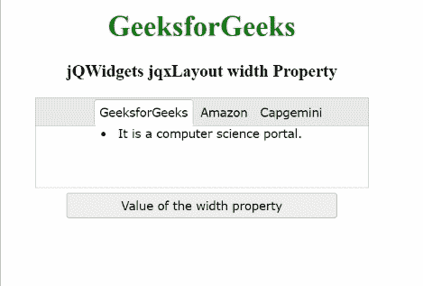

# jQWidgets jqxLayout 宽度属性

> 原文:[https://www . geesforgeks . org/jqwidgets-jqxlayout-width-property/](https://www.geeksforgeeks.org/jqwidgets-jqxlayout-width-property/)

**jQWidgets** 是一个 JavaScript 框架，用于为 PC 和移动设备制作基于 web 的应用程序。它是一个非常强大、优化、独立于平台并且得到广泛支持的框架。****jqxLayout**用于表示 jQuery 小部件，该部件用于创建具有嵌套、调整大小、固定、取消固定和闭合面板的复杂布局。**

*****宽度*** 属性用于设置或获取指定 **jqxLayout** 小部件的宽度。**

****语法:****

*   **用于设置*宽度*属性。**

    ```
    $("#jqxLayout").jqxLayout({ width: 450 });
    ```

*   **用于获取*宽度*属性。**

    ```
    var width = $('#jqxLayout').jqxLayout('width');
    ```

****链接文件:**从给定链接下载 [jQWidgets](https://www.jqwidgets.com/download/) 。在 HTML 文件中，找到下载文件夹中的脚本文件。**

> <link rel="”stylesheet”" href="”jqwidgets/styles/jqx.base.css”" type="”text/css”"> **<脚本类型=“text/JavaScript”src =“scripts/jquery . js”></脚本>
> <脚本类型=“text/JavaScript”src =“jqwidgets/jqxcore . js”></脚本>
> <脚本类型=“text/JavaScript”src =“jqwidgets/jqxbuttones . js”>【T17**

****示例:**下面的示例说明了 jQWidgets**jqxLayout***T5【宽度】* 属性。在以下示例中， ***宽度*** 属性的值已设置为 370**

## **超文本标记语言**

```
<!DOCTYPE html>
<html lang="en">

<head>
    <link rel="stylesheet" 
          href="jqwidgets/styles/jqx.base.css" 
          type="text/css"/>
    <script type="text/javascript" 
            src="scripts/jquery.js">
    </script>
    <script type="text/javascript" 
            src="jqwidgets/jqxcore.js">
    </script>
    <script type="text/javascript" 
            src="jqwidgets/jqxbuttons.js">
    </script>
    <script type="text/javascript" 
            src="jqwidgets/jqxribbon.js">
    </script>
    <script type="text/javascript" 
            src="jqwidgets/jqxlayout.js">
    </script>
    <script type="text/javascript" 
            src="jqwidgets/jqx-all.js">
    </script>
</head>

<body>
    <center>
        <h1 style="color:green;">
            GeeksforGeeks
        </h1>
        <h3> jQWidgets jqxLayout width Property  </h3>
        <div id="jqx_Layout">
            <div data-container="A1">
                <li>It is a computer science portal.</li>
            </div>
            <div data-container="A2">
                <li>It is a eCommerce platform.</li>
            </div>
            <div data-container="A3">
                <li>It is a service based company.</li>
            </div>
        </div>
        <input type="button" style="margin: 5px;" 
               id="button_for_width" 
               value="Value of the width property" />
        <div id="log"></div>
        <script type="text/javascript">
            $(document).ready(function () {
                var jqx_Layout = [{
                    items: [{
                        items: [{
                            items: [{
                                contentContainer: 'A1',
                                type: 'documentPanel',
                                title: 'GeeksforGeeks',
                            }, {
                                contentContainer: 'A2',
                                type: 'documentPanel',
                                title: 'Amazon',
                            }, {
                                contentContainer: 'A3',
                                type: 'documentPanel',
                                title: 'Capgemini',
                            }],
                            type: 'documentGroup',
                            height: 100,
                        },],
                        type: 'layoutGroup',
                        height: 100,
                    }],
                    orientation: 'vertical',
                    type: 'layoutGroup'
                }];
                $('#jqx_Layout').jqxLayout({
                    width: 370,
                    height: 100,
                    layout: jqx_Layout
                });
                $("#button_for_width").jqxButton({
                    width: 300
                });
                $('#button_for_width').jqxButton().click(function () {
                      var value =
                      $('#jqx_Layout').jqxLayout('width');
                      $("#log").html(value);
                })
            });
        </script>
    </center>
</body>
</html>
```

****输出:****

****

****参考:**[https://www . jqwidgets . com/jquery-widgets-documentation/documentation/jqxlayout/jquery-layout-API . htm？搜索=](https://www.jqwidgets.com/jquery-widgets-documentation/documentation/jqxlayout/jquery-layout-api.htm?search=)**