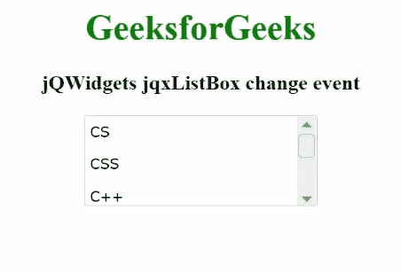

# jqwidget jqxlistox 变更事件

> 原文:[https://www . geesforgeks . org/jqwidgets-jqxlistbox-change-event/](https://www.geeksforgeeks.org/jqwidgets-jqxlistbox-change-event/)

**jQWidgets** 是一个 JavaScript 框架，用于为 PC 和移动设备制作基于 web 的应用程序。它是一个非常强大、优化、独立于平台并且得到广泛支持的框架。 **jqxListBox** 用于说明一个 jQuery ListBox 小部件，它包含一系列可选元素。

每当用户从所述列表框中选择一个项目时，**变化事件**被激活。

**语法:**

```html
$('selector').on('change', function (event) {});
```

**参数:**该方法有以下参数。

*   **标签:**是物品的规定标签。
*   **值:**是项目的设定值。
*   **禁用:**表示项目是否禁用。
*   **勾选:**表示项目是否勾选。
*   **hasthreads:**它定义了物品的三种状态。
*   **html:** 它定义了项目的 html 形式。
*   **索引:**定义项目的索引。
*   **组:**定义项目的组。

**链接文件:**从链接下载 [jQWidgets](https://www.jqwidgets.com/download/) 。在 HTML 文件中，找到下载文件夹中的脚本文件。

> <link rel="”stylesheet”" href="”jqwidgets/styles/jqx.base.css”" type="”text/css”">
> <脚本类型=【text/JavaScript】src =【scripts/jquery-1 . 11 . 1 . min . js】></脚本>
> <脚本类型=【text/JavaScript】src =【jqwidgets/jqx-all . js】></脚本>
> <脚本类型=【text/JavaScript】src =【jqwidgets/jqxcore

**示例:**以下示例说明了 jQWidgets 中的 jqxListBox **变更事件**。

## 超文本标记语言

```html
<!DOCTYPE html>
<html lang="en">

<head>
    <link rel="stylesheet" 
          href="jqwidgets/styles/jqx.base.css"
          type="text/css" />
    <script type="text/javascript" 
            src="scripts/jquery-1.11.1.min.js">
    </script>
    <script type="text/javascript" 
            src="jqwidgets/jqx-all.js">
    </script>
    <script type="text/javascript" 
            src="jqwidgets/jqxcore.js">
    </script>
    <script type="text/javascript" 
            src="jqwidgets/jqxbuttons.js">
    </script>
    <script type="text/javascript"
            src="jqwidgets/jqxscrollbar.js">
    </script>
    <script type="text/javascript"
            src="jqwidgets/jqxlistbox.js">
    </script>
</head>

<body>
    <center>
        <h1 style="color: green;">
            GeeksforGeeks
        </h1>

        <h3>
            jQWidgets jqxListBox change event
        </h3>

        <div id="jqxLB"></div>
        <br />
        <div id="log"></div>
    </center>

    <script type="text/javascript">
        $(document).ready(function () {
            var data =
                ["CS", "CSS", "C++",
                    "Java", "Scala"];

            $("#jqxLB").jqxListBox({
                source: data,
                width: "210px",
                height: "80px",
            });

            $("#jqxLB").on("change", function (event) {
                $("#log").html(
                    "Label: " + event.args.item.label
                );
            });
        });
    </script>
</body>

</html>
```

**输出:**



**参考:**[https://www . jqwidgets . com/jquery-widgets-documentation/documentation/jqxlistbox/jquery-listbox-API . htm](https://www.jqwidgets.com/jquery-widgets-documentation/documentation/jqxlistbox/jquery-listbox-api.htm)