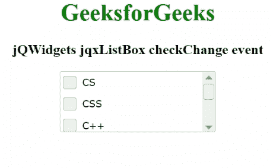

# jqwidget jqxlistox 检查变更事件

> 原文:[https://www . geesforgeks . org/jqwidgets-jqxlistbox-check change-event/](https://www.geeksforgeeks.org/jqwidgets-jqxlistbox-checkchange-event/)

**jQWidgets** 是一个 JavaScript 框架，用于为 PC 和移动设备制作基于 web 的应用程序。它是一个非常强大、优化、独立于平台并且得到广泛支持的框架。jqxListBox 用于说明一个 jQuery ListBox 小部件，它包含一个可选择元素的列表。

只要选中或未选中所述*列表框*中的某个项目，就会激活**检查更改**事件。

**语法:**

```html
$('selector').on('checkChange', function (event) {});
```

这里，项目对象拥有下面给定的字段:

*   标签
*   价值
*   有缺陷的
*   检查
*   hasThreeStates
*   超文本标记语言
*   指数
*   组

**链接文件:**从链接下载 [jQWidgets](https://www.jqwidgets.com/download/) 。在 HTML 文件中，找到下载文件夹中的脚本文件。

> <link rel="”stylesheet”" href="”jqwidgets/styles/jqx.base.css”" type="”text/css”">
> <脚本类型=【text/JavaScript】src =【scripts/jquery-1 . 11 . 1 . min . js】></脚本>
> <脚本类型=【text/JavaScript】src =【jqwidgets/jqx-all . js】></脚本>
> <脚本类型=【text/JavaScript】src =【jqwidgets/jqxcore

**示例:**下面的示例说明了 jQWidgets 中的 jqxListBox **checkChange** 事件。

## 超文本标记语言

```html
<html>
    <head>
        <link rel="stylesheet" 
              href="jqwidgets/styles/jqx.base.css" 
              type="text/css" />
        <script type="text/javascript"
                src="scripts/jquery-1.11.1.min.js">
        </script>
        <script type="text/javascript" 
                src="jqwidgets/jqx-all.js">
        </script>
        <script type="text/javascript" 
                src="jqwidgets/jqxcore.js">
        </script>
        <script type="text/javascript" 
                src="jqwidgets/jqxbuttons.js">
        </script>
        <script type="text/javascript" 
                src="jqwidgets/jqxscrollbar.js">
        </script>
        <script type="text/javascript" 
                src="jqwidgets/jqxlistbox.js">
        </script>
    </head>

    <body>
        <center>
            <h1 style="color: green;">
                GeeksforGeeks
            </h1>

            <h3>
                jQWidgets jqxListBox checkChange event
            </h3>

            <div id="jqxLB"></div>
            <br />
            <div id="log"></div>
        </center>

        <script type="text/javascript">
            $(document).ready(function () {
                var data = 
                    ["CS", "CSS", "C++", "Java", "Scala"];

                $("#jqxLB").jqxListBox({
                    source: data,
                    width: "210px",
                    height: "80px",
                    checkboxes: true,
                });

                $("#jqxLB").on("checkChange", function (event) {
                    var args = event.args;

                    if (args) {
                        $("#log").html(
                          "Value: " + event.args.item.value
                        );
                    }
                });
            });
        </script>
    </body>
</html>
```

**输出:**



**参考:**[https://www . jqwidgets . com/jquery-widgets-documentation/documentation/jqxlistbox/jquery-listbox-API . htm](https://www.jqwidgets.com/jquery-widgets-documentation/documentation/jqxlistbox/jquery-listbox-api.htm)