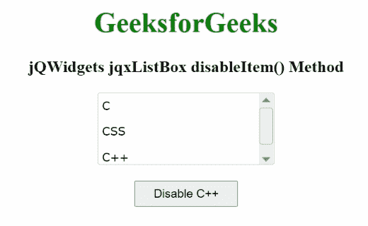

# jqwidgets jqxlistox disabled directem()方法

> 原文:[https://www . geesforgeks . org/jqwidgets-jqxlistbox-disableitem-method/](https://www.geeksforgeeks.org/jqwidgets-jqxlistbox-disableitem-method/)

**jQWidgets** 是一个 JavaScript 框架，用于为 PC 和移动设备制作基于 web 的应用程序。它是一个非常强大、优化、独立于平台并且得到广泛支持的框架。jqxListBox 用于说明一个 jQuery ListBox 小部件，它包含一个可选择元素的列表。

**禁用项目()方法**用于禁用所述列表中的项目。它有一个名为 item 的参数，类型为 object 或 string，并且不返回任何内容。

下列字段用于列表中规定的项目:

*   标签
*   价值
*   有缺陷的
*   检查
*   hasThreeStates
*   超文本标记语言
*   组

**语法:**

```
$("#jqxListBox").jqxListBox('disableItem', Item);  
```

**链接文件:**从链接下载 [jQWidgets](https://www.jqwidgets.com/download/) 。在 HTML 文件中，找到下载文件夹中的脚本文件。

> <link rel="”stylesheet”" href="”jqwidgets/styles/jqx.base.css”" type="”text/css”">
> <脚本类型=【text/JavaScript】src =【scripts/jquery-1 . 11 . 1 . min . js】></脚本>
> <脚本类型=【text/JavaScript】src =【jqwidgets/jqx-all . js】></脚本>
> <脚本类型=【text/JavaScript】src =【jqwidgets/jqxcore

**示例:**下面的示例说明了 jQWidgets 中的 jqxListBox **disableItem()** 方法。

## 超文本标记语言

```
<!DOCTYPE html>
<html lang="en">
    <head>
        <link rel="stylesheet" href=
            "jqwidgets/styles/jqx.base.css" type="text/css" />
        <script type="text/javascript" 
            src="scripts/jquery-1.11.1.min.js"></script>
        <script type="text/javascript" 
            src="jqwidgets/jqx-all.js"></script>
        <script type="text/javascript" 
            src="jqwidgets/jqxcore.js"></script>
        <script type="text/javascript" 
            src=".jqwidgets/jqxbuttons.js"></script>
        <script type="text/javascript" 
            src="jqwidgets/jqxscrollbar.js"></script>
        <script type="text/javascript" 
            src="jqwidgets/jqxlistbox.js"></script>
    </head>

    <body>
        <center>
            <h1 style="color: green;">
                GeeksforGeeks
            </h1>

            <h3>
                jQWidgets jqxListBox disableItem() Method
            </h3>

            <div id="jqxLB"></div>
            <br />
            <input type="button" id="jqxBtn" 
                style="padding: 5px 20px;" 
                value="Disable C++" />
        </center>

        <script type="text/javascript">
            $(document).ready(function () {
                var data = [
                  "C", 
                  "CSS",
                  "C++"];

                $("#jqxLB").jqxListBox({
                    source: data,
                    width: "200px",
                    height: "80px",
                });

                $("#jqxBtn").on("click", function () {
                    $("#jqxLB").jqxListBox("disableItem", "C++");
                });
            });
        </script>
    </body>
</html>
```

**输出:**



禁用项目方法

**参考:**[https://www . jqwidgets . com/jquery-widgets-documentation/documentation/jqxlistbox/jquery-listbox-API . htm？搜索=](https://www.jqwidgets.com/jquery-widgets-documentation/documentation/jqxlistbox/jquery-listbox-api.htm?search=)