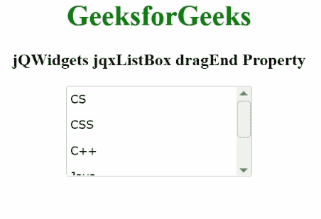

# jqwidgets jqxlistox dragend property

> 原文:[https://www . geesforgeks . org/jqwidgets-jqxlistbox-drag end-property/](https://www.geeksforgeeks.org/jqwidgets-jqxlistbox-dragend-property/)

**jQWidgets** 是一个 JavaScript 框架，用于为 PC 和移动设备制作基于 web 的应用程序。它是一个非常强大、优化、独立于平台并且得到广泛支持的框架。jqxListBox 用于说明一个 jQuery ListBox 小部件，它包含一个可选择元素的列表。

**拖动结束属性**是一个回调函数，每当拖动动作结束时都会调用。它属于函数类型，其默认值为空。

**语法:**

要设置*拖动*属性:

```
$("#jqxListBox").jqxListBox({ dragEnd: function (dragItem, dropItem) 
{
    // dragItem is the item that is to be dragged.
    // dropItem is the item that is to be dropped.
    if (dragItem.label == "item1")
    return false;
}
});
```

要获取*拖动*属性:

```
var dragEnd = $('#jqxListBox').jqxListBox('dragEnd'); 
```

**链接文件:**从链接下载 [jQWidgets](https://www.jqwidgets.com/download/) 。在 HTML 文件中，找到下载文件夹中的脚本文件。

> <link rel="”stylesheet”" href="”jqwidgets/styles/jqx.base.css”" type="”text/css”">
> <脚本类型=【text/JavaScript】src =【scripts/jquery-1 . 11 . 1 . min . js】></脚本>
> <脚本类型=【text/JavaScript】src =【jqwidgets/jqx-all . js】></脚本>
> <脚本类型=【text/JavaScript】src =【jqwidgets/jqxcore

**示例:**以下示例说明了 jQWidgets 中的 jqxListBox **dragEnd** 属性。

## 超文本标记语言

```
<html>
  <head>
    <link rel="stylesheet" 
          href="jqwidgets/styles/jqx.base.css" 
          type="text/css" />
    <script type="text/javascript"
            src="scripts/jquery-1.11.1.min.js">
    </script>
    <script type="text/javascript" 
            src="jqwidgets/jqx-all.js">
    </script>
    <script type="text/javascript" 
            src="jqwidgets/jqxcore.js">
    </script>
    <script type="text/javascript" 
            src="jqwidgets/jqxbuttons.js">
    </script>
    <script type="text/javascript" 
            src="jqwidgets/jqxscrollbar.js">
    </script>
    <script type="text/javascript" 
            src="jqwidgets/jqxlistbox.js">
    </script>
  </head>

  <body>
    <center>
      <h1 style="color: green;">
        GeeksforGeeks
      </h1>

      <h3>
        jQWidgets jqxListBox dragEnd Property
      </h3>

      <div id="jqxLB"></div>
      <br />
      <div id="log"></div>
    </center>

    <script type="text/javascript">
      $(document).ready(function () {
        var data = 
            ["CS", "CSS", "C++", "Java", "Scala"];

        $("#jqxLB").jqxListBox({
          source: data,
          allowDrop: true,
          allowDrag: true,
          width: "210px",
          height: "100px",
          dragEnd: function (i) {
            $("#log").text(
              "Dragging item: " + i.label
            );
          },
        });
      });
    </script>
  </body>
</html>
```

**输出:**



**参考:**[https://www . jqwidgets . com/jquery-widgets-documentation/documentation/jqxlistbox/jquery-listbox-API . htm](https://www.jqwidgets.com/jquery-widgets-documentation/documentation/jqxlistbox/jquery-listbox-api.htm)