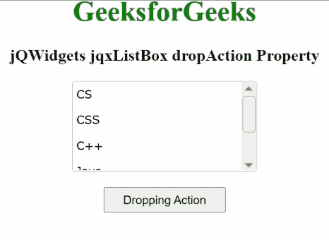

# jqwidgets jqxlistox drop action property

> 原文:[https://www . geesforgeks . org/jqwidgets-jqxlistbox-drop action-property/](https://www.geeksforgeeks.org/jqwidgets-jqxlistbox-dropaction-property/)

**jQWidgets** 是一个 JavaScript 框架，用于为 PC 和移动设备制作基于 web 的应用程序。它是一个非常强大、优化、独立于平台并且得到广泛支持的框架。jqxListBox 用于说明一个 jQuery ListBox 小部件，它包含一个可选择元素的列表。

每当从所述的*列表框*中删除一个项目时，**删除动作属性**用于设置或返回*删除*动作。它属于字符串类型，其默认值为“默认值”。

它的可能值是:

*   系统默认值
*   复制
*   没有人

**语法:**

要设置 *dropAction* 属性:

```
$("#jqxListBox").jqxListBox({dropAction:'copy'});  
```

要获取 *dropAction* 属性:

```
var dropAction = $('#jqxListBox').jqxListBox('dropAction');  
```

**链接文件:**从链接下载 [jQWidgets](https://www.jqwidgets.com/download/) 。在 HTML 文件中，找到下载文件夹中的脚本文件。

> <link rel="”stylesheet”" href="”jqwidgets/styles/jqx.base.css”" type="”text/css”">
> <脚本类型=【text/JavaScript】src =【scripts/jquery-1 . 11 . 1 . min . js】></脚本>
> <脚本类型=【text/JavaScript】src =【jqwidgets/jqx-all . js】></脚本>
> <脚本类型=【text/JavaScript】src =【jqwidgets/jqxcore

下面的例子说明了 jQWidgets 中的 jqxListBox **dropAction** 属性。

**示例:**

## 超文本标记语言

```
<!DOCTYPE html>
<html>
  <head>
    <link rel="stylesheet" 
          href="jqwidgets/styles/jqx.base.css" 
          type="text/css" />
    <script type="text/javascript"
            src="scripts/jquery-1.11.1.min.js">
    </script>
    <script type="text/javascript" 
            src="jqwidgets/jqx-all.js">
    </script>
    <script type="text/javascript" 
            src="jqwidgets/jqxcore.js">
    </script>
    <script type="text/javascript" 
            src="jqwidgets/jqxbuttons.js">
    </script>
    <script type="text/javascript" 
            src="jqwidgets/jqxscrollbar.js">
    </script>
    <script type="text/javascript" 
            src="jqwidgets/jqxlistbox.js">
    </script>
  </head>
  <body>
    <center>
      <h1 style="color: green;">
        GeeksforGeeks
      </h1>

      <h3>
        jQWidgets jqxListBox 
        dropAction Property
      </h3>

      <div id="jqxLB"></div>
      <br />
      <input type="button" id="jqxBtn" 
             style="padding: 5px 20px;" 
             value="Dropping Action" />
      <div id="log"></div>
    </center>

    <script type="text/javascript">
      $(document).ready(function () {
        var data = 
            ["CS", "CSS", "C++", "Java", "Scala"];

        $("#jqxLB").jqxListBox({
          source: data,
          width: "210px",
          height: "100px",
          allowDrag: true,
          allowDrop: true,
          dropAction:'copy'
        });

        $("#jqxBtn").on("click", function () {
          var dA = $("#jqxLB").jqxListBox("dropAction");
          $("#log").text(dA);
        });
      });
    </script>
  </body>
</html>
```

**输出:**



**参考:**[https://www . jqwidgets . com/jquery-widgets-documentation/documentation/jqxlistbox/jquery-listbox-API . htm](https://www.jqwidgets.com/jquery-widgets-documentation/documentation/jqxlistbox/jquery-listbox-api.htm)