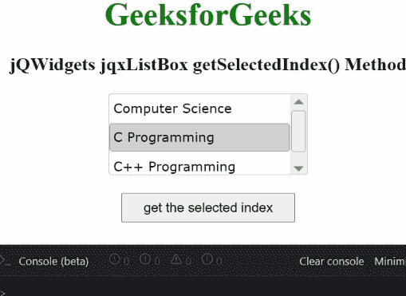

# jQWidgets jqxListBox getSelectedIndex（） Method

> [https://www.geeksforgeeks.org/jqwidgets-jqxlistbox-getselectedindex-method/](https://www.geeksforgeeks.org/jqwidgets-jqxlistbox-getselectedindex-method/)

**jQWidgets** 是一个 JavaScript 框架，用于为 PC 和移动设备制作基于 web 的应用程序。它是一个非常强大、优化、独立于平台并且得到广泛支持的框架。jqxListBox 用于说明一个 jQuery ListBox 小部件，它包含一个可选择元素的列表。

**getSelectedIndex()** 方法用于从所述列表中返回所选项目的索引。如果没有选择任何项目，则返回-1。它没有参数，返回一个数字，即索引。

**语法:**

```html
$("#jqxListBox").jqxListBox('getSelectedIndex');
```

**链接文件:**从链接下载 [jQWidgets](https://www.jqwidgets.com/download/) 。在 HTML 文件中，找到下载文件夹中的脚本文件。

> <link rel="”stylesheet”" href="”jqwidgets/styles/jqx.base.css”" type="”text/css”">
> <脚本类型=【text/JavaScript】src =【scripts/jquery-1 . 11 . 1 . min . js】></脚本>
> <脚本类型=【text/JavaScript】src =【jqwidgets/jqx-all . js】></脚本>
> <脚本类型=【text/JavaScript】src =【jqwidgets/jqxcore

**示例:**下面的示例说明了 jQWidgets 中的 jqxListBox**getSelectedIndex()**方法。

## 超文本标记语言

```html
<!DOCTYPE html>
<html lang="en">

<head>
    <link rel="stylesheet" href=
        "jqwidgets/styles/jqx.base.css" type="text/css" />
    <script type="text/javascript" 
        src="scripts/jquery-1.11.1.min.js"></script>
    <script type="text/javascript" 
        src="jqwidgets/jqx-all.js"></script>
    <script type="text/javascript" 
        src="jqwidgets/jqxcore.js"></script>
    <script type="text/javascript" 
        src="jqwidgets/jqxbuttons.js"></script>
    <script type="text/javascript" 
        src="jqwidgets/jqxscrollbar.js"></script>
    <script type="text/javascript" 
        src="jqwidgets/jqxlistbox.js"></script>
</head>

<body>
    <center>
        <h1 style="color: green;">
            GeeksforGeeks
        </h1>

        <h3>
            jQWidgets jqxListBox getSelectedIndex() Method
        </h3>

        <div id="jqxLB"></div>
        <br />
        <input type="button" id="jqxBtn" 
            style="padding: 5px 20px;" 
            value="get the selected index" />
    </center>

    <script type="text/javascript">
        $(document).ready(function () {
            var data = ["Computer Science", 
                "C Programming", "C++ Programming"];

            $("#jqxLB").jqxListBox({
                source: data,
                width: "200px",
                height: "80px",
                selectedIndex: 1,
            });

            $("#jqxBtn").on("click", function () {
                var i = $("#jqxLB").jqxListBox("getSelectedIndex");
                console.log("Selected Index is: " + i);
            });
        });
    </script>
</body>

</html>
```

**输出:**



getSelectedIndex 方法

**参考:**[https://www . jqwidgets . com/jquery-widgets-documentation/documentation/jqxlistbox/jquery-listbox-API . htm？搜索=](https://www.jqwidgets.com/jquery-widgets-documentation/documentation/jqxlistbox/jquery-listbox-api.htm?search=)