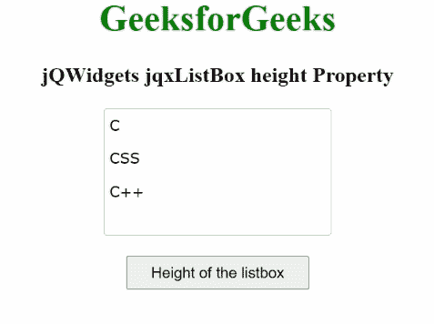

# jQWidgets jqxListBox 高度属性

> 原文:[https://www . geesforgeks . org/jqwidgets-jqxlistbox-height-property/](https://www.geeksforgeeks.org/jqwidgets-jqxlistbox-height-property/)

**jQWidgets** 是一个 JavaScript 框架，用于为 PC 和移动设备制作基于 web 的应用程序。它是一个非常强大、优化、独立于平台并且得到广泛支持的框架。jqxListBox 用于说明一个 jQuery ListBox 小部件，它包含一个可选择元素的列表。

**高度属性**用于设置或返回*列表框*的高度。它属于字符串类型，默认值为空。

**语法:**

要设置*高度*属性:

```
$("#jqxListBox").jqxListBox({ height: '250px' }); 
```

要获得*高度*属性:

```
var height = $('#jqxListBox').jqxListBox('height');
```

**链接文件:**从链接下载 [jQWidgets](https://www.jqwidgets.com/download/) 。在 HTML 文件中，找到下载文件夹中的脚本文件。

> <link rel="”stylesheet”" href="”jqwidgets/styles/jqx.base.css”" type="”text/css”">
> <脚本类型=【text/JavaScript】src =【scripts/jquery-1 . 11 . 1 . min . js】></脚本>
> <脚本类型=【text/JavaScript】src =【jqwidgets/jqx-all . js】></脚本>
> <脚本类型=【text/JavaScript】src =【jqwidgets/jqxcore

以下示例说明了 jQWidgets 中的 jqxListBox **高度**属性。

**示例:**

## 超文本标记语言

```
<!DOCTYPE html>
<html>
  <head>
    <link rel="stylesheet" 
          href="jqwidgets/styles/jqx.base.css" 
          type="text/css" />
    <script type="text/javascript"
            src="scripts/jquery-1.11.1.min.js">
    </script>
    <script type="text/javascript" 
            src="jqwidgets/jqx-all.js">
    </script>
    <script type="text/javascript" 
            src="jqwidgets/jqxcore.js">
    </script>
    <script type="text/javascript" 
            src="jqwidgets/jqxbuttons.js">
    </script>
    <script type="text/javascript" 
            src="jqwidgets/jqxscrollbar.js">
    </script>
    <script type="text/javascript" 
            src="jqwidgets/jqxlistbox.js">
    </script>
  </head>
  <body>
    <center>
      <h1 style="color: green;">
        GeeksforGeeks
      </h1>
      <h3>
        jQWidgets jqxListBox height Property
      </h3>
      <div id="jqxLB"></div>
      <br />
      <input type="button" id="jqxBtn" 
             style="padding: 5px 20px;" 
             value="Height of the listbox" />
      <div id="log"></div>
    </center>
    <script type="text/javascript">
      $(document).ready(function () {
        var data = ["C", "CSS", "C++"];

        $("#jqxLB").jqxListBox({
          source: data,
          width: "200px",
          height: "110px"
        });

        $("#jqxBtn").on("click", function () {
          var h = $("#jqxLB").jqxListBox("height");
          $("#log").text(h);
        });
      });
    </script>
  </body>
</html>
```

**输出:**



**参考:**[https://www . jqwidgets . com/jquery-widgets-documentation/documentation/jqxlistbox/jquery-listbox-API . htm](https://www.jqwidgets.com/jquery-widgets-documentation/documentation/jqxlistbox/jquery-listbox-api.htm)